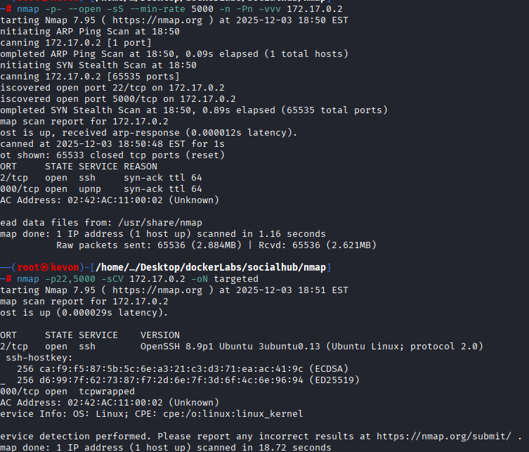
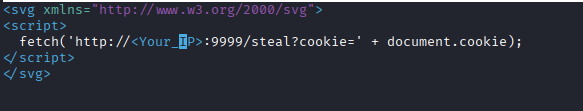
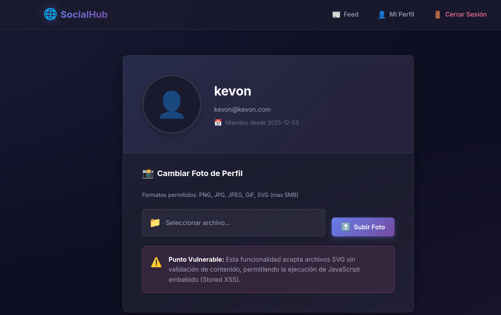
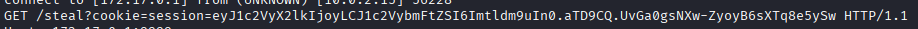
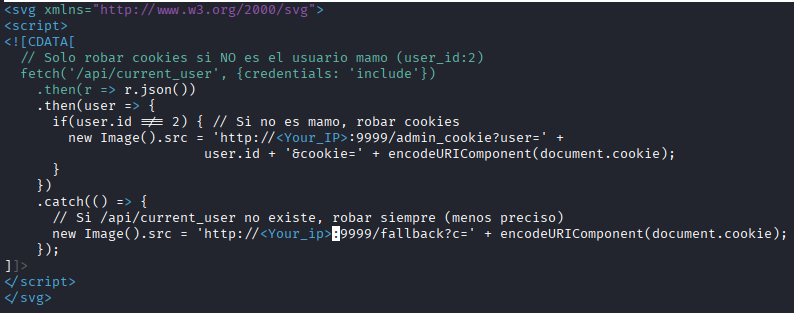
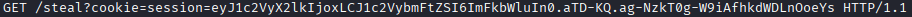
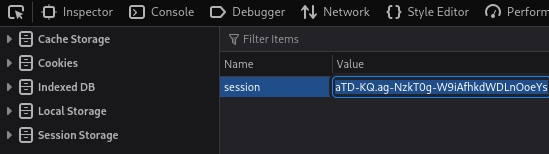
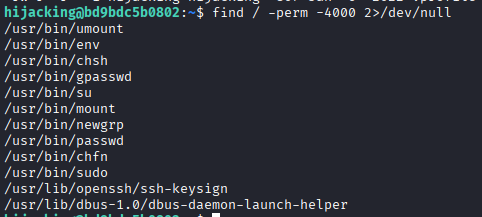

## Reconnaissance and Enumeration

Let's start with an **nmap** scan to discover the open ports and the services running on the machine.

```
nmap -p- --open -sS --min-rate 5000 -vvv -n -Pn <IP>
```

```
nmap -p22,5000 -sCV <IP> -oN targeted
```



## Gaining access 

On the web service running on **port 5000**, we can register a new user.


After registering, we can log in.


Inside the **/feed** directory, we can see another user named **admin**. We also notice that we can upload a profile image. This is a good opportunity to try an **XSS attack** to steal the admin's cookie.

To do this, we need to upload an `.svg` file that contains a small script, because the admin’s browser will execute it.

Here’s a simple script:



Go to the button named **"Mi perfil"** to access your profile and upload the script.

Before uploading, listen with **netcat** on port `9999`.



After uploading the script, we receive a cookie.



But this cookie is **our cookie**, so I generated a better script (with DeepSeek) to steal the **admin** cookie.



Place your IP in the script, upload it again, and listen with netcat.



Copy the admin cookie into your browser's developer tools (**Storage** section), refresh, and you’re in.



Once inside, we get credentials for SSH. Let’s use them.


## Scalling privilages

Inside SSH as the user **hijacking**, I checked for root-executable programs with:

```
sudo -l
```

Then I looked for SUID binaries:

```
find / -perm -4000 2>/dev/null
```



Among them, `/usr/bin/env` stands out — it can be abused to escalate privileges easily.

Just run:

```
/usr/bin/env /bin/bash -p
```


And that’s it. We are **root**. So easy >:3

