## Reconnaissance and Enumeration

We begin with a comprehensive TCP port scan to identify all open ports on the target machine.

```
nmap -p- --open -sS --min-rate 5000 -vvv -n -Pn <IP>
```

With ports 22 (SSH) and 5000 (HTTP) identified, we proceed with a detailed service and version enumeration scan.

```
nmap -p22,5000 -sCV <IP> -oN targeted
```

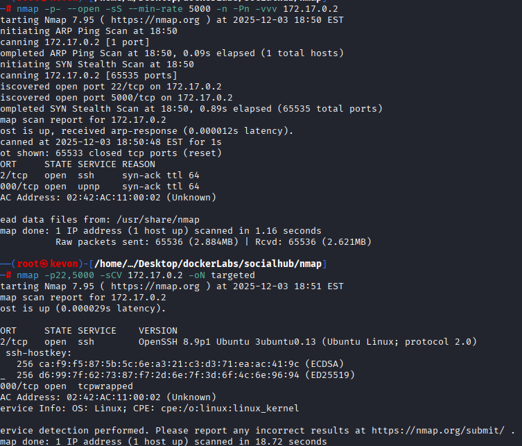

## Gaining Initial Access

The web service running on **port 5000** presents a registration page. We create a new user account to access the application.

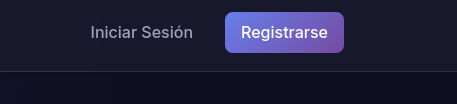

After registering, we log in with our new credentials.

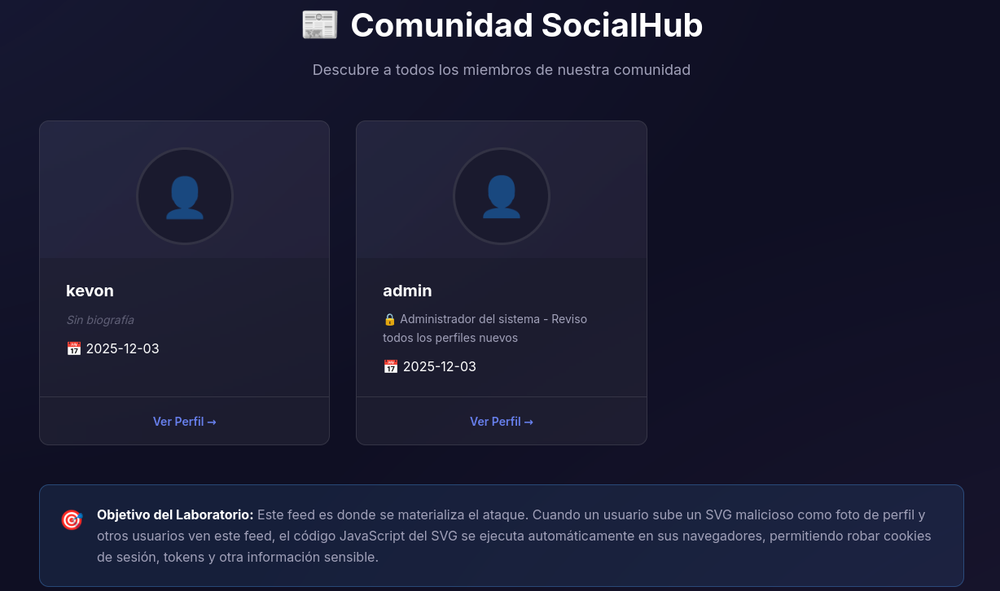

Navigating to the **/feed** endpoint, we observe a user named **admin**. We also notice a feature that allows users to upload a profile image. This presents an excellent opportunity to test for a **Stored Cross-Site Scripting (XSS)** vulnerability to steal the admin's session cookie.

To bypass standard image upload filters, we can craft a malicious `.svg` file containing embedded JavaScript. When the admin's browser renders this SVG, the script will execute.

Here is the initial XSS payload:

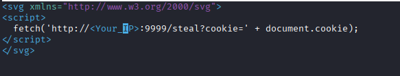

We navigate to the **"My Profile"** (_Mi perfil_) section to upload our malicious SVG.


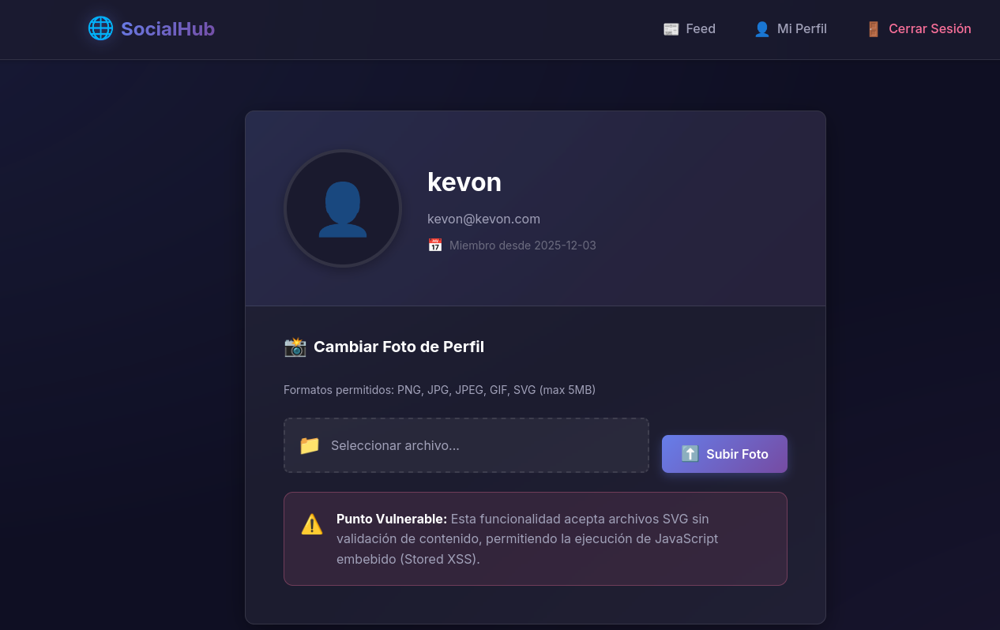

Before uploading the file, we start a Netcat listener on port `9999` to catch the exfiltrated cookie.

`nc -nvlp 9999`
After uploading the SVG, we receive a callback with a cookie.
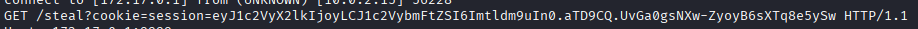

However, inspecting the captured data reveals that it is **our own session cookie**. To successfully hijack the administrator's session, we need to refine the payload to ensure it executes strictly in the admin's context and exfiltrates their specific cookie.

Here is the improved payload:

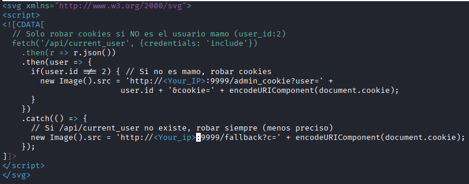

We update the script with our attacker IP, upload the new SVG, and wait on our Netcat listener.

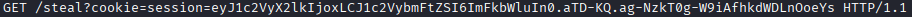

This time, we successfully capture the **admin's session cookie**. To hijack the session, we open our browser's Developer Tools, navigate to the **Storage** (or Application) tab, replace our current session cookie with the admin's cookie, and refresh the page.

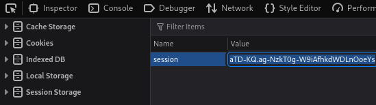

We are now authenticated as the admin. Inside the admin dashboard, we discover SSH credentials.

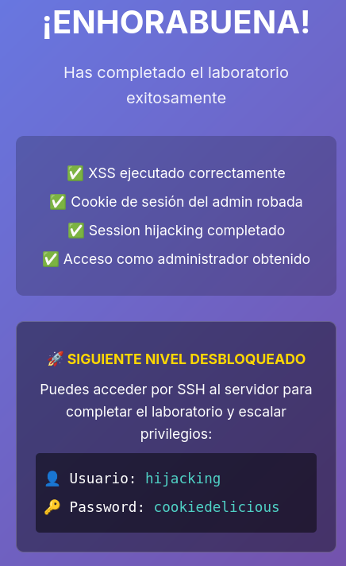


## Privilege Escalation

After gaining SSH access using the discovered credentials, we find ourselves logged in as the user **hijacking**. We begin our local enumeration by checking for sudo misconfigurations:

```
sudo -l
```

Next, we search for SUID (Set-owner User ID) binaries that could be abused for privilege escalation:

```
find / -perm -4000 2>/dev/null
```

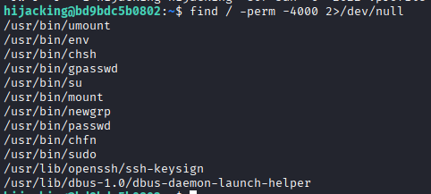

Among the results, the presence of `/usr/bin/env` with the SUID bit set immediately stands out. According to [GTFOBins](https://gtfobins.github.io/gtfobins/env/), `env` can be abused to execute arbitrary commands with elevated privileges.

We can easily spawn a root shell by executing:

```
/usr/bin/env /bin/bash -p
```

The `-p` flag preserves the elevated privileges (SUID), granting us a fully functional **root** shell.

## root flag

`cat /root/root*`
